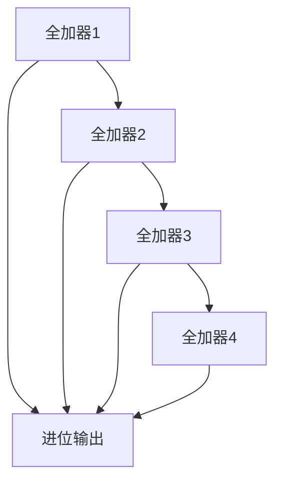
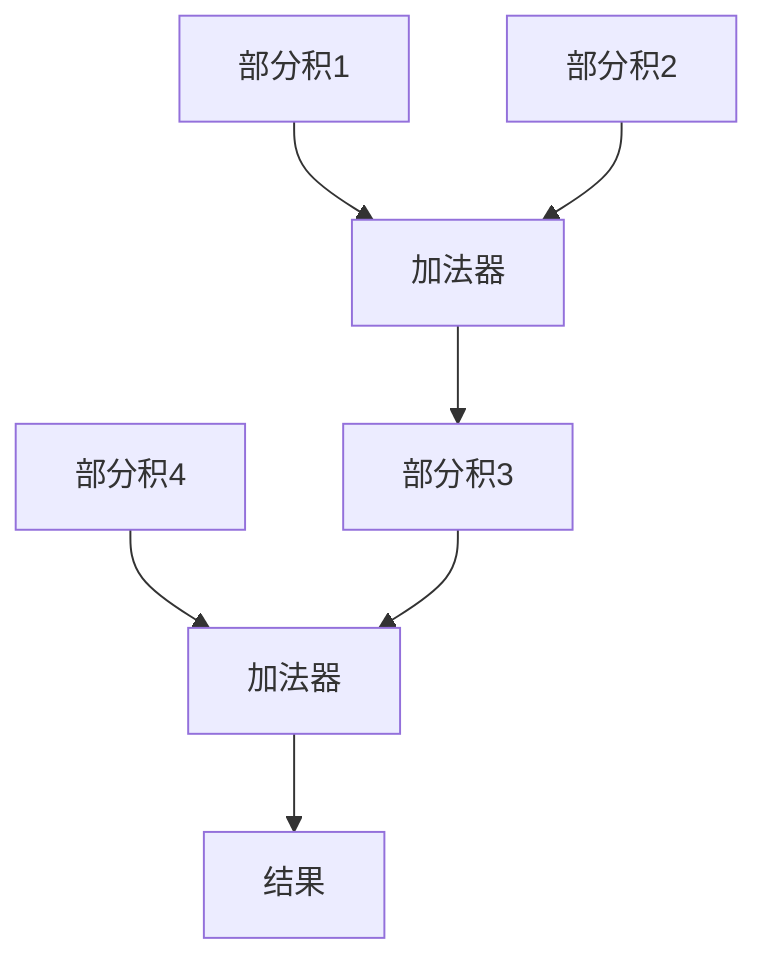
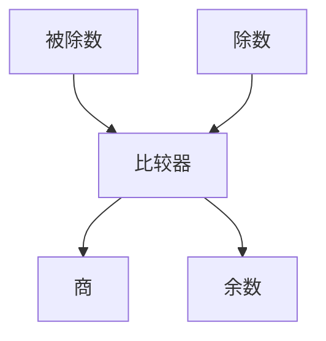

# 2.3 定点数运算

> [!abstract] 核心问题
> 定点数的加减乘除运算如何进行？补码加法的规则是什么？如何判断溢出？

## 一、定点数加法

### 1. 补码加法

**规则**：

$$[x + y]_补 = [x]_补 + [y]_补 \quad (\mod 2^n)$$

**示例**：

```
x = +1011B（+11D），[x]_补 = 01011B
y = +0110B（+6D），[y]_补 = 00110B

[x + y]_补 = 01011B + 00110B = 10001B
结果：x + y = -0111B（-7D）→ 溢出！
```

**溢出判断**：

```
符号位：0 + 0 = 1（正溢出）
结论：结果溢出
```

### 2. 补码减法

**规则**：

$$[x - y]_补 = [x]_补 + [-y]_补 \quad (\mod 2^n)$$

**求负数的补码**：

$$[-y]_补 = \overline{[y]_补} + 1$$

**示例**：

```
x = +1011B（+11D），[x]_补 = 01011B
y = +0110B（+6D），[y]_补 = 00110B
[-y]_补 = 11010B（00110取反加1）

[x - y]_补 = 01011B + 11010B = 00101B（进位丢弃）
结果：x - y = +0101B（+5D）
```

## 二、定点数乘法

### 1. 原码乘法

**规则**：

$$[x \times y]_原 = [x]_原 \times [y]_原$$

**符号位**：

$$符号位 = x的符号 \oplus y的符号$$

**数值位**：

$$数值位 = |x| \times |y|$$

**示例**：

```
x = +101B（+5D），[x]_原 = 0101B
y = +110B（+6D），[y]_原 = 0110B

符号位：0 ⊕ 0 = 0（正数）
数值位：101 × 110 = 11110B
结果：[x × y]_原 = 011110B（+30D）
```

### 2. 补码乘法

**布斯算法（Booth's Algorithm）**：

**原理**：

| 条件 | 操作 |
|-----|------|
| $y_i y_{i+1} = 00$ | 右移 |
| $y_i y_{i+1} = 01$ | 加[x]_补，右移 |
| $y_i y_{i+1} = 10$ | 减[x]_补，右移 |
| $y_i y_{i+1} = 11$ | 右移 |

**示例**：

```
x = +101B（+5D），[x]_补 = 0101B，[-x]_补 = 1011B
y = -110B（-6D），[y]_补 = 1010B

初始化：
A = 0000，Q = 1010，Q[-1] = 0

步骤：
1. Q[0]Q[-1] = 00 → 右移
   A = 0000，Q = 0101，Q[-1] = 0
2. Q[0]Q[-1] = 10 → 减[x]_补，右移
   A = 1011，右移 → A = 1101，Q = 1010，Q[-1] = 1
3. Q[0]Q[-1] = 01 → 加[x]_补，右移
   A = 0010，右移 → A = 0001，Q = 0101，Q[-1] = 0
4. Q[0]Q[-1] = 10 → 减[x]_补，右移
   A = 1010，右移 → A = 1101，Q = 1010，Q[-1] = 1

结果：A = 1101，Q = 1010 → 11011010B = -0011110B（-30D）
```

## 三、定点数除法

### 1. 原码除法

**规则**：

$$[x \div y]_原 = [x]_原 \div [y]_原$$

**符号位**：

$$符号位 = x的符号 \oplus y的符号$$

**数值位**：

$$数值位 = |x| \div |y|$$

**恢复余数法**：

**步骤**：

1. 比较被除数和除数
2. 如果被除数 >= 除数，商1，减去除数
3. 如果被除数 < 除数，商0，加上除数恢复余数
4. 左移，重复步骤1-3

**示例**：

```
x = +1010B（+10D），[x]_原 = 01010B
y = +110B（+6D），[y]_原 = 0110B

符号位：0 ⊕ 0 = 0（正数）
数值位计算：
1010 ÷ 110

步骤：
1. 1010 >= 110 → 商1，1010 - 110 = 100
2. 左移 → 1000
3. 1000 >= 110 → 商1，1000 - 110 = 10
4. 左移 → 100
5. 100 < 110 → 商0，100 + 110 = 1010（恢复余数）
6. 左移 → 10100（超出位数，停止）

商：110B（6D），余数：10B（2D）
结果：10 ÷ 6 = 1 余 2
```

### 2. 补码除法

**加减交替法**：

**原理**：

| 条件 | 操作 |
|-----|------|
| 余数与除数同号 | 商1，左移，减去除数 |
| 余数与除数异号 | 商0，左移，加上除数 |

**示例**：

```
x = +1010B（+10D），[x]_补 = 01010B
y = +110B（+6D），[y]_补 = 0110B，[-y]_补 = 1010B

初始化：
余数 = 0000，被除数 = 1010

步骤：
1. 余数 = 0000，被除数 = 1010
   余数与除数同号（0）→ 商1，左移，减去除数
   余数 = 1010 - 110 = 100，被除数 = 0
2. 左移 → 余数 = 1000，被除数 = 0
   余数与除数同号（1）→ 商1，左移，减去除数
   余数 = 1000 - 110 = 10，被除数 = 0
3. 左移 → 余数 = 100，被除数 = 0
   余数与除数异号（0）→ 商0，左移，加上除数
   余数 = 100 + 110 = 1010，被除数 = 0
4. 左移 → 余数 = 10100（超出位数，停止）

商：110B（6D），余数：10B（2D）
```

## 四、运算电路

### 1. 加法器

**半加器**：

**功能**：

$$S = A \oplus B$$
$$C = A \cdot B$$

**全加器**：

**功能**：

$$S = A \oplus B \oplus C_{in}$$
$$C_{out} = (A \cdot B) + (A \cdot C_{in}) + (B \cdot C_{in})$$

**多位加法器**：



### 2. 乘法器

**阵列乘法器**：



### 3. 除法器

**除法器结构**：



## 五、运算总结

### 1. 运算规则总结

| 运算 | 规则 | 溢出判断 |
|-----|------|---------|
| **补码加法** | [x+y]_补 = [x]_补 + [y]_补 | 符号位进位异或最高数值位进位 |
| **补码减法** | [x-y]_补 = [x]_补 + [-y]_补 | 同加法 |
| **原码乘法** | 符号位异或，数值位相乘 | 结果超出范围 |
| **原码除法** | 符号位异或，数值位相除 | 除数为0或结果溢出 |

### 2. 运算复杂度

| 运算 | 复杂度 | 说明 |
|-----|-------|------|
| **加法** | O(n) | n位加法器 |
| **乘法** | O(n^2) | 传统方法，可用O(n log n)优化 |
| **除法** | O(n^2) | 传统方法，可用O(n log n)优化 |

> [!warning] 易错点
> 补码乘法使用布斯算法！布斯算法可以减少加法次数，提高乘法效率。

---

**导航**：上一节 [[2.2-定点数表示.md]] · [[MOC - 第2章.md|返回章节导航]]