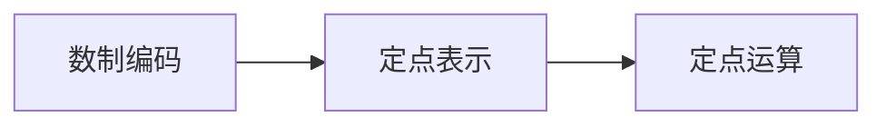

# 第2章-数据的表示与运算

> [!abstract] 本章定位
> 本章介绍计算机中数据的表示方法和运算规则，是理解计算机工作原理的基础。

## 学习主线

## 章节内容

- [[2.1-数制与编码.md]]：二进制、十进制、十六进制转换
- [[2.2-定点数表示.md]]：原码、反码、补码、移码
- [[2.3-定点数运算.md]]：加减乘除运算

## 考点汇总

> [!important] 核心考点
> 1. 数制转换：二进制与十进制、十六进制的转换
> 2. 有符号数表示：原码、反码、补码、移码的定义和计算
> 3. 补码运算：补码加法、减法、溢出判断
> 4. 定点乘法：原码乘法、补码乘法
> 5. 定点除法：原码除法、补码除法
> 6. 编码：ASCII码、BCD码、Unicode

## 前后章节依赖

| 方向 | 章节 | 依赖关系 |
|-----|------|---------|
| 先修 | 第1章 | 理解计算机组成有助于理解数据表示 |
| 后续 | 第3章 | 数据表示是存储器设计的基础 |

## 复习自测

> [!question] 自测题
> 1. 如何将十进制数转换为二进制数？
> 2. 原码、反码、补码的定义是什么？如何计算？
> 3. 补码加法的规则是什么？如何判断溢出？
> 4. 定点乘法和除法的算法是什么？
> 5. ASCII码和BCD码的区别是什么？