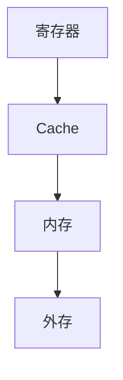

# 3.1 存储器分类与层次结构

> [!abstract] 核心问题
> 存储器如何分类？存储器的层次结构是怎样的？各层的特点是什么？

## 一、存储器分类

### 1. 按存取方式分类

**随机存取存储器（RAM）**：

**定义**：可以随机访问任意存储单元的存储器。

**特点**：

| 特点 | 说明 |
|-----|------|
| **存取速度快** | 可以直接访问任意位置 |
| **断电丢失** | 数据在断电后丢失 |
| **用于内存** | 计算机的主存通常是RAM |

**只读存储器（ROM）**：

**定义**：只能读取不能写入的存储器。

**特点**：

| 特点 | 说明 |
|-----|------|
| **只读不写** | 只能读取数据，不能写入 |
| **断电保存** | 数据在断电后不丢失 |
| **用于固件** | 存储计算机启动程序等 |

**顺序存取存储器（SAM）**：

**定义**：只能按顺序访问存储单元的存储器。

**特点**：

| 特点 | 说明 |
|-----|------|
| **顺序访问** | 只能按顺序读取 |
| **存取速度慢** | 需要等待数据到达 |
| **用于磁带** | 磁带是典型的顺序存取存储器 |

**直接存取存储器（DAM）**：

**定义**：结合了随机存取和顺序存取的存储器。

**特点**：

| 特点 | 说明 |
|-----|------|
| **直接定位** | 可以直接定位到磁道 |
| **顺序读取** | 在磁道内顺序读取 |
| **用于磁盘** | 硬盘和软盘是直接存取存储器 |

### 2. 按存储介质分类

**半导体存储器**：

**定义**：使用半导体器件存储数据的存储器。

**特点**：

| 特点 | 说明 |
|-----|------|
| **速度快** | 存取速度快 |
| **体积小** | 体积小，集成度高 |
| **功耗低** | 功耗较低 |
| **用于内存** | RAM和ROM都是半导体存储器 |

**磁表面存储器**：

**定义**：使用磁性材料存储数据的存储器。

**特点**：

| 特点 | 说明 |
|-----|------|
| **容量大** | 存储容量大 |
| **成本低** | 成本较低 |
| **断电保存** | 数据在断电后不丢失 |
| **用于外存** | 硬盘、软盘、磁带都是磁表面存储器 |

**光存储器**：

**定义**：使用光学技术存储数据的存储器。

**特点**：

| 特点 | 说明 |
|-----|------|
| **容量大** | 存储容量大 |
| **成本低** | 成本较低 |
| **断电保存** | 数据在断电后不丢失 |
| **用于光盘** | CD、DVD、蓝光光盘都是光存储器 |

### 3. 按作用分类

**主存储器（内存）**：

**定义**：计算机中直接与CPU交换数据的存储器。

**特点**：

| 特点 | 说明 |
|-----|------|
| **速度快** | 存取速度快 |
| **容量小** | 容量相对较小 |
| **断电丢失** | 数据在断电后丢失 |
| **用于运行** | 存储正在运行的程序和数据 |

**辅助存储器（外存）**：

**定义**：计算机中用于长期存储的存储器。

**特点**：

| 特点 | 说明 |
|-----|------|
| **速度慢** | 存取速度慢 |
| **容量大** | 容量大 |
| **断电保存** | 数据在断电后不丢失 |
| **用于存储** | 存储程序和数据文件 |

**高速缓冲存储器（Cache）**：

**定义**：位于CPU和内存之间的高速存储器。

**特点**：

| 特点 | 说明 |
|-----|------|
| **速度快** | 存取速度接近CPU |
| **容量小** | 容量很小 |
| **用于缓存** | 缓存CPU常用的数据 |

## 二、存储器层次结构

### 1. 层次结构概述

**结构**：



**层次**：

| 层次 | 名称 | 速度 | 容量 | 价格 |
|-----|------|------|------|------|
| 1 | 寄存器 | 最快 | 最小 | 最贵 |
| 2 | Cache | 快 | 小 | 贵 |
| 3 | 内存 | 中等 | 中等 | 中等 |
| 4 | 外存 | 慢 | 大 | 便宜 |

### 2. 层次结构的原理

**局部性原理**：

| 原理 | 说明 |
|-----|------|
| **时间局部性** | 最近访问过的数据可能再次被访问 |
| **空间局部性** | 相邻的数据可能一起被访问 |

**缓存策略**：


### 3. 层次结构的性能

**命中率**：

**定义**：CPU访问Cache时，数据在Cache中的概率。

**计算公式**：

$$命中率 = \frac{Cache访问次数}{总访问次数}$$

**平均访问时间**：

**定义**：CPU访问数据的平均时间。

**计算公式**：

$$平均访问时间 = 命中率 \times Cache访问时间 + (1 - 命中率) \times 内存访问时间$$

**示例**：

```
Cache访问时间：10 ns
内存访问时间：100 ns
命中率：95%

平均访问时间 = 0.95 × 10 ns + 0.05 × 100 ns = 9.5 ns + 5 ns = 14.5 ns
```

## 三、各类存储器的应用

### 1. 内存

**应用场景**：

| 场景 | 说明 |
|-----|------|
| **程序运行** | 存储正在运行的程序 |
| **数据处理** | 存储正在处理的数据 |
| **系统缓存** | 缓存系统常用数据 |

**内存类型**：

| 类型 | 说明 |
|-----|------|
| **DDR** | 双倍数据速率内存 |
| **DDR2** | 第二代DDR内存 |
| **DDR3** | 第三代DDR内存 |
| **DDR4** | 第四代DDR内存 |

### 2. 外存

**应用场景**：

| 场景 | 说明 |
|-----|------|
| **文件存储** | 存储用户文件 |
| **程序安装** | 存储安装的程序 |
| **数据备份** | 备份重要数据 |

**外存类型**：

| 类型 | 说明 |
|-----|------|
| **硬盘** | 大容量磁性存储 |
| **SSD** | 固态硬盘 |
| **U盘** | 便携式存储 |
| **光盘** | 光学存储 |

### 3. Cache

**应用场景**：

| 场景 | 说明 |
|-----|------|
| **CPU缓存** | 缓存CPU常用数据 |
| **指令缓存** | 缓存常用指令 |
| **数据缓存** | 缓存常用数据 |

**Cache级别**：

| 级别 | 说明 |
|-----|------|
| **L1 Cache** | 一级缓存，速度最快 |
| **L2 Cache** | 二级缓存，速度较快 |
| **L3 Cache** | 三级缓存，容量较大 |

> [!warning] 易错点
> 存储器层次结构的核心是局部性原理！时间局部性和空间局部性是缓存策略的基础。

---

**导航**：[[MOC - 第3章.md|返回章节导航]] · 下一节 [[3.2-随机存取存储器RAM.md]]