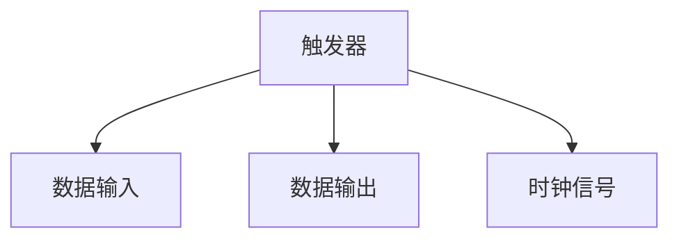
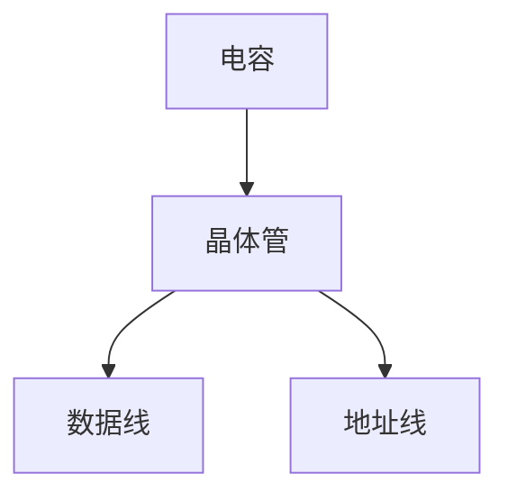
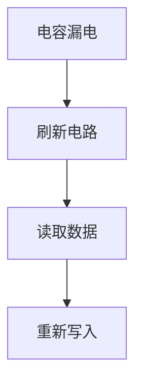
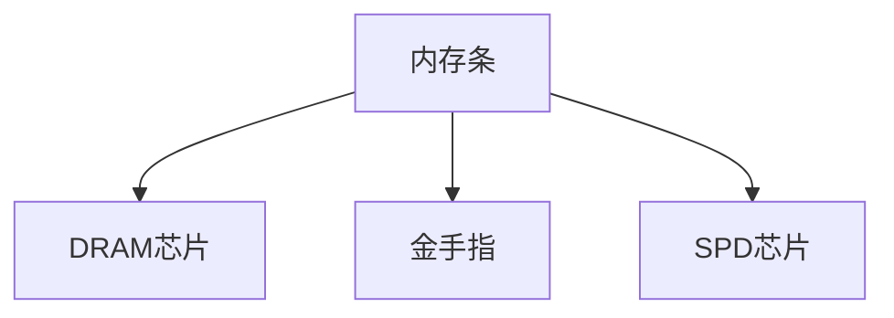

# 3.2 随机存取存储器RAM

> [!abstract] 核心问题
> SRAM和DRAM的区别是什么？内存芯片如何扩展？内存条的结构是怎样的？

## 一、SRAM

### 1. SRAM的结构

**定义**：SRAM是静态随机存取存储器，使用触发器存储数据。

**存储单元**：



**存储单元组成**：

| 组成 | 说明 |
|-----|------|
| **触发器** | 由6个MOS管组成 |
| **数据线** | 用于读写数据 |
| **地址线** | 用于选择存储单元 |
| **控制线** | 用于控制读写操作 |

### 2. SRAM的特点

**特点**：

| 特点 | 说明 |
|-----|------|
| **速度快** | 存取速度快 |
| **功耗高** | 功耗较高 |
| **价格贵** | 价格较贵 |
| **不需要刷新** | 数据保持不需要刷新 |

**应用**：

| 应用 | 说明 |
|-----|------|
| **Cache** | L1、L2、L3 Cache |
| **高速寄存器** | 高速数据缓存 |
| **小容量内存** | 需要高速访问的场合 |

## 二、DRAM

### 1. DRAM的结构

**定义**：DRAM是动态随机存取存储器，使用电容存储数据。

**存储单元**：



**存储单元组成**：

| 组成 | 说明 |
|-----|------|
| **电容** | 存储电荷表示数据 |
| **晶体管** | 控制读写操作 |
| **数据线** | 用于读写数据 |
| **地址线** | 用于选择存储单元 |

### 2. DRAM的特点

**特点**：

| 特点 | 说明 |
|-----|------|
| **速度慢** | 存取速度比SRAM慢 |
| **功耗低** | 功耗较低 |
| **价格便宜** | 价格较便宜 |
| **需要刷新** | 电容会漏电，需要定期刷新 |

**刷新过程**：



**刷新方式**：

| 方式 | 说明 |
|-----|------|
| **集中刷新** | 在刷新周期内集中刷新所有单元 |
| **分散刷新** | 将刷新操作分散到每个存取周期 |
| **异步刷新** | 在存取操作空闲时进行刷新 |

## 三、SRAM与DRAM的对比

### 1. 性能对比

| 对比项 | SRAM | DRAM |
|-------|------|------|
| **速度** | 快 | 慢 |
| **功耗** | 高 | 低 |
| **价格** | 贵 | 便宜 |
| **集成度** | 低 | 高 |
| **刷新** | 不需要 | 需要 |

### 2. 应用场景对比

| 场景 | SRAM | DRAM |
|-----|------|------|
| **Cache** | 是 | 否 |
| **主存** | 否 | 是 |
| **高速缓存** | 是 | 否 |
| **大容量存储** | 否 | 是 |

## 四、内存芯片扩展

### 1. 位扩展

**定义**：增加内存的位数。

**方法**：

| 方法 | 说明 |
|-----|------|
| **并联** | 将多个芯片的数据线并联 |
| **地址线共享** | 共享地址线 |
| **控制线共享** | 共享控制线 |

**示例**：

```
使用8片1K×1位的芯片扩展为1K×8位的内存：
- 将8片芯片的地址线并联
- 将8片芯片的控制线并联
- 将8片芯片的数据线分别连接到数据总线的不同位
```

### 2. 字扩展

**定义**：增加内存的字数。

**方法**：

| 方法 | 说明 |
|-----|------|
| **串联** | 将多个芯片的地址线串联 |
| **数据线共享** | 共享数据线 |
| **控制线共享** | 共享控制线 |

**示例**：

```
使用2片1K×8位的芯片扩展为2K×8位的内存：
- 将2片芯片的数据线并联
- 将2片芯片的控制线并联
- 使用地址线的高位选择不同的芯片
```

### 3. 字位扩展

**定义**：同时增加内存的字数和位数。

**方法**：

| 方法 | 说明 |
|-----|------|
| **组合** | 结合位扩展和字扩展 |
| **行列选择** | 使用行地址和列地址选择芯片 |

**示例**：

```
使用4片1K×4位的芯片扩展为2K×8位的内存：
- 使用2片芯片进行位扩展，组成1K×8位
- 使用2组进行字扩展，组成2K×8位
```

## 五、内存条

### 1. 内存条的结构

**组成**：

| 组成 | 说明 |
|-----|------|
| **内存芯片** | 多个DRAM芯片 |
| **电路板** | 承载芯片的电路板 |
| **金手指** | 连接主板的接口 |
| **SPD芯片** | 存储内存条信息 |

**结构**：



### 2. 内存条的类型

**类型**：

| 类型 | 说明 |
|-----|------|
| **DDR** | 双倍数据速率内存 |
| **DDR2** | 第二代DDR内存 |
| **DDR3** | 第三代DDR内存 |
| **DDR4** | 第四代DDR内存 |

**特性对比**：

| 特性 | DDR | DDR2 | DDR3 | DDR4 |
|-----|-----|------|------|------|
| **数据速率** | 200-400 MHz | 400-800 MHz | 800-1600 MHz | 1600-3200 MHz |
| **电压** | 2.5V | 1.8V | 1.5V | 1.2V |
| **引脚数** | 184 | 240 | 240 | 288 |

### 3. 内存条的安装

**安装步骤**：

| 步骤 | 说明 |
|-----|------|
| **断电** | 关闭计算机电源 |
| **打开机箱** | 打开计算机机箱 |
| **找到插槽** | 找到主板上的内存插槽 |
| **插入内存条** | 将内存条插入插槽 |
| **固定** | 按下插槽两端的卡扣 |
| **关闭机箱** | 关闭计算机机箱 |

> [!warning] 易错点
> DRAM需要刷新！电容会漏电，必须定期刷新才能保持数据。这是DRAM和SRAM的主要区别。

---

**导航**：上一节 [[3.1-存储器分类与层次结构.md]] · [[MOC - 第3章.md|返回章节导航]] · 下一节 [[3.3-高速缓存Cache.md]]