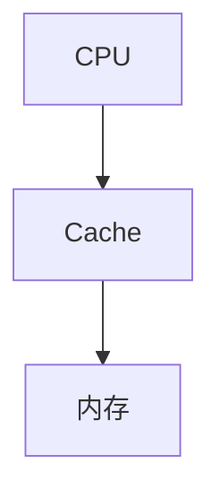
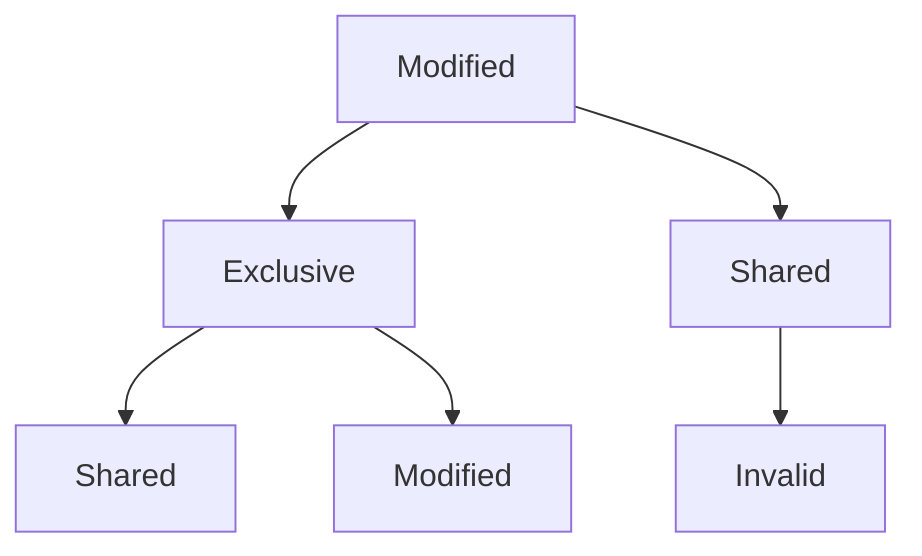
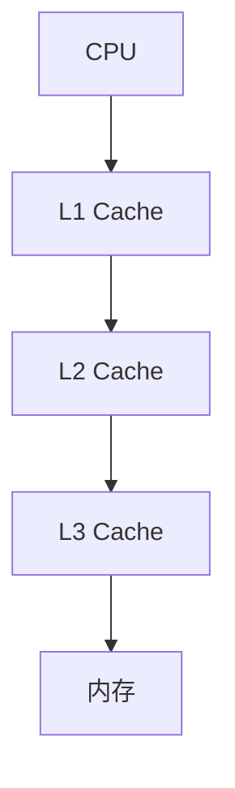

# 3.3 高速缓存Cache

> [!abstract] 核心问题
> Cache的映射方式有哪些？Cache的替换策略有哪些？如何保证Cache一致性？

## 一、Cache的基本概念

### 1. Cache的定义

**定义**：Cache是位于CPU和内存之间的高速存储器，用于缓存CPU常用的数据。

**作用**：

| 作用 | 说明 |
|-----|------|
| **提高速度** | 减少CPU访问内存的时间 |
| **降低延迟** | 提高数据访问的响应速度 |
| **优化性能** | 利用局部性原理提高效率 |

**结构**：



### 2. Cache的性能指标

**命中率**：

**定义**：CPU访问Cache时，数据在Cache中的概率。

**计算公式**：

$$命中率 = \frac{Cache命中次数}{总访问次数}$$

**示例**：

```
CPU访问1000次，其中950次命中Cache
命中率 = 950 / 1000 = 95%
```

**平均访问时间**：

**定义**：CPU访问数据的平均时间。

**计算公式**：

$$平均访问时间 = 命中率 \times Cache访问时间 + (1 - 命中率) \times 内存访问时间$$

**示例**：

```
Cache访问时间：10 ns
内存访问时间：100 ns
命中率：95%

平均访问时间 = 0.95 × 10 ns + 0.05 × 100 ns = 9.5 ns + 5 ns = 14.5 ns
```

**加速比**：

**定义**：使用Cache后的性能提升倍数。

**计算公式**：

$$加速比 = \frac{内存访问时间}{平均访问时间}$$

**示例**：

```
加速比 = 100 ns / 14.5 ns ≈ 6.9
```

## 二、Cache的映射方式

### 1. 直接映射

**定义**：每个内存块只能映射到Cache的一个特定位置。

**映射公式**：

$$Cache行号 = 内存块号 \mod Cache行数$$

**示例**：

```
Cache有8行，内存块号为15
Cache行号 = 15 mod 8 = 7
内存块15映射到Cache行7
```

**特点**：

| 特点 | 说明 |
|-----|------|
| **优点** | 实现简单，速度快 |
| **缺点** | 冲突概率高，命中率低 |
| **适用场景** | Cache容量较小 |

### 2. 全相联映射

**定义**：每个内存块可以映射到Cache的任意位置。

**映射方式**：

| 方式 | 说明 |
|-----|------|
| **任意选择** | 内存块可以放在Cache的任何位置 |
| **需要查找** | 访问时需要查找整个Cache |

**特点**：

| 特点 | 说明 |
|-----|------|
| **优点** | 冲突概率低，命中率高 |
| **缺点** | 实现复杂，速度慢 |
| **适用场景** | Cache容量较小 |

### 3. 组相联映射

**定义**：每个内存块可以映射到Cache的一个特定组中的任意位置。

**映射公式**：

$$Cache组号 = 内存块号 \mod Cache组数$$

**示例**：

```
Cache有8行，分为4组，每组2行
内存块号为15
Cache组号 = 15 mod 4 = 3
内存块15可以映射到Cache组3的任意一行
```

**特点**：

| 特点 | 说明 |
|-----|------|
| **优点** | 兼顾直接映射和全相联映射的优点 |
| **缺点** | 实现复杂度中等 |
| **适用场景** | 大多数计算机系统 |

**组相联度**：

| 组相联度 | 说明 |
|-----|------|
| **2路组相联** | 每组2行 |
| **4路组相联** | 每组4行 |
| **8路组相联** | 每组8行 |

## 三、Cache的替换策略

### 1. FIFO（先进先出）

**定义**：最先进入Cache的块最先被替换。

**原理**：

| 原理 | 说明 |
|-----|------|
| **队列管理** | 使用队列管理Cache块 |
| **先进先出** | 新块入队，旧块出队 |

**示例**：

```
Cache块顺序：A → B → C → D
新块E进入，替换A
Cache块顺序：B → C → D → E
```

**特点**：

| 特点 | 说明 |
|-----|------|
| **优点** | 实现简单 |
| **缺点** | 可能替换掉常用的块 |

### 2. LRU（最近最少使用）

**定义**：最近最少使用的块最先被替换。

**原理**：

| 原理 | 说明 |
|-----|------|
| **记录使用时间** | 记录每个块的使用时间 |
| **替换最久未用** | 替换最久未使用的块 |

**示例**：

```
Cache块使用顺序：A → B → C → A → D
新块E进入，替换B（最久未使用）
Cache块：A → C → D → E
```

**特点**：

| 特点 | 说明 |
|-----|------|
| **优点** | 命中率较高 |
| **缺点** | 实现较复杂 |

### 3. LFU（最不经常使用）

**定义**：使用次数最少的块最先被替换。

**原理**：

| 原理 | 说明 |
|-----|------|
| **记录使用次数** | 记录每个块的使用次数 |
| **替换最少使用** | 替换使用次数最少的块 |

**示例**：

```
Cache块使用次数：A(5) → B(2) → C(3) → D(4)
新块E进入，替换B（使用次数最少）
Cache块：A → C → D → E
```

**特点**：

| 特点 | 说明 |
|-----|------|
| **优点** | 考虑使用频率 |
| **缺点** | 不考虑使用时间 |

### 4. 替换策略对比

| 策略 | 优点 | 缺点 | 命中率 |
|-----|------|------|-------|
| **FIFO** | 实现简单 | 可能替换常用块 | 中等 |
| **LRU** | 命中率高 | 实现较复杂 | 较高 |
| **LFU** | 考虑频率 | 不考虑时间 | 中等 |

## 四、Cache的一致性

### 1. 一致性问题

**问题**：

| 问题 | 说明 |
|-----|------|
| **写回问题** | Cache中的数据与内存中的数据不一致 |
| **多处理器** | 多个处理器的Cache之间数据不一致 |

**示例**：

```
CPU修改了Cache中的数据，但没有写回内存
其他设备读取内存时得到的是旧数据
```

### 2. 写策略

**写回法（Write-Back）**：

**定义**：只在Cache块被替换时才将数据写回内存。

**原理**：

| 原理 | 说明 |
|-----|------|
| **标记脏位** | 标记被修改过的Cache块 |
| **替换时写回** | 只有在替换时才写回内存 |

**特点**：

| 特点 | 说明 |
|-----|------|
| **优点** | 减少写操作次数 |
| **缺点** | 需要维护脏位，一致性问题 |

**写直达法（Write-Through）**：

**定义**：每次写操作都同时写回内存。

**原理**：

| 原理 | 说明 |
|-----|------|
| **同时写入** | 同时写入Cache和内存 |
| **保证一致** | 保证Cache和内存一致 |

**特点**：

| 特点 | 说明 |
|-----|------|
| **优点** | 保证一致性 |
| **缺点** | 写操作次数多，速度慢 |

### 3. 一致性协议

**MESI协议**：

**状态**：

| 状态 | 说明 |
|-----|------|
| **Modified** | 已修改，与内存不一致 |
| **Exclusive** | 独占，与内存一致 |
| **Shared** | 共享，与内存一致 |
| **Invalid** | 无效 |

**转换**：



## 五、Cache的多级结构

### 1. 多级Cache

**结构**：

| 级别 | 说明 |
|-----|------|
| **L1 Cache** | 一级缓存，速度最快，容量最小 |
| **L2 Cache** | 二级缓存，速度较快，容量较小 |
| **L3 Cache** | 三级缓存，速度较慢，容量较大 |

**层次**：



### 2. 多级Cache的性能

**命中率计算**：

**示例**：

```
L1命中率：90%，访问时间：5 ns
L2命中率：95%，访问时间：20 ns
L3命中率：98%，访问时间：50 ns
内存访问时间：100 ns

平均访问时间 = 0.90 × 5 ns + 0.10 × 0.95 × 20 ns + 0.10 × 0.05 × 0.98 × 50 ns + 0.10 × 0.05 × 0.02 × 100 ns
= 4.5 ns + 1.9 ns + 0.245 ns + 0.01 ns
= 6.655 ns
```

> [!warning] 易错点
> 组相联映射是直接映射和全相联映射的折中！组相联度越高，越接近全相联映射；组相联度越低，越接近直接映射。

---

**导航**：上一节 [[3.2-随机存取存储器RAM.md]] · [[MOC - 第3章.md|返回章节导航]]