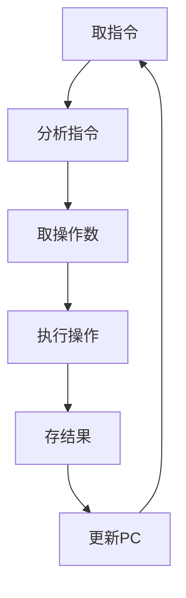

# 4.2 指令类型与功能

> [!abstract] 核心问题
> 指令的类型有哪些？各有什么功能？常见的指令有哪些？

## 一、指令类型分类

### 1. 数据传送类指令

**定义**：用于在寄存器、内存和I/O设备之间传送数据。

**常见指令**：

| 指令 | 说明 |
|-----|------|
| **MOV** | 数据传送 |
| **PUSH** | 入栈 |
| **POP** | 出栈 |
| **LOAD** | 从内存加载到寄存器 |
| **STORE** | 从寄存器存储到内存 |

**示例**：

```
MOV AX, BX（AX = BX）
MOV [1000H], AX（内存[1000H] = AX）
PUSH AX（将AX入栈）
POP BX（将栈顶元素弹出到BX）
```

**功能**：

| 功能 | 说明 |
|-----|------|
| **寄存器之间** | 在寄存器之间传送数据 |
| **寄存器与内存** | 在寄存器和内存之间传送数据 |
| **内存与内存** | 在内存之间传送数据 |
| **栈操作** | 入栈和出栈操作 |

### 2. 算术运算类指令

**定义**：用于执行算术运算。

**常见指令**：

| 指令 | 说明 |
|-----|------|
| **ADD** | 加法 |
| **SUB** | 减法 |
| **MUL** | 乘法 |
| **DIV** | 除法 |
| **INC** | 加1 |
| **DEC** | 减1 |
| **NEG** | 取负 |
| **CMP** | 比较 |

**示例**：

```
ADD AX, BX（AX = AX + BX）
SUB AX, BX（AX = AX - BX）
MUL BX（AX = AX × BX）
DIV BX（AX = AX ÷ BX）
INC AX（AX = AX + 1）
DEC AX（AX = AX - 1）
NEG AX（AX = -AX）
CMP AX, BX（比较AX和BX）
```

**功能**：

| 功能 | 说明 |
|-----|------|
| **基本运算** | 加减乘除运算 |
| **增量减量** | 加1和减1操作 |
| **取负** | 取操作数的相反数 |
| **比较** | 比较两个操作数 |

### 3. 逻辑运算类指令

**定义**：用于执行逻辑运算。

**常见指令**：

| 指令 | 说明 |
|-----|------|
| **AND** | 与运算 |
| **OR** | 或运算 |
| **NOT** | 非运算 |
| **XOR** | 异或运算 |
| **TEST** | 测试 |

**示例**：

```
AND AX, BX（AX = AX ∧ BX）
OR AX, BX（AX = AX ∨ BX）
NOT AX（AX = ¬AX）
XOR AX, BX（AX = AX ⊕ BX）
TEST AX, BX（测试AX和BX）
```

**功能**：

| 功能 | 说明 |
|-----|------|
| **逻辑运算** | 与或非异或运算 |
| **位操作** | 按位操作 |
| **测试** | 测试某些位是否为1 |

### 4. 控制转移类指令

**定义**：用于改变程序的执行顺序。

**常见指令**：

| 指令 | 说明 |
|-----|------|
| **JMP** | 无条件跳转 |
| **JZ/JNZ** | 条件跳转 |
| **JC/JNC** | 进位跳转 |
| **CALL** | 调用子程序 |
| **RET** | 返回子程序 |
| **INT** | 中断 |

**示例**：

```
JMP LABEL（跳转到LABEL）
JZ LABEL（如果ZF=1，跳转到LABEL）
JNZ LABEL（如果ZF=0，跳转到LABEL）
JC LABEL（如果CF=1，跳转到LABEL）
CALL SUB（调用子程序SUB）
RET（从子程序返回）
INT 21H（调用中断21H）
```

**功能**：

| 功能 | 说明 |
|-----|------|
| **无条件跳转** | 无条件跳转到指定地址 |
| **条件跳转** | 根据条件跳转到指定地址 |
| **子程序调用** | 调用子程序 |
| **子程序返回** | 从子程序返回 |
| **中断** | 调用中断服务程序 |

### 5. 输入输出类指令

**定义**：用于与外部设备进行数据交换。

**常见指令**：

| 指令 | 说明 |
|-----|------|
| **IN** | 输入 |
| **OUT** | 输出 |

**示例**：

```
IN AX, 20H（从端口20H输入到AX）
OUT 20H, AX（从AX输出到端口20H）
```

**功能**：

| 功能 | 说明 |
|-----|------|
| **端口输入** | 从I/O端口输入数据 |
| **端口输出** | 向I/O端口输出数据 |

### 6. 处理器控制类指令

**定义**：用于控制处理器的状态。

**常见指令**：

| 指令 | 说明 |
|-----|------|
| **NOP** | 空操作 |
| **HALT** | 停机 |
| **STI** | 开中断 |
| **CLI** | 关中断 |
| **CLC** | 清进位标志 |
| **STC** | 置进位标志 |

**示例**：

```
NOP（空操作）
HALT（停机）
STI（开中断）
CLI（关中断）
CLC（清进位标志）
STC（置进位标志）
```

**功能**：

| 功能 | 说明 |
|-----|------|
| **空操作** | 不执行任何操作 |
| **停机** | 停止处理器运行 |
| **中断控制** | 开中断和关中断 |
| **标志控制** | 设置和清除标志位 |

## 二、指令功能详解

### 1. 数据传送指令

**MOV指令**：

**格式**：

```
MOV 目的操作数, 源操作数
```

**操作**：

```
目的操作数 = 源操作数
```

**示例**：

```
MOV AX, 100H（AX = 100H）
MOV BX, AX（BX = AX）
MOV [1000H], AX（内存[1000H] = AX）
```

**PUSH指令**：

**格式**：

```
PUSH 操作数
```

**操作**：

```
SP = SP - 2
内存[SP] = 操作数
```

**示例**：

```
PUSH AX（将AX入栈）
```

**POP指令**：

**格式**：

```
POP 操作数
```

**操作**：

```
操作数 = 内存[SP]
SP = SP + 2
```

**示例**：

```
POP BX（将栈顶元素弹出到BX）
```

### 2. 算术运算指令

**ADD指令**：

**格式**：

```
ADD 目的操作数, 源操作数
```

**操作**：

```
目的操作数 = 目的操作数 + 源操作数
```

**示例**：

```
ADD AX, BX（AX = AX + BX）
```

**SUB指令**：

**格式**：

```
SUB 目的操作数, 源操作数
```

**操作**：

```
目的操作数 = 目的操作数 - 源操作数
```

**示例**：

```
SUB AX, BX（AX = AX - BX）
```

**MUL指令**：

**格式**：

```
MUL 源操作数
```

**操作**：

```
AX = AX × 源操作数
```

**示例**：

```
MUL BX（AX = AX × BX）
```

**DIV指令**：

**格式**：

```
DIV 源操作数
```

**操作**：

```
AX ÷ 源操作数
商 → AX
余数 → DX
```

**示例**：

```
DIV BX（AX ÷ BX）
```

### 3. 逻辑运算指令

**AND指令**：

**格式**：

```
AND 目的操作数, 源操作数
```

**操作**：

```
目的操作数 = 目的操作数 ∧ 源操作数
```

**示例**：

```
AND AX, 0FFH（将AX的高8位清零）
```

**OR指令**：

**格式**：

```
OR 目的操作数, 源操作数
```

**操作**：

```
目的操作数 = 目的操作数 ∨ 源操作数
```

**示例**：

```
OR AX, 0FFH（将AX的低8位置1）
```

**NOT指令**：

**格式**：

```
NOT 操作数
```

**操作**：

```
操作数 = ¬操作数
```

**示例**：

```
NOT AX（将AX取反）
```

### 4. 控制转移指令

**JMP指令**：

**格式**：

```
JMP 目标地址
```

**操作**：

```
IP = 目标地址
```

**示例**：

```
JMP LABEL（跳转到LABEL）
```

**JZ指令**：

**格式**：

```
JZ 目标地址
```

**操作**：

```
如果ZF = 1，则IP = 目标地址
```

**示例**：

```
JZ LABEL（如果ZF=1，跳转到LABEL）
```

**CALL指令**：

**格式**：

```
CALL 子程序地址
```

**操作**：

```
SP = SP - 2
内存[SP] = IP
IP = 子程序地址
```

**示例**：

```
CALL SUB（调用子程序SUB）
```

**RET指令**：

**格式**：

```
RET
```

**操作**：

```
IP = 内存[SP]
SP = SP + 2
```

**示例**：

```
RET（从子程序返回）
```

## 三、指令的执行过程

### 1. 指令执行的基本步骤

**步骤**：

1. **取指令**：从内存中取出指令
2. **分析指令**：解码指令，确定操作类型
3. **取操作数**：根据寻址方式获取操作数
4. **执行操作**：执行指令规定的操作
5. **存结果**：将结果存放到指定位置
6. **更新PC**：更新程序计数器

**流程图**：



### 2. 指令执行的时间

**指令周期**：

**定义**：执行一条指令所需的时间。

**组成**：

| 组成 | 说明 |
|-----|------|
| **取指周期** | 取出指令的时间 |
| **执行周期** | 执行指令的时间 |
| **访存周期** | 访问内存的时间 |

**示例**：

```
指令周期 = 取指周期 + 执行周期 + 访存周期
```

> [!warning] 易错点
> 控制转移指令会改变程序的执行顺序！JMP是无条件跳转，JZ/JNZ是条件跳转，CALL/RET用于子程序调用。

---

**导航**：上一节 [[4.1-指令格式.md]] · [[MOC - 第4章.md|返回章节导航]] · 下一节 [[4.3-指令系统设计.md]]