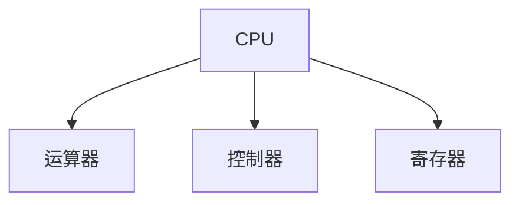
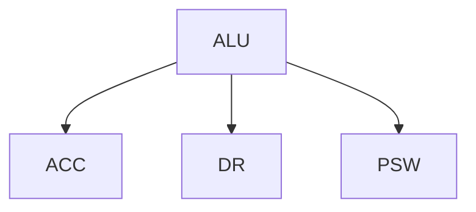
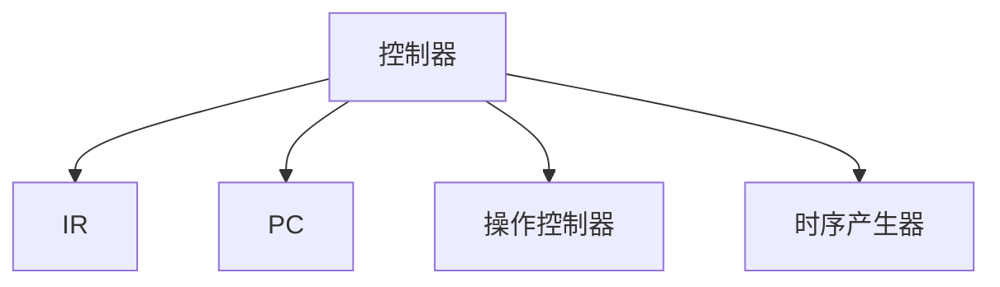
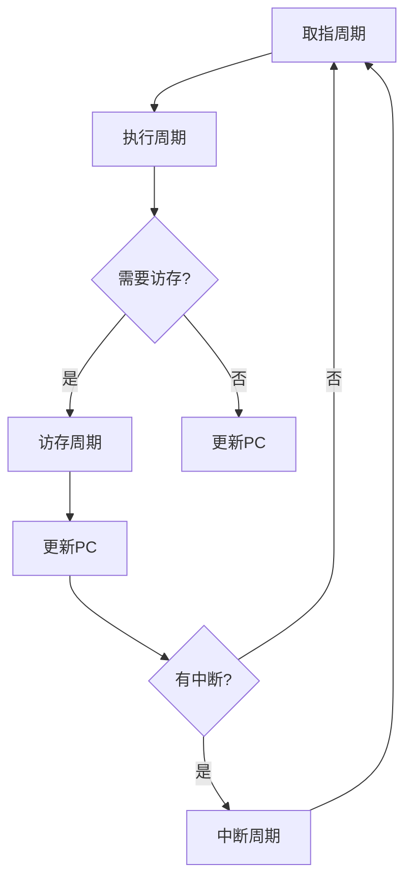

# 5.1 CPU的功能与结构

> [!abstract] 核心问题
> CPU的功能是什么？CPU由哪些部分组成？各部分的作用是什么？

## 一、CPU的功能

### 1. 指令控制

**定义**：指令控制是指控制程序的执行顺序。

**功能**：

| 功能 | 说明 |
|-----|------|
| **取指令** | 从内存中取出指令 |
| **分析指令** | 解码指令，确定操作类型 |
| **执行指令** | 执行指令规定的操作 |
| **控制时序** | 控制指令执行的时序 |

**示例**：

```
指令控制流程：
1. PC指向当前指令地址
2. 从内存取出指令到IR
3. 解码IR中的操作码
4. 根据操作码执行相应操作
5. 更新PC指向下一条指令
```

### 2. 操作控制

**定义**：操作控制是指控制各部件执行指令规定的操作。

**功能**：

| 功能 | 说明 |
|-----|------|
| **产生控制信号** | 产生控制各部件的信号 |
| **控制数据流动** | 控制数据在各部件之间的流动 |
| **协调操作** | 协调各部件的操作 |

**示例**：

```
操作控制流程：
1. 根据指令操作码产生控制信号
2. 控制运算器执行运算
3. 控制存储器读写数据
4. 控制输入输出设备
```

### 3. 时间控制

**定义**：时间控制是指控制指令执行的时间。

**功能**：

| 功能 | 说明 |
|-----|------|
| **时序控制** | 控制各操作的时间顺序 |
| **同步控制** | 使用时钟信号同步各部件 |
| **异步控制** | 使用握手信号协调各部件 |

**示例**：

```
时间控制流程：
1. 时钟信号驱动各部件
2. 在规定的时钟周期内完成操作
3. 等待操作完成后进行下一步
```

### 4. 数据加工

**定义**：数据加工是指对数据进行算术和逻辑运算。

**功能**：

| 功能 | 说明 |
|-----|------|
| **算术运算** | 加减乘除等运算 |
| **逻辑运算** | 与或非等运算 |
| **数据处理** | 数据的转换和处理 |

**示例**：

```
数据加工流程：
1. 从寄存器或内存获取操作数
2. 在运算器中执行运算
3. 将结果存回寄存器或内存
```

## 二、CPU的结构

### 1. CPU的组成

**组成**：



**各部分功能**：

| 组成 | 功能 |
|-----|------|
| **运算器** | 执行算术和逻辑运算 |
| **控制器** | 控制指令执行 |
| **寄存器** | 临时存储数据和地址 |

### 2. 运算器

**组成**：

| 组成 | 说明 |
|-----|------|
| **算术逻辑单元（ALU）** | 执行算术和逻辑运算 |
| **累加器（ACC）** | 临时存储运算结果 |
| **数据寄存器（DR）** | 暂存参与运算的数据 |
| **状态寄存器（PSW）** | 存储运算结果的状态 |

**结构**：



**ALU功能**：

| 功能 | 说明 |
|-----|------|
| **算术运算** | 加、减、乘、除 |
| **逻辑运算** | 与、或、非、异或 |
| **移位运算** | 左移、右移、循环移位 |

### 3. 控制器

**组成**：

| 组成 | 说明 |
|-----|------|
| **指令寄存器（IR）** | 存储当前执行的指令 |
| **程序计数器（PC）** | 存储下一条指令的地址 |
| **操作控制器** | 生成控制信号 |
| **时序产生器** | 产生时序信号 |

**结构**：



**控制器功能**：

| 功能 | 说明 |
|-----|------|
| **取指令** | 从内存中取出指令 |
| **分析指令** | 解码指令 |
| **执行指令** | 向各部件发送控制信号 |
| **控制时序** | 协调各部件的工作时序 |

### 4. 寄存器

**分类**：

| 分类 | 说明 |
|-----|------|
| **通用寄存器** | 用于临时存储数据和地址 |
| **专用寄存器** | 用于特定功能 |
| **控制寄存器** | 用于控制CPU的工作 |

**通用寄存器**：

| 寄存器 | 说明 |
|-----|------|
| **AX** | 累加器 |
| **BX** | 基址寄存器 |
| **CX** | 计数寄存器 |
| **DX** | 数据寄存器 |
| **SP** | 栈指针 |
| **BP** | 基址指针 |
| **SI** | 源变址寄存器 |
| **DI** | 目的变址寄存器 |

**专用寄存器**：

| 寄存器 | 说明 |
|-----|------|
| **IR** | 指令寄存器 |
| **PC** | 程序计数器 |
| **MAR** | 内存地址寄存器 |
| **MDR** | 内存数据寄存器 |
| **PSW** | 程序状态字 |

**控制寄存器**：

| 寄存器 | 说明 |
|-----|------|
| **CR0** | 控制寄存器0 |
| **CR1** | 控制寄存器1 |
| **CR2** | 控制寄存器2 |
| **CR3** | 控制寄存器3 |

## 三、指令周期

### 1. 指令周期的定义

**定义**：指令周期是CPU执行一条指令所需的时间。

**组成**：

| 组成 | 说明 |
|-----|------|
| **取指周期** | 取出指令的时间 |
| **执行周期** | 执行指令的时间 |
| **访存周期** | 访问内存的时间 |
| **中断周期** | 处理中断的时间 |

**流程图**：



### 2. 取指周期

**任务**：

| 任务 | 说明 |
|-----|------|
| **送地址** | 将PC的内容送到MAR |
| **读内存** | 从内存中读出指令 |
| **存指令** | 将指令存入IR |
| **PC+1** | PC指向下一条指令 |

**操作**：

```
MAR = PC
MDR = Memory[MAR]
IR = MDR
PC = PC + 1
```

### 3. 执行周期

**任务**：

| 任务 | 说明 |
|-----|------|
| **译码** | 解码IR中的操作码 |
| **取操作数** | 根据寻址方式获取操作数 |
| **执行运算** | 执行指令规定的操作 |
| **存结果** | 将结果存放到指定位置 |

**操作**：

```
根据IR中的操作码：
- ADD：ACC = ACC + 操作数
- SUB：ACC = ACC - 操作数
- MOV：目的操作数 = 源操作数
```

### 4. 访存周期

**任务**：

| 任务 | 说明 |
|-----|------|
| **送地址** | 将操作数地址送到MAR |
| **读/写内存** | 读取或写入内存 |
| **存数据** | 将数据存入MDR或ACC |

**操作**：

```
读操作：
MAR = 地址
MDR = Memory[MAR]
ACC = MDR

写操作：
MAR = 地址
MDR = ACC
Memory[MAR] = MDR
```

### 5. 中断周期

**任务**：

| 任务 | 说明 |
|-----|------|
| **保护断点** | 将PC和PSW压入栈 |
| **送中断向量** | 将中断向量地址送到PC |
| **开中断** | 允许响应更高优先级的中断 |

**操作**：

```
SP = SP - 2
Memory[SP] = PC
SP = SP - 2
Memory[SP] = PSW
PC = 中断向量地址
```

## 四、CPU的性能指标

### 1. 主频

**定义**：主频是CPU的时钟频率。

**单位**：

| 单位 | 说明 |
|-----|------|
| **Hz** | 赫兹 |
| **MHz** | 兆赫兹 |
| **GHz** | 吉赫兹 |

**示例**：

```
CPU主频：3.0 GHz
含义：CPU每秒执行30亿个时钟周期
```

### 2. CPI

**定义**：CPI是执行一条指令所需的平均时钟周期数。

**计算公式**：

$$CPI = \frac{总时钟周期数}{总指令数}$$

**示例**：

```
总时钟周期数：10亿
总指令数：5000万
CPI = 10亿 / 5000万 = 20
```

### 3. MIPS

**定义**：MIPS是每秒执行的百万条指令数。

**计算公式**：

$$MIPS = \frac{主频}{CPI \times 10^6}$$

**示例**：

```
主频：3.0 GHz
CPI：20
MIPS = 3.0 GHz / (20 × 10^6) = 150
```

> [!warning] 易错点
> CPU由运算器和控制器组成！运算器负责执行运算，控制器负责控制指令执行。

---

**导航**：[[MOC - 第5章.md|返回章节导航]] · 下一节 [[5.2-指令执行过程.md]]