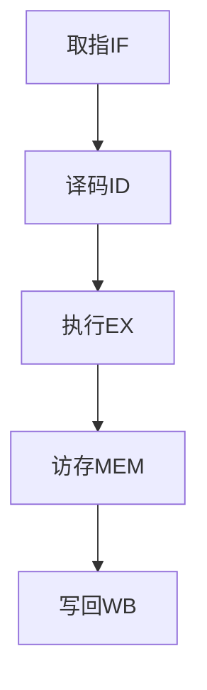

# 5.2 指令执行过程

> [!abstract] 核心问题
> 指令执行的过程是怎样的？取指、译码、执行、访存、写回各阶段的任务是什么？

## 一、指令执行的基本过程

### 1. 指令执行的五个阶段

**阶段**：

| 阶段 | 任务 |
|-----|------|
| **取指（IF）** | 从内存中取出指令 |
| **译码（ID）** | 解码指令，确定操作类型和操作数 |
| **执行（EX）** | 执行指令规定的操作 |
| **访存（MEM）** | 访问内存获取或存储数据 |
| **写回（WB）** | 将结果写回寄存器或内存 |

**流程图**：



### 2. 取指阶段

**任务**：

| 任务 | 说明 |
|-----|------|
| **送地址** | 将PC的内容送到MAR |
| **读内存** | 从内存中读出指令 |
| **存指令** | 将指令存入IR |
| **PC+1** | PC指向下一条指令 |

**操作**：

```
MAR = PC
MDR = Memory[MAR]
IR = MDR
PC = PC + 4（假设指令长度为4字节）
```

**示例**：

```
PC = 0x1000
MAR = 0x1000
MDR = Memory[0x1000] = 0x8B4500
IR = 0x8B4500（MOV AX, [BX]）
PC = 0x1004
```

### 3. 译码阶段

**任务**：

| 任务 | 说明 |
|-----|------|
| **解码操作码** | 确定指令的操作类型 |
| **确定寻址方式** | 确定操作数的寻址方式 |
| **获取操作数** | 根据寻址方式获取操作数 |
| **准备执行** | 为执行阶段做准备 |

**操作**：

```
操作码 = IR[31:26]
寻址方式 = IR[25:20]
操作数1 = 根据寻址方式获取
操作数2 = 根据寻址方式获取
```

**示例**：

```
IR = 0x8B4500（MOV AX, [BX]）
操作码 = 0x8B（MOV）
寻址方式 = 寄存器间接寻址
操作数 = Memory[BX]
```

### 4. 执行阶段

**任务**：

| 任务 | 说明 |
|-----|------|
| **执行运算** | 在ALU中执行运算 |
| **计算地址** | 计算访存地址 |
| **更新状态** | 更新PSW中的状态位 |

**操作**：

```
根据操作码：
- ADD：结果 = 操作数1 + 操作数2
- SUB：结果 = 操作数1 - 操作数2
- MOV：结果 = 操作数
- JMP：PC = 目标地址
```

**示例**：

```
指令：ADD AX, BX
操作数1 = AX = 0x1000
操作数2 = BX = 0x0500
结果 = 0x1000 + 0x0500 = 0x1500
```

### 5. 访存阶段

**任务**：

| 任务 | 说明 |
|-----|------|
| **计算地址** | 计算内存地址 |
| **读内存** | 从内存中读取数据 |
| **写内存** | 向内存中写入数据 |

**操作**：

```
读操作：
MAR = 地址
MDR = Memory[MAR]
数据 = MDR

写操作：
MAR = 地址
MDR = 数据
Memory[MAR] = MDR
```

**示例**：

```
指令：MOV [BX], AX
地址 = BX = 0x2000
数据 = AX = 0x1500
Memory[0x2000] = 0x1500
```

### 6. 写回阶段

**任务**：

| 任务 | 说明 |
|-----|------|
| **写回寄存器** | 将结果写回寄存器 |
| **写回内存** | 将结果写回内存 |
| **更新状态** | 更新PSW中的状态位 |

**操作**：

```
写回寄存器：
寄存器 = 结果

写回内存：
Memory[地址] = 结果
```

**示例**：

```
指令：ADD AX, BX
结果 = 0x1500
AX = 0x1500
```

## 二、不同指令的执行过程

### 1. 数据传送指令

**执行过程**：

```
MOV AX, BX
1. 取指：IR = MOV指令
2. 译码：操作码=MOV，源=BX，目的=AX
3. 执行：结果 = BX
4. 访存：不需要
5. 写回：AX = 结果
```

**示例**：

```
MOV AX, [1000H]
1. 取指：IR = MOV指令
2. 译码：操作码=MOV，源=[1000H]，目的=AX
3. 执行：计算地址=1000H
4. 访存：读取Memory[1000H]
5. 写回：AX = Memory[1000H]
```

### 2. 算术运算指令

**执行过程**：

```
ADD AX, BX
1. 取指：IR = ADD指令
2. 译码：操作码=ADD，源=BX，目的=AX
3. 执行：结果 = AX + BX
4. 访存：不需要
5. 写回：AX = 结果，更新PSW
```

**示例**：

```
SUB AX, [BX]
1. 取指：IR = SUB指令
2. 译码：操作码=SUB，源=[BX]，目的=AX
3. 执行：计算地址=BX
4. 访存：读取Memory[BX]
5. 写回：AX = AX - Memory[BX]，更新PSW
```

### 3. 逻辑运算指令

**执行过程**：

```
AND AX, BX
1. 取指：IR = AND指令
2. 译码：操作码=AND，源=BX，目的=AX
3. 执行：结果 = AX ∧ BX
4. 访存：不需要
5. 写回：AX = 结果，更新PSW
```

**示例**：

```
OR AX, [BX]
1. 取指：IR = OR指令
2. 译码：操作码=OR，源=[BX]，目的=AX
3. 执行：计算地址=BX
4. 访存：读取Memory[BX]
5. 写回：AX = AX ∨ Memory[BX]，更新PSW
```

### 4. 控制转移指令

**执行过程**：

```
JMP LABEL
1. 取指：IR = JMP指令
2. 译码：操作码=JMP，目标=LABEL
3. 执行：计算目标地址
4. 访存：不需要
5. 写回：PC = 目标地址
```

**示例**：

```
JZ LABEL
1. 取指：IR = JZ指令
2. 译码：操作码=JZ，目标=LABEL
3. 执行：检查ZF标志
4. 访存：不需要
5. 写回：如果ZF=1，PC=目标地址
```

### 5. 子程序调用指令

**执行过程**：

```
CALL SUB
1. 取指：IR = CALL指令
2. 译码：操作码=CALL，目标=SUB
3. 执行：计算返回地址=PC+4
4. 访存：将返回地址压入栈
5. 写回：PC = 目标地址
```

**示例**：

```
RET
1. 取指：IR = RET指令
2. 译码：操作码=RET
3. 执行：计算栈顶地址=SP
4. 访存：从栈中弹出返回地址
5. 写回：PC = 返回地址，SP = SP + 4
```

## 三、指令执行的时序控制

### 1. 同步控制

**定义**：同步控制是指使用统一的时钟信号控制各部件的操作。

**特点**：

| 特点 | 说明 |
|-----|------|
| **统一时钟** | 使用统一的时钟信号 |
| **固定周期** | 每个阶段占用固定的时钟周期 |
| **简单可靠** | 设计简单，可靠性高 |
| **效率较低** | 效率较低，浪费时间 |

**示例**：

```
同步控制时序：
时钟周期1：取指阶段
时钟周期2：译码阶段
时钟周期3：执行阶段
时钟周期4：访存阶段
时钟周期5：写回阶段
```

### 2. 异步控制

**定义**：异步控制是指使用握手信号控制各部件的操作。

**特点**：

| 特点 | 说明 |
|-----|------|
| **握手信号** | 使用握手信号协调 |
| **可变周期** | 每个阶段占用可变的时钟周期 |
| **效率较高** | 效率较高，节省时间 |
| **设计复杂** | 设计复杂，可靠性较低 |

**示例**：

```
异步控制时序：
取指阶段：完成后发送完成信号
译码阶段：收到完成信号后开始
执行阶段：完成后发送完成信号
```

### 3. 联合控制

**定义**：联合控制是指结合同步控制和异步控制。

**特点**：

| 特点 | 说明 |
|-----|------|
| **基本同步** | 大部分操作使用同步控制 |
| **特殊异步** | 特殊操作使用异步控制 |
| **兼顾效率** | 兼顾效率和可靠性 |

**示例**：

```
联合控制时序：
基本指令：同步控制，5个时钟周期
复杂指令：异步控制，根据需要占用多个周期
```

## 四、指令执行的优化

### 1. 流水线技术

**定义**：流水线技术是指将指令执行的各个阶段重叠执行。

**原理**：

```
流水线执行：
时间1：指令1取指
时间2：指令1译码，指令2取指
时间3：指令1执行，指令2译码，指令3取指
时间4：指令1访存，指令2执行，指令3译码，指令4取指
时间5：指令1写回，指令2访存，指令3执行，指令4译码，指令5取指
```

**优点**：

| 优点 | 说明 |
|-----|------|
| **提高吞吐量** | 单位时间内执行更多指令 |
| **提高效率** | 充分利用硬件资源 |

### 2. 超标量技术

**定义**：超标量技术是指在一个时钟周期内执行多条指令。

**原理**：

```
超标量执行：
时间1：指令1和指令2同时取指
时间2：指令1和指令2同时译码
时间3：指令1和指令2同时执行
时间4：指令1和指令2同时访存
时间5：指令1和指令2同时写回
```

**优点**：

| 优点 | 说明 |
|-----|------|
| **提高并行度** | 更高的指令级并行 |
| **提高性能** | 更高的执行性能 |

> [!warning] 易错点
> 指令执行的五个阶段是取指、译码、执行、访存、写回！每个阶段有明确的任务，流水线技术是将这些阶段重叠执行。

---

**导航**：上一节 [[5.1-CPU的功能与结构.md]] · [[MOC - 第5章.md|返回章节导航]] · 下一节 [[5.3-流水线技术.md]]