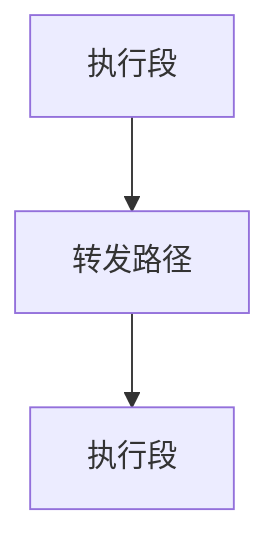

# 5.3 流水线技术

> [!abstract] 核心问题
> 流水线技术的原理是什么？流水线的性能如何计算？流水线的冲突有哪些？如何解决？

## 一、流水线技术的基本原理

### 1. 流水线的定义

**定义**：流水线是将指令执行的各个阶段重叠执行的技术。

**类比**：

```
流水线类比工厂装配线：
- 每个工人负责一个工序
- 多个产品同时在不同工序上加工
- 提高生产效率
```

**原理**：

```
非流水线执行：
指令1：取指 → 译码 → 执行 → 访存 → 写回（5个周期）
指令2：取指 → 译码 → 执行 → 访存 → 写回（5个周期）
总时间：10个周期

流水线执行：
时间1：指令1取指
时间2：指令1译码，指令2取指
时间3：指令1执行，指令2译码，指令3取指
时间4：指令1访存，指令2执行，指令3译码，指令4取指
时间5：指令1写回，指令2访存，指令3执行，指令4译码，指令5取指
总时间：5个周期执行5条指令
```

### 2. 流水线的结构

**组成**：

| 组成 | 说明 |
|-----|------|
| **取指段** | 从内存中取出指令 |
| **译码段** | 解码指令 |
| **执行段** | 执行运算 |
| **访存段** | 访问内存 |
| **写回段** | 写回结果 |

**结构**：


### 3. 流水线的特点

**特点**：

| 特点 | 说明 |
|-----|------|
| **重叠执行** | 多条指令同时在不同阶段执行 |
| **提高吞吐量** | 单位时间内执行更多指令 |
| **不提高单条指令速度** | 单条指令的执行时间不变 |
| **需要缓冲** | 需要寄存器缓冲各阶段的结果 |

## 二、流水线的性能指标

### 1. 吞吐量

**定义**：吞吐量是单位时间内执行的指令数。

**计算公式**：

$$吞吐量 = \frac{指令数}{时间}$$

**示例**：

```
5条指令在5个周期内完成
吞吐量 = 5 / 5 = 1条指令/周期
```

### 2. 加速比

**定义**：加速比是使用流水线后的性能提升倍数。

**计算公式**：

$$加速比 = \frac{非流水线时间}{流水线时间}$$

**示例**：

```
非流水线时间：5条指令 × 5个周期 = 25个周期
流水线时间：5 + 5 - 1 = 9个周期
加速比 = 25 / 9 ≈ 2.78
```

### 3. 效率

**定义**：效率是流水线的利用率。

**计算公式**：

$$效率 = \frac{流水线中实际工作的时间}{流水线总时间}$$

**示例**：

```
流水线总时间：9个周期
实际工作时间：5 × 5 = 25个周期（每个指令在流水线中占用5个周期）
效率 = 25 / (5 × 9) ≈ 55.6%
```

## 三、流水线的冲突

### 1. 结构冲突

**定义**：结构冲突是指多个指令同时需要访问同一硬件资源。

**原因**：

| 原因 | 说明 |
|-----|------|
| **资源共享** | 多个阶段共享同一硬件资源 |
| **资源不足** | 硬件资源数量不足 |

**示例**：

```
结构冲突：
指令1和指令2同时需要访问内存
取指阶段需要读内存
访存阶段也需要读内存
如果只有一个内存端口，就会发生冲突
```

**解决方法**：

| 方法 | 说明 |
|-----|------|
| **增加资源** | 增加硬件资源的数量 |
| **流水线停顿** | 让流水线停顿一个周期 |
| **分时复用** | 不同时间使用同一资源 |

### 2. 数据冲突

**定义**：数据冲突是指指令之间存在数据依赖关系。

**分类**：

| 分类 | 说明 |
|-----|------|
| **写后读冲突（RAW）** | 指令j需要读取指令i写入的数据 |
| **读后写冲突（WAR）** | 指令j写入的数据被指令i读取 |
| **写后写冲突（WAW）** | 指令j写入的数据被指令i覆盖 |

**示例**：

```
数据冲突：
指令1：ADD AX, BX（AX = AX + BX）
指令2：MOV CX, AX（CX = AX）

RAW冲突：指令2需要读取指令1写入的AX
```

**解决方法**：

| 方法 | 说明 |
|-----|------|
| **流水线停顿** | 让流水线停顿一个或多个周期 |
| **数据转发** | 将结果直接转发给需要的阶段 |
| **指令重排序** | 重新排列指令顺序 |

**数据转发**：



### 3. 控制冲突

**定义**：控制冲突是指分支指令导致流水线停顿。

**原因**：

| 原因 | 说明 |
|-----|------|
| **分支预测失败** | 分支预测错误导致流水线清空 |
| **跳转指令** | 跳转指令导致流水线清空 |

**示例**：

```
控制冲突：
指令1：JZ LABEL（如果ZF=1，跳转到LABEL）
指令2：取指（已经取出，但可能被丢弃）
指令3：取指（已经取出，但可能被丢弃）

如果ZF=1，指令2和指令3被丢弃，流水线清空
```

**解决方法**：

| 方法 | 说明 |
|-----|------|
| **分支预测** | 预测分支的方向 |
| **延迟分支** | 在分支指令后插入一条有用的指令 |
| **流水线清空** | 清空流水线中已取出的指令 |

**分支预测**：

| 预测策略 | 说明 |
|-----|------|
| **静态预测** | 总是预测不跳转 |
| **动态预测** | 根据历史记录预测 |
| **两级预测** | 使用两级历史记录预测 |

## 四、流水线的类型

### 1. 单流水线

**定义**：只有一条流水线的处理器。

**特点**：

| 特点 | 说明 |
|-----|------|
| **简单** | 设计简单 |
| **效率低** | 效率较低 |

**示例**：

```
Intel 80486：单流水线处理器
```

### 2. 超标量流水线

**定义**：有多条流水线的处理器。

**特点**：

| 特点 | 说明 |
|-----|------|
| **并行执行** | 多条指令同时执行 |
| **效率高** | 效率较高 |
| **设计复杂** | 设计复杂 |

**示例**：

```
Intel Pentium：超标量处理器，两条流水线
```

### 3. 超流水线

**定义**：将每个阶段进一步细分的处理器。

**特点**：

| 特点 | 说明 |
|-----|------|
| **细分阶段** | 将每个阶段分为多个子阶段 |
| **更高频率** | 可以使用更高的时钟频率 |
| **更多冲突** | 可能产生更多冲突 |

**示例**：

```
Alpha 21264：超流水线处理器
```

### 4. 超标量超流水线

**定义**：同时使用超标量和超流水线技术的处理器。

**特点**：

| 特点 | 说明 |
|-----|------|
| **高性能** | 最高的性能 |
| **非常复杂** | 设计非常复杂 |

**示例**：

```
Intel Core i7：超标量超流水线处理器
```

## 五、流水线的发展

### 1. 流水线的演进

**阶段**：

| 阶段 | 说明 |
|-----|------|
| **单周期** | 一条指令在一个周期内完成 |
| **多周期** | 一条指令在多个周期内完成 |
| **流水线** | 多条指令同时在不同阶段执行 |
| **超标量** | 多条流水线同时执行 |
| **超流水线** | 细分阶段，提高频率 |

### 2. 现代处理器的流水线

**特点**：

| 特点 | 说明 |
|-----|------|
| **深度流水线** | 流水线深度超过20级 |
| **超标量** | 多个发射端口 |
| **乱序执行** | 乱序执行指令 |
| **分支预测** | 先进的分支预测 |

**示例**：

```
Intel Core i9：
- 流水线深度：14级
- 超标量：4个发射端口
- 乱序执行：支持乱序执行
- 分支预测：先进的分支预测
```

> [!warning] 易错点
> 流水线提高的是吞吐量，不是单条指令的执行速度！单条指令的执行时间仍然是5个周期，但单位时间内可以执行更多指令。

---

**导航**：上一节 [[5.2-指令执行过程.md]] · [[MOC - 第5章.md|返回章节导航]]