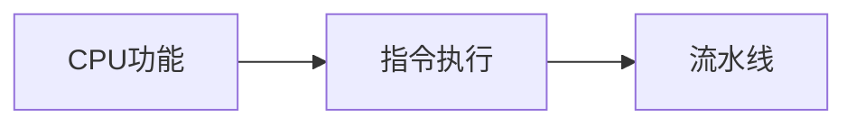

# 第5章-中央处理器CPU

> [!abstract] 本章定位
> 本章介绍CPU的功能、结构和指令执行过程，是理解计算机核心工作原理的关键。

## 学习主线

## 章节内容

- [[5.1-CPU的功能与结构.md]]：CPU的组成、指令周期
- [[5.2-指令执行过程.md]]：取指、译码、执行、访存、写回
- [[5.3-流水线技术.md]]：流水线的基本原理、冲突处理

## 考点汇总

> [!important] 核心考点
> 1. CPU的功能：指令控制、操作控制、时间控制、数据加工
> 2. CPU的组成：运算器、控制器、寄存器
> 3. 指令周期：取指周期、执行周期、访存周期、中断周期
> 4. 指令执行过程：取指、译码、执行、访存、写回
> 5. 流水线技术：流水线的基本原理、流水线的冲突、流水线的性能
> 6. 流水线的冲突：结构冲突、数据冲突、控制冲突

## 前后章节依赖

| 方向 | 章节 | 依赖关系 |
|-----|------|---------|
| 先修 | 第4章 | 指令系统是CPU设计的基础 |
| 后续 | 第6章 | CPU通过总线与其他设备通信 |

## 复习自测

> [!question] 自测题
> 1. CPU的功能是什么？CPU由哪些部分组成？
> 2. 指令周期包括哪些阶段？每个阶段的任务是什么？
> 3. 指令执行的过程是怎样的？
> 4. 流水线技术的原理是什么？流水线的性能如何计算？
> 5. 流水线的冲突有哪些？如何解决？