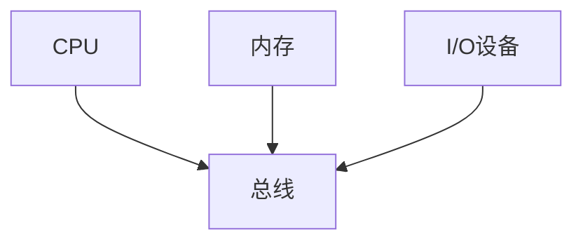

# 6.1 总线概述

> [!abstract] 核心问题
> 总线的定义是什么？总线的分类有哪些？系统总线分为哪几类？各有什么作用？

## 一、总线的定义和作用

### 1. 总线的定义

**定义**：总线是连接计算机各部件的公共通信线路。

**作用**：

| 作用 | 说明 |
|-----|------|
| **连接部件** | 连接CPU、内存、I/O设备等部件 |
| **传输数据** | 在各部件之间传输数据、地址和控制信号 |
| **共享资源** | 多个设备共享总线资源 |

**结构**：



### 2. 总线的特点

**特点**：

| 特点 | 说明 |
|-----|------|
| **共享性** | 多个设备共享总线 |
| **分时性** | 同一时间只有一个设备使用总线 |
| **标准性** | 总线有统一的标准 |
| **扩展性** | 可以方便地扩展设备 |

**示例**：

```
计算机总线：
- CPU通过总线访问内存
- I/O设备通过总线与CPU通信
- 多个设备分时使用总线
```

## 二、总线的分类

### 1. 按层次分类

**片内总线**：

**定义**：片内总线是CPU内部各部件之间的总线。

**特点**：

| 特点 | 说明 |
|-----|------|
| **速度快** | 速度最快 |
| **距离短** | 距离最短 |
| **专用** | CPU内部专用 |

**示例**：

```
CPU内部总线：
- 连接ALU、寄存器、控制器
- 速度非常快
```

**系统总线**：

**定义**：系统总线是计算机各主要部件之间的总线。

**特点**：

| 特点 | 说明 |
|-----|------|
| **速度较快** | 速度较快 |
| **距离较短** | 距离较短 |
| **主要总线** | 计算机的主要总线 |

**示例**：

```
系统总线：
- 连接CPU、内存、I/O接口
- 包括数据总线、地址总线、控制总线
```

**外总线**：

**定义**：外总线是计算机与外部设备之间的总线。

**特点**：

| 特点 | 说明 |
|-----|------|
| **速度较慢** | 速度较慢 |
| **距离较长** | 距离较长 |
| **外部设备** | 连接外部设备 |

**示例**：

```
外总线：
- USB总线、PCIe总线、SATA总线
- 连接硬盘、U盘、显示器等外部设备
```

### 2. 按功能分类

**数据总线**：

**定义**：数据总线是传输数据的总线。

**特点**：

| 特点 | 说明 |
|-----|------|
| **双向传输** | 可以双向传输数据 |
| **位数** | 数据总线的位数决定了一次传输的数据量 |
| **宽度** | 宽度通常为8位、16位、32位、64位 |

**示例**：

```
数据总线：
- 宽度为64位
- 一次可以传输8字节数据
```

**地址总线**：

**定义**：地址总线是传输地址的总线。

**特点**：

| 特点 | 说明 |
|-----|------|
| **单向传输** | 通常是单向传输 |
| **位数** | 地址总线的位数决定了寻址范围 |
| **宽度** | 宽度通常为20位、32位、64位 |

**示例**：

```
地址总线：
- 宽度为32位
- 寻址范围为2^32 = 4GB
```

**控制总线**：

**定义**：控制总线是传输控制信号的总线。

**特点**：

| 特点 | 说明 |
|-----|------|
| **双向传输** | 可以双向传输控制信号 |
| **信号类型** | 包括读写信号、中断信号、时钟信号等 |
| **条数** | 条数根据需要确定 |

**示例**：

```
控制总线：
- 读写信号：控制内存的读写操作
- 中断信号：处理中断请求
- 时钟信号：同步各部件的工作
```

### 3. 按传输方式分类

**并行总线**：

**定义**：并行总线是同时传输多位数据的总线。

**特点**：

| 特点 | 说明 |
|-----|------|
| **速度快** | 速度快 |
| **距离短** | 距离短 |
| **成本高** | 成本高 |

**示例**：

```
并行总线：
- PCI总线、ISA总线
- 同时传输多位数据
```

**串行总线**：

**定义**：串行总线是逐位传输数据的总线。

**特点**：

| 特点 | 说明 |
|-----|------|
| **速度较慢** | 速度较慢 |
| **距离长** | 距离长 |
| **成本低** | 成本低 |

**示例**：

```
串行总线：
- USB总线、PCIe总线、SATA总线
- 逐位传输数据
```

## 三、总线的性能指标

### 1. 总线宽度

**定义**：总线宽度是总线一次能传输的数据位数。

**计算公式**：

$$总线宽度 = 数据总线位数$$

**示例**：

```
数据总线宽度：64位
含义：一次可以传输8字节数据
```

### 2. 总线频率

**定义**：总线频率是总线工作的时钟频率。

**单位**：

| 单位 | 说明 |
|-----|------|
| **MHz** | 兆赫兹 |
| **GHz** | 吉赫兹 |

**示例**：

```
总线频率：100 MHz
含义：总线每秒工作1亿个时钟周期
```

### 3. 总线带宽

**定义**：总线带宽是总线单位时间内传输的数据量。

**计算公式**：

$$总线带宽 = \frac{总线宽度 \times 总线频率}{8}$$

**示例**：

```
总线宽度：64位
总线频率：100 MHz
总线带宽 = (64 × 100 MHz) / 8 = 800 MB/s
```

### 4. 总线延迟

**定义**：总线延迟是总线传输数据的时间。

**计算公式**：

$$总线延迟 = \frac{1}{总线频率}$$

**示例**：

```
总线频率：100 MHz
总线延迟 = 1 / 100 MHz = 10 ns
```

## 四、常见总线标准

### 1. PCI总线

**定义**：PCI总线是外设部件互连总线。

**特点**：

| 特点 | 说明 |
|-----|------|
| **并行总线** | 32位或64位并行传输 |
| **频率** | 33 MHz或66 MHz |
| **带宽** | 133 MB/s或533 MB/s |

**应用**：

| 应用 | 说明 |
|-----|------|
| **显卡** | 连接显卡 |
| **网卡** | 连接网卡 |
| **声卡** | 连接声卡 |

### 2. PCIe总线

**定义**：PCIe总线是PCI Express总线。

**特点**：

| 特点 | 说明 |
|-----|------|
| **串行总线** | 串行传输 |
| **频率** | 2.5 GHz、5 GHz、8 GHz等 |
| **带宽** | 每个通道1 GB/s、2 GB/s、4 GB/s等 |

**应用**：

| 应用 | 说明 |
|-----|------|
| **显卡** | 连接高性能显卡 |
| **固态硬盘** | 连接NVMe固态硬盘 |
| **网卡** | 连接高性能网卡 |

### 3. USB总线

**定义**：USB总线是通用串行总线。

**特点**：

| 特点 | 说明 |
|-----|------|
| **串行总线** | 串行传输 |
| **版本** | USB 1.0、USB 2.0、USB 3.0、USB 4.0 |
| **带宽** | 1.5 MB/s、480 MB/s、5 Gb/s、40 Gb/s |

**应用**：

| 应用 | 说明 |
|-----|------|
| **U盘** | 连接U盘 |
| **鼠标** | 连接鼠标 |
| **键盘** | 连接键盘 |

### 4. SATA总线

**定义**：SATA总线是串行ATA总线。

**特点**：

| 特点 | 说明 |
|-----|------|
| **串行总线** | 串行传输 |
| **版本** | SATA I、SATA II、SATA III |
| **带宽** | 1.5 Gb/s、3 Gb/s、6 Gb/s |

**应用**：

| 应用 | 说明 |
|-----|------|
| **硬盘** | 连接机械硬盘 |
| **固态硬盘** | 连接SATA固态硬盘 |

> [!warning] 易错点
> 系统总线分为数据总线、地址总线和控制总线！数据总线传输数据，地址总线传输地址，控制总线传输控制信号。

---

**导航**：[[MOC - 第6章.md|返回章节导航]] · 下一节 [[6.2-总线仲裁.md]]