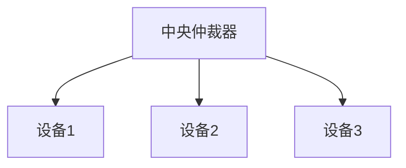
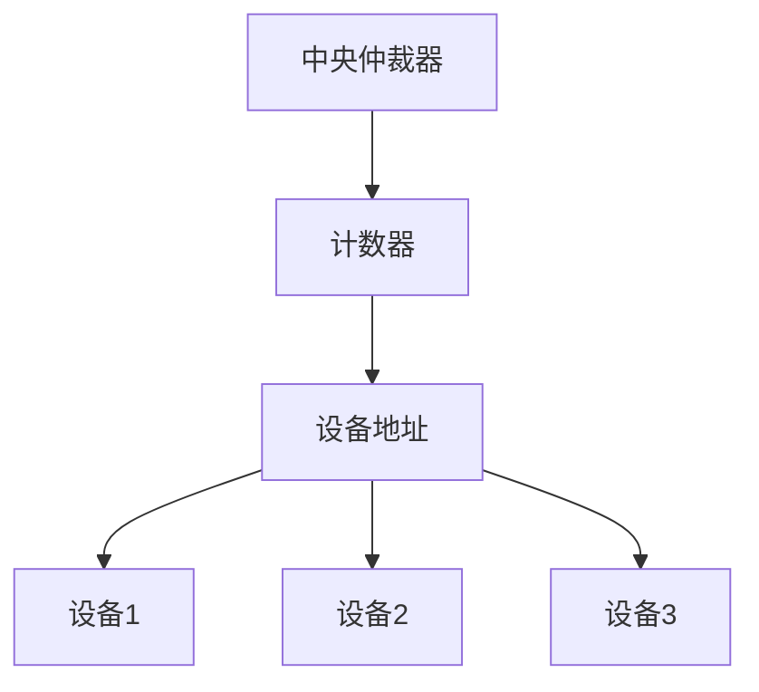
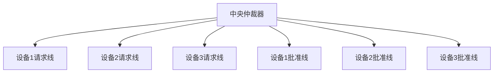
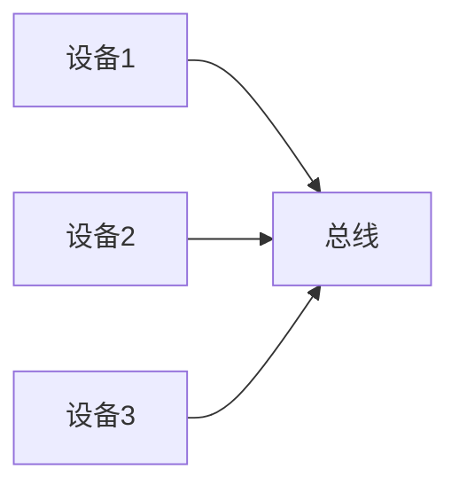

# 6.2 总线仲裁

> [!abstract] 核心问题
> 总线仲裁的方式有哪些？集中式仲裁的三种方式是什么？各有什么优缺点？

## 一、总线仲裁的定义和作用

### 1. 总线仲裁的定义

**定义**：总线仲裁是解决多个设备同时请求使用总线的机制。

**问题**：

| 问题 | 说明 |
|-----|------|
| **冲突** | 多个设备同时请求使用总线 |
| **竞争** | 设备之间竞争总线使用权 |
| **死锁** | 设备之间互相等待 |

**作用**：

| 作用 | 说明 |
|-----|------|
| **解决冲突** | 解决设备之间的总线冲突 |
| **分配总线** | 合理分配总线使用权 |
| **提高效率** | 提高总线的使用效率 |

### 2. 总线仲裁的分类

**分类**：

| 分类 | 说明 |
|-----|------|
| **集中式仲裁** | 由一个中央仲裁器负责仲裁 |
| **分布式仲裁** | 由各个设备自己负责仲裁 |

## 二、集中式仲裁

### 1. 集中式仲裁的定义

**定义**：集中式仲裁是由一个中央仲裁器负责仲裁。

**结构**：



**特点**：

| 特点 | 说明 |
|-----|------|
| **集中控制** | 由中央仲裁器控制 |
| **简单** | 实现简单 |
| **单点故障** | 中央仲裁器故障会导致系统瘫痪 |

### 2. 链式查询方式

**定义**：链式查询方式是通过链式连接设备进行仲裁。

**结构**：


**工作原理**：

| 步骤 | 说明 |
|-----|------|
| **请求** | 设备发送总线请求 |
| **查询** | 中央仲裁器发送查询信号 |
| **响应** | 设备响应查询信号 |
| **分配** | 中央仲裁器分配总线使用权 |

**示例**：

```
链式查询流程：
1. 设备3发送总线请求
2. 中央仲裁器发送查询信号
3. 查询信号依次经过设备1、设备2、设备3
4. 设备3响应查询信号
5. 中央仲裁器将总线使用权分配给设备3
```

**优点**：

| 优点 | 说明 |
|-----|------|
| **简单** | 实现简单 |
| **成本低** | 成本低 |
| **易于扩展** | 易于扩展设备 |

**缺点**：

| 缺点 | 说明 |
|-----|------|
| **优先级固定** | 靠近仲裁器的设备优先级高 |
| **查询延迟** | 查询延迟较长 |
| **可靠性** | 链路故障会影响后面的设备 |

### 3. 计数器定时查询方式

**定义**：计数器定时查询方式是通过计数器进行仲裁。

**结构**：



**工作原理**：

| 步骤 | 说明 |
|-----|------|
| **请求** | 设备发送总线请求 |
| **计数** | 中央仲裁器启动计数器 |
| **查询** | 计数器依次查询设备 |
| **响应** | 设备响应查询 |
| **分配** | 中央仲裁器分配总线使用权 |

**示例**：

```
计数器定时查询流程：
1. 设备2发送总线请求
2. 中央仲裁器启动计数器，从0开始计数
3. 计数器查询设备0（无响应）
4. 计数器查询设备1（无响应）
5. 计数器查询设备2（有响应）
6. 中央仲裁器将总线使用权分配给设备2
```

**优点**：

| 优点 | 说明 |
|-----|------|
| **优先级可控** | 可以通过设置计数器初始值改变优先级 |
| **查询速度较快** | 查询速度较快 |
| **可靠性较高** | 可靠性较高 |

**缺点**：

| 缺点 | 说明 |
|-----|------|
| **实现较复杂** | 实现较复杂 |
| **成本较高** | 成本较高 |
| **查询延迟** | 查询延迟与设备数量有关 |

### 4. 独立请求方式

**定义**：独立请求方式是每个设备都有独立的请求线和批准线。

**结构**：



**工作原理**：

| 步骤 | 说明 |
|-----|------|
| **请求** | 设备发送独立的总线请求 |
| **仲裁** | 中央仲裁器根据优先级选择设备 |
| **批准** | 中央仲裁器发送批准信号 |
| **使用** | 设备使用总线 |

**示例**：

```
独立请求流程：
1. 设备1和设备3同时发送总线请求
2. 中央仲裁器根据优先级选择设备1
3. 中央仲裁器向设备1发送批准信号
4. 设备1使用总线
```

**优点**：

| 优点 | 说明 |
|-----|------|
| **响应速度快** | 响应速度最快 |
| **优先级灵活** | 可以灵活设置优先级 |
| **可靠性高** | 可靠性高 |

**缺点**：

| 缺点 | 说明 |
|-----|------|
| **实现复杂** | 实现最复杂 |
| **成本高** | 成本最高 |
| **线数多** | 需要大量的请求线和批准线 |

### 5. 集中式仲裁方式对比

**对比表**：

| 对比项 | 链式查询 | 计数器定时查询 | 独立请求 |
|-------|---------|---------------|---------|
| **实现复杂度** | 简单 | 中等 | 复杂 |
| **成本** | 低 | 中等 | 高 |
| **响应速度** | 慢 | 中等 | 快 |
| **优先级** | 固定 | 可控 | 灵活 |
| **可靠性** | 低 | 中等 | 高 |
| **线数** | 少 | 中等 | 多 |

## 三、分布式仲裁

### 1. 分布式仲裁的定义

**定义**：分布式仲裁是由各个设备自己负责仲裁。

**结构**：



**特点**：

| 特点 | 说明 |
|-----|------|
| **分布式控制** | 由各个设备自己控制 |
| **无单点故障** | 没有单点故障 |
| **实现复杂** | 实现复杂 |

### 2. 分布式仲裁的方式

**自举方式**：

**定义**：自举方式是设备通过竞争获得总线使用权。

**原理**：

| 原理 | 说明 |
|-----|------|
| **竞争** | 设备同时发送请求 |
| **识别** | 设备识别自己是否获胜 |
| **使用** | 获胜设备使用总线 |

**示例**：

```
自举方式流程：
1. 设备1、设备2、设备3同时发送总线请求
2. 设备根据优先级判断自己是否获胜
3. 优先级最高的设备获胜
4. 获胜设备使用总线
```

**冲突检测方式**：

**定义**：冲突检测方式是设备检测总线上的冲突。

**原理**：

| 原理 | 说明 |
|-----|------|
| **发送** | 设备发送请求 |
| **检测** | 设备检测是否有冲突 |
| **重发** | 如果有冲突，设备等待后重发 |

**示例**：

```
冲突检测方式流程：
1. 设备1和设备2同时发送总线请求
2. 检测到冲突
3. 设备等待随机时间后重发
4. 设备1先发送，获得总线使用权
```

### 3. 分布式仲裁的优缺点

**优点**：

| 优点 | 说明 |
|-----|------|
| **无单点故障** | 没有单点故障 |
| **可靠性高** | 可靠性高 |
| **易于扩展** | 易于扩展设备 |

**缺点**：

| 缺点 | 说明 |
|-----|------|
| **实现复杂** | 实现复杂 |
| **响应速度慢** | 响应速度较慢 |
| **可能死锁** | 可能发生死锁 |

> [!warning] 易错点
> 集中式仲裁有三种方式：链式查询、计数器定时查询和独立请求！链式查询最简单但优先级固定，独立请求最复杂但响应速度最快。

---

**导航**：上一节 [[6.1-总线概述.md]] · [[MOC - 第6章.md|返回章节导航]] · 下一节 [[6.3-总线操作与定时.md]]