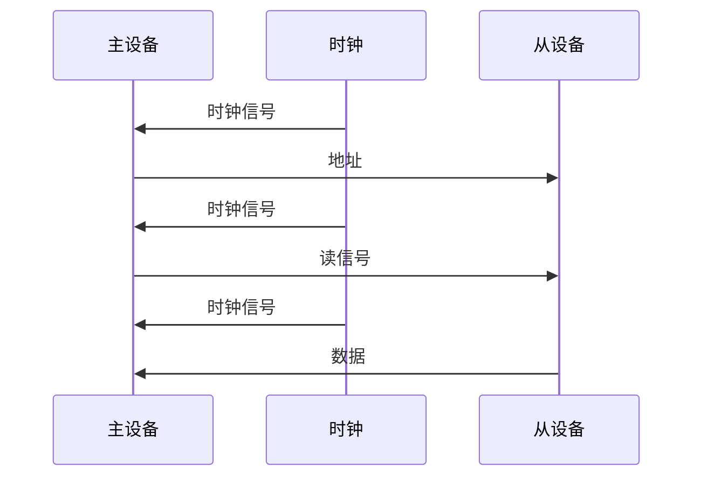
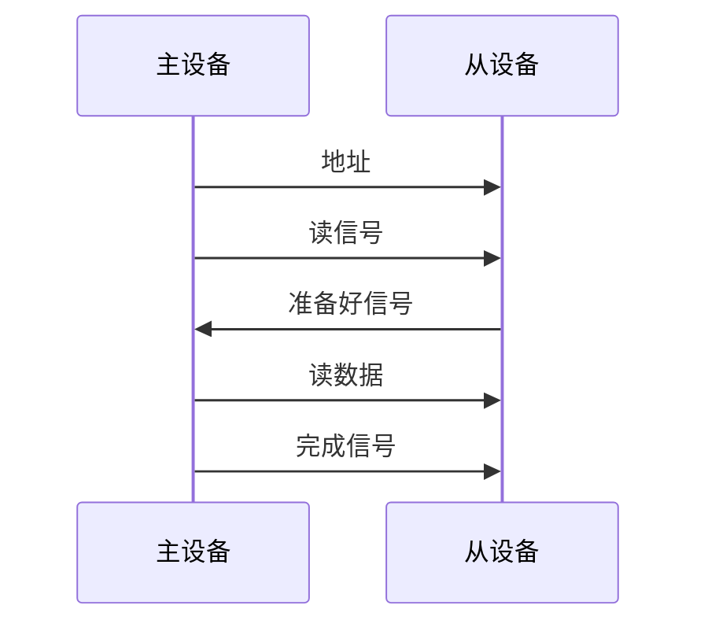
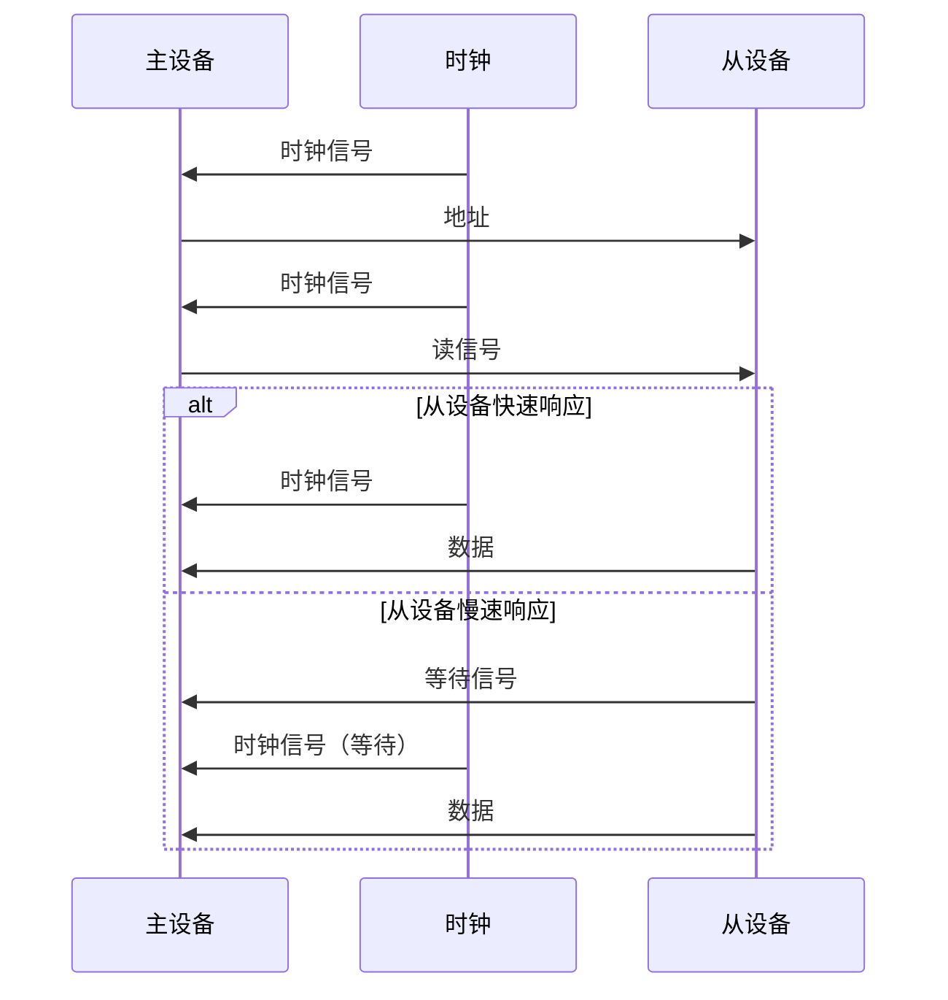

# 6.3 总线操作与定时

> [!abstract] 核心问题
> 总线定时的方式有哪些？同步定时和异步定时的区别是什么？半同步定时的原理是什么？

## 一、总线操作的定义和类型

### 1. 总线操作的定义

**定义**：总线操作是指设备通过总线进行数据传输的过程。

**类型**：

| 类型 | 说明 |
|-----|------|
| **读操作** | 从设备读取数据 |
| **写操作** | 向设备写入数据 |
| **地址传输** | 传输地址信息 |
| **控制传输** | 传输控制信息 |

### 2. 总线操作的过程

**读操作过程**：

| 步骤 | 说明 |
|-----|------|
| **送地址** | 主设备将地址送到地址总线 |
| **发读信号** | 主设备发送读控制信号 |
| **等待** | 主设备等待从设备响应 |
| **读数据** | 主设备从数据总线读取数据 |

**写操作过程**：

| 步骤 | 说明 |
|-----|------|
| **送地址** | 主设备将地址送到地址总线 |
| **送数据** | 主设备将数据送到数据总线 |
| **发写信号** | 主设备发送写控制信号 |
| **等待** | 主设备等待从设备响应 |

## 二、总线定时的方式

### 1. 同步定时

**定义**：同步定时是使用统一的时钟信号控制总线操作。

**原理**：

| 原理 | 说明 |
|-----|------|
| **统一时钟** | 使用统一的时钟信号 |
| **固定周期** | 每个总线操作占用固定的时钟周期 |
| **同步操作** | 所有设备同步操作 |

**时序图**：



**优点**：

| 优点 | 说明 |
|-----|------|
| **简单** | 实现简单 |
| **可靠** | 可靠性高 |
| **快速** | 速度快 |

**缺点**：

| 缺点 | 说明 |
|-----|------|
| **不灵活** | 不灵活，不能适应不同速度的设备 |
| **时钟偏移** | 时钟偏移会影响可靠性 |
| **距离限制** | 传输距离有限 |

### 2. 异步定时

**定义**：异步定时是使用握手信号控制总线操作。

**原理**：

| 原理 | 说明 |
|-----|------|
| **握手信号** | 使用握手信号协调 |
| **可变周期** | 每个总线操作占用可变的时间 |
| **异步操作** | 设备之间异步操作 |

**时序图**：



**全互锁方式**：

**定义**：全互锁方式是主设备和从设备之间完全互锁。

**原理**：

| 原理 | 说明 |
|-----|------|
| **主设备请求** | 主设备发送请求 |
| **从设备响应** | 从设备发送响应 |
| **主设备确认** | 主设备发送确认 |
| **从设备完成** | 从设备发送完成 |

**示例**：

```
全互锁流程：
1. 主设备发送读请求
2. 从设备发送准备好信号
3. 主设备读取数据
4. 主设备发送完成信号
5. 从设备取消准备好信号
```

**半互锁方式**：

**定义**：半互锁方式是主设备和从设备之间部分互锁。

**原理**：

| 原理 | 说明 |
|-----|------|
| **主设备请求** | 主设备发送请求 |
| **从设备响应** | 从设备发送响应 |
| **主设备完成** | 主设备完成操作 |

**示例**：

```
半互锁流程：
1. 主设备发送读请求
2. 从设备发送准备好信号
3. 主设备读取数据（不需要发送完成信号）
```

**优点**：

| 优点 | 说明 |
|-----|------|
| **灵活** | 灵活，可以适应不同速度的设备 |
| **距离远** | 传输距离远 |
| **可靠** | 可靠性高 |

**缺点**：

| 缺点 | 说明 |
|-----|------|
| **复杂** | 实现复杂 |
| **速度慢** | 速度较慢 |
| **握手延迟** | 握手信号会增加延迟 |

### 3. 半同步定时

**定义**：半同步定时是结合同步定时和异步定时。

**原理**：

| 原理 | 说明 |
|-----|------|
| **基本同步** | 大部分操作使用同步定时 |
| **异步等待** | 需要时使用异步等待 |
| **兼顾效率** | 兼顾效率和灵活性 |

**时序图**：



**优点**：

| 优点 | 说明 |
|-----|------|
| **高效** | 高效，大部分操作快速 |
| **灵活** | 灵活，可以适应慢速设备 |
| **简单** | 实现相对简单 |

**缺点**：

| 缺点 | 说明 |
|-----|------|
| **比同步慢** | 比纯同步定时慢 |
| **比异步复杂** | 比纯异步定时复杂 |

## 三、总线操作的实例

### 1. 内存读操作

**同步定时**：

```
时序：
时钟1：主设备送地址
时钟2：主设备发读信号
时钟3：从设备送数据
时钟4：主设备读数据
```

**异步定时**：

```
时序：
主设备送地址
主设备发读信号
从设备送准备好信号
主设备读数据
主设备发完成信号
```

### 2. 内存写操作

**同步定时**：

```
时序：
时钟1：主设备送地址
时钟2：主设备送数据
时钟3：主设备发写信号
时钟4：从设备写数据
```

**异步定时**：

```
时序：
主设备送地址
主设备送数据
主设备发写信号
从设备送完成信号
```

### 3. I/O操作

**同步定时**：

```
时序：
时钟1：主设备送端口地址
时钟2：主设备发读/写信号
时钟3：I/O设备送/收数据
时钟4：主设备读/写数据
```

**异步定时**：

```
时序：
主设备送端口地址
主设备发读/写信号
I/O设备送准备好信号
主设备读/写数据
主设备发完成信号
```

## 四、总线定时的选择

### 1. 选择因素

**因素**：

| 因素 | 说明 |
|-----|------|
| **设备速度** | 设备的速度 |
| **传输距离** | 传输距离 |
| **可靠性** | 可靠性要求 |
| **成本** | 成本预算 |

### 2. 选择建议

**同步定时**：

**适用场景**：

| 场景 | 说明 |
|-----|------|
| **高速设备** | 设备速度相近 |
| **短距离** | 传输距离短 |
| **低成本** | 成本预算低 |

**异步定时**：

**适用场景**：

| 场景 | 说明 |
|-----|------|
| **低速设备** | 设备速度差异大 |
| **长距离** | 传输距离长 |
| **高可靠性** | 可靠性要求高 |

**半同步定时**：

**适用场景**：

| 场景 | 说明 |
|-----|------|
| **混合速度** | 设备速度混合 |
| **中等距离** | 传输距离中等 |
| **平衡效率** | 需要平衡效率和灵活性 |

> [!warning] 易错点
> 同步定时使用统一时钟，异步定时使用握手信号！同步定时简单但不灵活，异步定时灵活但复杂。

---

**导航**：上一节 [[6.2-总线仲裁.md]] · [[MOC - 第6章.md|返回章节导航]]