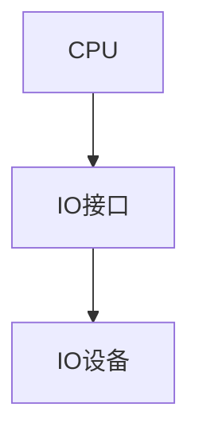
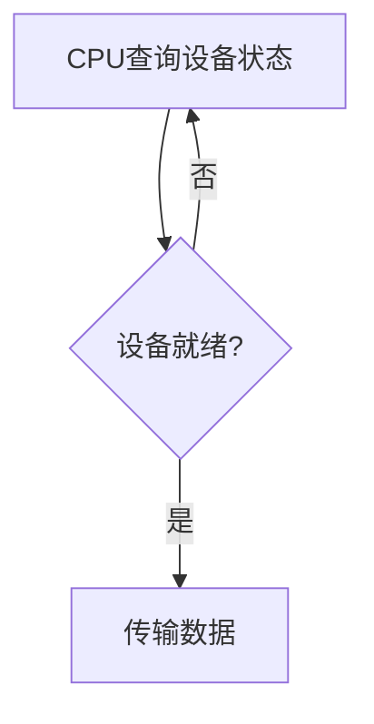
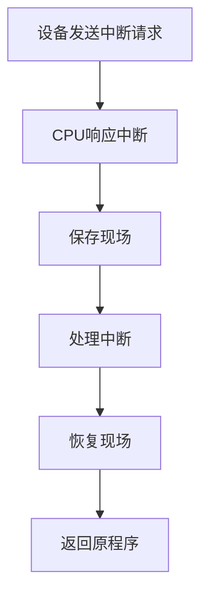
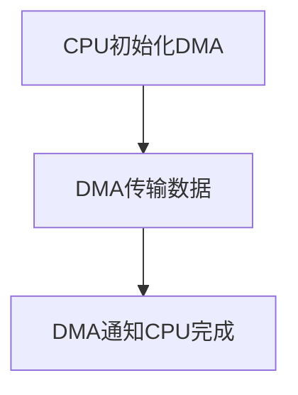
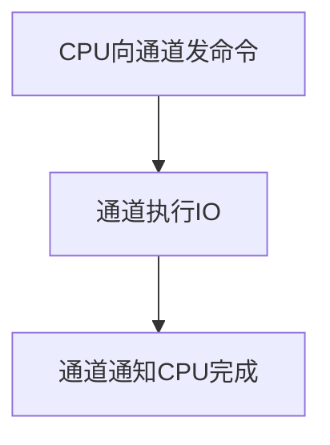

# 7.1 IO系统概述

> [!abstract] 核心问题
> IO设备如何分类？IO接口的作用是什么？IO控制方式有哪些？

## 一、IO设备的分类

### 1. 按用途分类

**输入设备**：

**定义**：输入设备是向计算机输入数据和指令的设备。

**常见设备**：

| 设备 | 说明 |
|-----|------|
| **键盘** | 输入字符和命令 |
| **鼠标** | 控制光标和选择 |
| **扫描仪** | 输入图像 |
| **麦克风** | 输入声音 |

**输出设备**：

**定义**：输出设备是将计算机处理结果输出的设备。

**常见设备**：

| 设备 | 说明 |
|-----|------|
| **显示器** | 显示文字和图像 |
| **打印机** | 打印文字和图像 |
| **音箱** | 输出声音 |
| **绘图仪** | 绘制图形 |

**存储设备**：

**定义**：存储设备是用于存储数据的设备。

**常见设备**：

| 设备 | 说明 |
|-----|------|
| **硬盘** | 大容量磁性存储 |
| **SSD** | 固态硬盘 |
| **U盘** | 便携式存储 |
| **光盘** | 光学存储 |

### 2. 按传输方式分类

**串行设备**：

**定义**：串行设备是逐位传输数据的设备。

**特点**：

| 特点 | 说明 |
|-----|------|
| **速度慢** | 速度较慢 |
| **距离长** | 距离长 |
| **成本低** | 成本低 |

**示例**：

```
串行设备：
- 鼠标、键盘、串口设备
```

**并行设备**：

**定义**：并行设备是同时传输多位数据的设备。

**特点**：

| 特点 | 说明 |
|-----|------|
| **速度快** | 速度快 |
| **距离短** | 距离短 |
| **成本高** | 成本高 |

**示例**：

```
并行设备：
- 打印机、硬盘、显示器
```

### 3. 按速度分类

**低速设备**：

**定义**：低速设备是传输速度较慢的设备。

**特点**：

| 特点 | 说明 |
|-----|------|
| **速度慢** | 传输速度低于1 KB/s |
| **人机交互** | 通常与人机交互有关 |

**示例**：

```
低速设备：
- 键盘、鼠标、打印机
```

**中速设备**：

**定义**：中速设备是传输速度中等的设备。

**特点**：

| 特点 | 说明 |
|-----|------|
| **速度中等** | 传输速度在1 KB/s到1 MB/s之间 |
| **数据传输** | 通常用于数据传输 |

**示例**：

```
中速设备：
- 硬盘、U盘、光盘
```

**高速设备**：

**定义**：高速设备是传输速度较快的设备。

**特点**：

| 特点 | 说明 |
|-----|------|
| **速度快** | 传输速度高于1 MB/s |
| **大量数据** | 通常用于大量数据传输 |

**示例**：

```
高速设备：
- SSD、内存、网络接口
```

## 二、IO接口

### 1. IO接口的定义

**定义**：IO接口是连接CPU和IO设备的逻辑电路。

**作用**：

| 作用 | 说明 |
|-----|------|
| **连接** | 连接CPU和IO设备 |
| **缓冲** | 缓冲数据 |
| **控制** | 控制IO操作 |
| **转换** | 转换数据格式 |

**结构**：



### 2. IO接口的组成

**数据寄存器**：

**定义**：数据寄存器用于暂存传输的数据。

**作用**：

| 作用 | 说明 |
|-----|------|
| **输入缓冲** | 缓冲输入数据 |
| **输出缓冲** | 缓冲输出数据 |

**示例**：

```
数据寄存器：
- 输入数据寄存器：存储从设备输入的数据
- 输出数据寄存器：存储要输出到设备的数据
```

**状态寄存器**：

**定义**：状态寄存器用于存储设备的状态。

**作用**：

| 作用 | 说明 |
|-----|------|
| **就绪状态** | 设备是否就绪 |
| **忙状态** | 设备是否忙碌 |
| **错误状态** | 是否发生错误 |

**示例**：

```
状态寄存器：
- bit0：设备就绪
- bit1：设备忙碌
- bit2：错误标志
```

**控制寄存器**：

**定义**：控制寄存器用于存储控制命令。

**作用**：

| 作用 | 说明 |
|-----|------|
| **启动命令** | 启动设备 |
| **停止命令** | 停止设备 |
| **模式选择** | 选择工作模式 |

**示例**：

```
控制寄存器：
- bit0：启动设备
- bit1：停止设备
- bit2：中断允许
```

### 3. IO接口的类型

**并行接口**：

**定义**：并行接口是同时传输多位数据的接口。

**特点**：

| 特点 | 说明 |
|-----|------|
| **速度快** | 速度快 |
| **距离短** | 距离短 |
| **成本高** | 成本高 |

**示例**：

```
并行接口：
- PCI接口、ISA接口
```

**串行接口**：

**定义**：串行接口是逐位传输数据的接口。

**特点**：

| 特点 | 说明 |
|-----|------|
| **速度慢** | 速度慢 |
| **距离长** | 距离长 |
| **成本低** | 成本低 |

**示例**：

```
串行接口：
- USB接口、串口、网口
```

**通用接口**：

**定义**：通用接口是可以连接多种设备的接口。

**特点**：

| 特点 | 说明 |
|-----|------|
| **通用性** | 可以连接多种设备 |
| **标准化** | 有统一的标准 |

**示例**：

```
通用接口：
- USB接口、PCIe接口
```

## 三、IO控制方式

### 1. 程序查询方式

**定义**：程序查询方式是CPU通过程序查询设备状态。

**原理**：

| 原理 | 说明 |
|-----|------|
| **查询** | CPU不断查询设备状态 |
| **等待** | CPU等待设备就绪 |
| **传输** | 设备就绪后传输数据 |

**流程**：



**优点**：

| 优点 | 说明 |
|-----|------|
| **简单** | 实现简单 |
| **可靠** | 可靠性高 |

**缺点**：

| 缺点 | 说明 |
|-----|------|
| **效率低** | CPU利用率低 |
| **等待时间长** | CPU需要等待设备 |

### 2. 中断方式

**定义**：中断方式是设备通过中断通知CPU。

**原理**：

| 原理 | 说明 |
|-----|------|
| **请求** | 设备发送中断请求 |
| **响应** | CPU响应中断 |
| **处理** | CPU处理中断 |
| **返回** | CPU返回原程序 |

**流程**：



**优点**：

| 优点 | 说明 |
|-----|------|
| **效率高** | CPU利用率高 |
| **及时** | 可以及时处理设备请求 |

**缺点**：

| 缺点 | 说明 |
|-----|------|
| **开销大** | 中断处理有开销 |
| **可能丢失** | 可能丢失中断 |

### 3. DMA方式

**定义**：DMA方式是直接内存访问，不需要CPU干预。

**原理**：

| 原理 | 说明 |
|-----|------|
| **初始化** | CPU初始化DMA控制器 |
| **传输** | DMA控制器直接传输数据 |
| **完成** | DMA控制器通知CPU |

**流程**：



**优点**：

| 优点 | 说明 |
|-----|------|
| **效率高** | 不需要CPU干预 |
| **速度快** | 传输速度快 |

**缺点**：

| 缺点 | 说明 |
|-----|------|
| **硬件复杂** | 需要DMA控制器 |
| **成本高** | 成本较高 |

### 4. 通道方式

**定义**：通道方式是使用通道处理器控制IO。

**原理**：

| 原理 | 说明 |
|-----|------|
| **命令** | CPU向通道发送命令 |
| **执行** | 通道执行IO操作 |
| **完成** | 通道通知CPU完成 |

**流程**：



**优点**：

| 优点 | 说明 |
|-----|------|
| **效率高** | CPU可以做其他工作 |
| **灵活** | 可以处理复杂IO |

**缺点**：

| 缺点 | 说明 |
|-----|------|
| **硬件复杂** | 需要通道处理器 |
| **成本高** | 成本较高 |

### 5. IO控制方式对比

**对比表**：

| 对比项 | 程序查询 | 中断方式 | DMA方式 | 通道方式 |
|-------|---------|---------|---------|---------|
| **CPU干预** | 完全干预 | 部分干预 | 不干预 | 不干预 |
| **效率** | 低 | 中 | 高 | 高 |
| **硬件复杂度** | 低 | 中 | 高 | 很高 |
| **成本** | 低 | 中 | 高 | 很高 |
| **适用场景** | 低速设备 | 中速设备 | 高速设备 | 大型系统 |

> [!warning] 易错点
> IO控制方式有四种：程序查询、中断、DMA和通道！程序查询最简单但效率最低，DMA和通道效率最高但硬件复杂。

---

**导航**：[[MOC - 第7章.md|返回章节导航]] · 下一节 [[7.2-程序查询方式.md]]