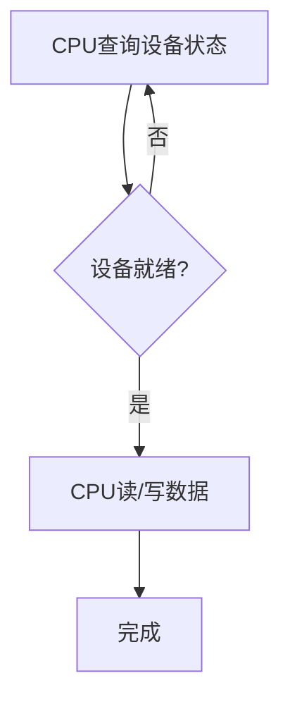

# 7.2 程序查询方式

> [!abstract] 核心问题
> 程序查询方式的流程是怎样的？程序查询方式的优缺点是什么？如何实现程序查询？

## 一、程序查询方式的基本原理

### 1. 程序查询的定义

**定义**：程序查询方式是CPU通过程序不断查询设备状态，直到设备就绪后进行数据传输。

**原理**：

| 原理 | 说明 |
|-----|------|
| **循环查询** | CPU循环查询设备状态 |
| **忙等待** | CPU在设备忙碌时等待 |
| **数据传输** | 设备就绪后进行数据传输 |

**流程图**：



### 2. 程序查询的步骤

**步骤**：

| 步骤 | 说明 |
|-----|------|
| **送地址** | CPU将设备地址送到地址总线 |
| **查状态** | CPU读取设备状态寄存器 |
| **判断** | CPU判断设备是否就绪 |
| **等待** | 如果设备未就绪，CPU继续查询 |
| **传输** | 如果设备就绪，CPU传输数据 |

**示例**：

```
程序查询流程：
1. CPU将设备地址0x20送到地址总线
2. CPU读取状态寄存器
3. CPU判断状态寄存器的就绪位
4. 如果未就绪，重复步骤2-3
5. 如果就绪，CPU读取或写入数据
```

## 二、程序查询方式的实现

### 1. 输入操作

**流程**：

```
输入操作流程：
1. CPU将设备地址送到地址总线
2. CPU读取状态寄存器
3. CPU判断就绪位
4. 如果未就绪，继续查询
5. 如果就绪，CPU读取数据寄存器
```

**代码示例**：

```
INPUT_LOOP:
    IN AL, STATUS_PORT    ; 读取状态寄存器
    AND AL, 01H           ; 判断就绪位
    JZ INPUT_LOOP         ; 如果未就绪，继续查询
    IN AL, DATA_PORT      ; 如果就绪，读取数据
```

### 2. 输出操作

**流程**：

```
输出操作流程：
1. CPU将设备地址送到地址总线
2. CPU读取状态寄存器
3. CPU判断就绪位
4. 如果未就绪，继续查询
5. 如果就绪，CPU写入数据寄存器
```

**代码示例**：

```
OUTPUT_LOOP:
    IN AL, STATUS_PORT    ; 读取状态寄存器
    AND AL, 01H           ; 判断就绪位
    JZ OUTPUT_LOOP        ; 如果未就绪，继续查询
    OUT DATA_PORT, AL     ; 如果就绪，写入数据
```

### 3. 查询方式的特点

**特点**：

| 特点 | 说明 |
|-----|------|
| **简单** | 实现简单 |
| **可靠** | 可靠性高 |
| **CPU忙等待** | CPU在等待时不能做其他工作 |
| **效率低** | CPU利用率低 |

## 三、程序查询方式的优缺点

### 1. 优点

**优点**：

| 优点 | 说明 |
|-----|------|
| **实现简单** | 不需要复杂的硬件支持 |
| **可靠性高** | 不会丢失数据 |
| **控制简单** | 程序容易编写和调试 |

**示例**：

```
程序查询的优点：
- 不需要中断控制器
- 不需要DMA控制器
- 程序逻辑简单
```

### 2. 缺点

**缺点**：

| 缺点 | 说明 |
|-----|------|
| **CPU利用率低** | CPU在等待时不能做其他工作 |
| **响应时间长** | 设备请求可能需要较长时间才能被处理 |
| **不适合高速设备** | 高速设备需要快速响应 |

**示例**：

```
程序查询的缺点：
- CPU可能花费99%的时间等待
- 设备请求可能被延迟
- 高速设备可能因等待而丢失数据
```

### 3. 适用场景

**适用场景**：

| 场景 | 说明 |
|-----|------|
| **低速设备** | 键盘、鼠标等低速设备 |
| **简单系统** | 嵌入式系统等简单系统 |
| **低优先级任务** | 低优先级的IO任务 |

**不适用场景**：

| 场景 | 说明 |
|-----|------|
| **高速设备** | 硬盘、网络等高速设备 |
| **实时系统** | 需要快速响应的实时系统 |
| **多任务系统** | 需要同时处理多个任务的系统 |

## 四、程序查询方式的改进

### 1. 定时查询

**定义**：定时查询是CPU定期查询设备状态。

**原理**：

| 原理 | 说明 |
|-----|------|
| **定时** | CPU每隔一定时间查询一次 |
| **间隔** | 查询间隔根据设备速度确定 |

**优点**：

| 优点 | 说明 |
|-----|------|
| **CPU可以做其他工作** | 在查询间隔期间，CPU可以做其他工作 |
| **响应时间可控** | 响应时间由查询间隔决定 |

**缺点**：

| 缺点 | 说明 |
|-----|------|
| **响应时间不确定** | 如果设备在查询间隔之后就绪，需要等待下一次查询 |
| **可能丢失数据** | 如果设备数据缓冲区溢出 |

### 2. 条件查询

**定义**：条件查询是CPU在执行其他任务时，顺便查询设备状态。

**原理**：

| 原理 | 说明 |
|-----|------|
| **顺便查询** | CPU在执行其他任务时，顺便查询设备状态 |
| **不专门等待** | CPU不专门等待设备 |

**优点**：

| 优点 | 说明 |
|-----|------|
| **CPU利用率高** | CPU可以同时做其他工作 |
| **简单** | 实现简单 |

**缺点**：

| 缺点 | 说明 |
|-----|------|
| **响应时间不确定** | 响应时间取决于CPU何时查询 |
| **可能丢失数据** | 如果设备数据缓冲区溢出 |

### 3. 查询方式的改进对比

**对比表**：

| 对比项 | 简单查询 | 定时查询 | 条件查询 |
|-------|---------|---------|---------|
| **CPU利用率** | 低 | 中 | 高 |
| **响应时间** | 短（但CPU等待） | 中等 | 不确定 |
| **实现复杂度** | 简单 | 中等 | 中等 |
| **可靠性** | 高 | 中 | 中 |

## 五、程序查询方式的实例

### 1. 键盘输入

**流程**：

```
键盘输入流程：
1. CPU查询键盘状态寄存器
2. 判断是否有按键按下
3. 如果有按键按下，读取按键代码
4. 如果没有按键按下，继续查询
```

**代码示例**：

```
KEYBOARD_LOOP:
    IN AL, KEYBOARD_STATUS  ; 读取键盘状态
    AND AL, 80H             ; 判断是否有按键
    JZ KEYBOARD_LOOP        ; 如果没有按键，继续查询
    IN AL, KEYBOARD_DATA    ; 如果有按键，读取按键代码
```

### 2. 打印机输出

**流程**：

```
打印机输出流程：
1. CPU查询打印机状态寄存器
2. 判断打印机是否就绪
3. 如果就绪，发送数据
4. 如果未就绪，继续查询
```

**代码示例**：

```
PRINTER_LOOP:
    IN AL, PRINTER_STATUS   ; 读取打印机状态
    AND AL, 01H             ; 判断是否就绪
    JZ PRINTER_LOOP         ; 如果未就绪，继续查询
    OUT PRINTER_DATA, AL    ; 如果就绪，发送数据
```

> [!warning] 易错点
> 程序查询方式中CPU需要不断查询设备状态！这会导致CPU利用率低，因为CPU在等待时不能做其他工作。

---

**导航**：上一节 [[7.1-IO系统概述.md]] · [[MOC - 第7章.md|返回章节导航]] · 下一节 [[7.3-中断与DMA方式.md]]