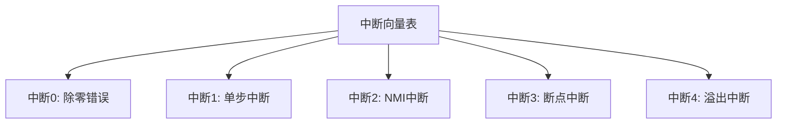
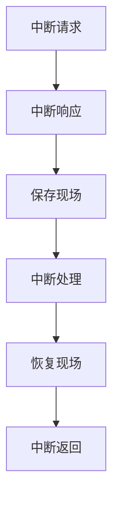
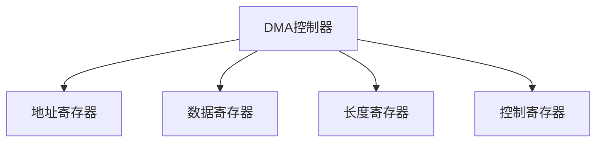
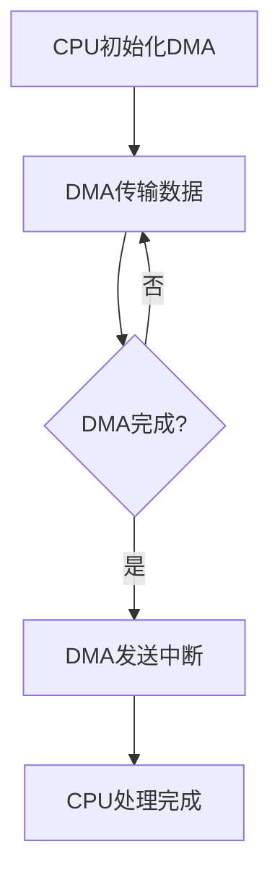

# 7.3 中断与DMA方式

> [!abstract] 核心问题
> 中断的概念是什么？中断处理流程是怎样的？DMA的原理是什么？DMA和中断的区别是什么？

## 一、中断的概念和分类

### 1. 中断的定义

**定义**：中断是设备通过硬件信号通知CPU，请求CPU处理的机制。

**作用**：

| 作用 | 说明 |
|-----|------|
| **及时响应** | 及时响应设备请求 |
| **提高效率** | CPU可以做其他工作 |
| **处理异常** | 处理程序执行中的异常 |

**对比程序查询**：

| 对比项 | 程序查询 | 中断方式 |
|-------|---------|---------|
| **CPU等待** | CPU主动等待 | CPU被动响应 |
| **效率** | 低 | 高 |
| **响应时间** | 不确定 | 较短 |

### 2. 中断的分类

**按中断源分类**：

**外部中断**：

**定义**：外部中断是由外部设备引起的中断。

**示例**：

```
外部中断：
- 键盘中断
- 鼠标中断
- 定时器中断
- 网络中断
```

**内部中断**：

**定义**：内部中断是由CPU内部事件引起的中断。

**示例**：

```
内部中断：
- 除零错误
- 溢出错误
- 非法指令
- 断点中断
```

**按中断性质分类**：

**可屏蔽中断**：

**定义**：可屏蔽中断是可以被CPU屏蔽的中断。

**示例**：

```
可屏蔽中断：
- 键盘中断
- 鼠标中断
- 打印机中断
```

**不可屏蔽中断**：

**定义**：不可屏蔽中断是不能被CPU屏蔽的中断。

**示例**：

```
不可屏蔽中断：
- 电源故障中断
- 内存错误中断
- 时钟中断
```

### 3. 中断向量

**定义**：中断向量是中断服务程序的入口地址。

**中断向量表**：

**定义**：中断向量表是存储中断向量的表格。

**结构**：



**示例**：

```
中断向量表：
- 中断号0：除零错误处理程序地址
- 中断号1：单步中断处理程序地址
- 中断号2：NMI中断处理程序地址
- 中断号3：断点中断处理程序地址
```

## 二、中断处理流程

### 1. 中断处理的步骤

**步骤**：

| 步骤 | 说明 |
|-----|------|
| **中断请求** | 设备发送中断请求 |
| **中断响应** | CPU响应中断 |
| **保存现场** | CPU保存当前执行状态 |
| **中断处理** | CPU执行中断服务程序 |
| **恢复现场** | CPU恢复执行状态 |
| **中断返回** | CPU返回原程序 |

**流程图**：



### 2. 中断请求

**流程**：

| 流程 | 说明 |
|-----|------|
| **设备就绪** | 设备完成操作 |
| **发送请求** | 设备发送中断请求信号 |
| **等待响应** | 设备等待CPU响应 |

**示例**：

```
中断请求流程：
1. 键盘按键按下
2. 键盘控制器发送中断请求信号
3. 键盘控制器等待CPU响应
```

### 3. 中断响应

**流程**：

| 流程 | 说明 |
|-----|------|
| **检测请求** | CPU检测到中断请求 |
| **判断优先级** | CPU判断中断优先级 |
| **响应中断** | CPU响应最高优先级的中断 |

**示例**：

```
中断响应流程：
1. CPU检测到键盘中断请求
2. CPU判断键盘中断的优先级
3. CPU响应键盘中断
```

### 4. 保存现场

**流程**：

| 流程 | 说明 |
|-----|------|
| **保存PC** | 保存程序计数器 |
| **保存PSW** | 保存程序状态字 |
| **保存寄存器** | 保存通用寄存器 |

**示例**：

```
保存现场流程：
1. 将PC压入栈
2. 将PSW压入栈
3. 将通用寄存器压入栈
```

### 5. 中断处理

**流程**：

| 流程 | 说明 |
|-----|------|
| **查找向量** | 根据中断号查找中断向量 |
| **跳转处理** | 跳转到中断服务程序 |
| **执行处理** | 执行中断服务程序 |

**示例**：

```
中断处理流程：
1. 根据中断号查找中断向量表
2. 获取中断服务程序地址
3. 跳转到中断服务程序
4. 执行键盘中断处理程序
```

### 6. 恢复现场

**流程**：

| 流程 | 说明 |
|-----|------|
| **恢复寄存器** | 恢复通用寄存器 |
| **恢复PSW** | 恢复程序状态字 |
| **恢复PC** | 恢复程序计数器 |

**示例**：

```
恢复现场流程：
1. 从栈中弹出通用寄存器
2. 从栈中弹出PSW
3. 从栈中弹出PC
```

### 7. 中断返回

**流程**：

| 流程 | 说明 |
|-----|------|
| **返回原程序** | CPU返回到原程序执行 |
| **继续执行** | CPU继续执行原程序 |

**示例**：

```
中断返回流程：
1. CPU返回到被中断的程序
2. CPU继续执行被中断的指令
```

## 三、中断优先级

### 1. 中断优先级的定义

**定义**：中断优先级是中断的优先处理顺序。

**作用**：

| 作用 | 说明 |
|-----|------|
| **处理顺序** | 确定中断的处理顺序 |
| **避免冲突** | 避免中断之间的冲突 |
| **保证重要中断** | 保证重要中断被及时处理 |

### 2. 中断优先级的设置

**硬件优先级**：

**定义**：硬件优先级是由硬件决定的优先级。

**特点**：

| 特点 | 说明 |
|-----|------|
| **固定** | 优先级固定 |
| **简单** | 实现简单 |
| **不可改变** | 不能通过软件改变 |

**软件优先级**：

**定义**：软件优先级是由软件决定的优先级。

**特点**：

| 特点 | 说明 |
|-----|------|
| **灵活** | 优先级可以改变 |
| **复杂** | 实现复杂 |
| **可配置** | 可以通过软件配置 |

### 3. 中断嵌套

**定义**：中断嵌套是指在处理中断时，又发生了更高优先级的中断。

**原理**：

| 原理 | 说明 |
|-----|------|
| **高优先级中断** | 高优先级中断可以打断低优先级中断 |
| **保存现场** | 保存当前中断的现场 |
| **处理高优先级** | 处理高优先级中断 |
| **恢复现场** | 恢复低优先级中断的现场 |

**示例**：

```
中断嵌套流程：
1. CPU处理键盘中断
2. 发生定时器中断（优先级更高）
3. CPU保存键盘中断的现场
4. CPU处理定时器中断
5. CPU恢复键盘中断的现场
6. CPU继续处理键盘中断
```

## 四、DMA方式

### 1. DMA的定义

**定义**：DMA是直接内存访问，是一种不需要CPU干预的数据传输方式。

**原理**：

| 原理 | 说明 |
|-----|------|
| **初始化** | CPU初始化DMA控制器 |
| **传输** | DMA控制器直接传输数据 |
| **完成** | DMA控制器通知CPU |

**对比中断方式**：

| 对比项 | 中断方式 | DMA方式 |
|-------|---------|---------|
| **CPU干预** | 需要CPU干预 | 不需要CPU干预 |
| **效率** | 中 | 高 |
| **硬件复杂度** | 中 | 高 |
| **适用场景** | 中速设备 | 高速设备 |

### 2. DMA控制器

**组成**：

| 组成 | 说明 |
|-----|------|
| **地址寄存器** | 存储内存地址 |
| **数据寄存器** | 存储传输数据 |
| **长度寄存器** | 存储传输长度 |
| **控制寄存器** | 存储控制命令 |

**结构**：



### 3. DMA的工作流程

**初始化**：

| 步骤 | 说明 |
|-----|------|
| **设置地址** | CPU设置内存地址 |
| **设置长度** | CPU设置传输长度 |
| **设置方向** | CPU设置传输方向 |
| **启动DMA** | CPU启动DMA控制器 |

**数据传输**：

| 步骤 | 说明 |
|-----|------|
| **传输数据** | DMA控制器传输数据 |
| **更新地址** | DMA控制器更新内存地址 |
| **更新长度** | DMA控制器更新传输长度 |
| **判断完成** | DMA控制器判断是否完成 |

**完成处理**：

| 步骤 | 说明 |
|-----|------|
| **发送中断** | DMA控制器发送中断请求 |
| **CPU响应** | CPU响应中断 |
| **处理完成** | CPU处理传输完成 |

**流程图**：



### 4. DMA的传输方式

**单字传输方式**：

**定义**：单字传输方式是每次传输一个字。

**特点**：

| 特点 | 说明 |
|-----|------|
| **CPU干预少** | CPU只在初始化和完成时干预 |
| **速度慢** | 传输速度较慢 |
| **简单** | 实现简单 |

**块传输方式**：

**定义**：块传输方式是每次传输一块数据。

**特点**：

| 特点 | 说明 |
|-----|------|
| **CPU干预少** | CPU只在初始化和完成时干预 |
| **速度快** | 传输速度快 |
| **占用总线** | 占用总线时间较长 |

**周期窃取方式**：

**定义**：周期窃取方式是DMA控制器在CPU空闲时传输数据。

**特点**：

| 特点 | 说明 |
|-----|------|
| **不影响CPU** | 不影响CPU的正常工作 |
| **速度较慢** | 传输速度较慢 |
| **效率高** | CPU利用率高 |

### 5. DMA的优缺点

**优点**：

| 优点 | 说明 |
|-----|------|
| **效率高** | 不需要CPU干预 |
| **速度快** | 传输速度快 |
| **减轻CPU负担** | CPU可以做其他工作 |

**缺点**：

| 缺点 | 说明 |
|-----|------|
| **硬件复杂** | 需要DMA控制器 |
| **成本高** | 成本较高 |
| **总线冲突** | 可能与CPU发生总线冲突 |

### 6. DMA与中断的区别

**区别表**：

| 对比项 | 中断方式 | DMA方式 |
|-------|---------|---------|
| **CPU干预** | 需要CPU干预每个数据传输 | 不需要CPU干预数据传输 |
| **效率** | 中 | 高 |
| **硬件复杂度** | 中 | 高 |
| **适用场景** | 中速设备 | 高速设备 |
| **数据传输** | 每次传输一个数据 | 可以传输大量数据 |

> [!warning] 易错点
> DMA方式不需要CPU干预数据传输！DMA控制器直接在内存和设备之间传输数据，CPU只需要初始化和处理完成。

---

**导航**：上一节 [[7.2-程序查询方式.md]] · [[MOC - 第7章.md|返回章节导航]]