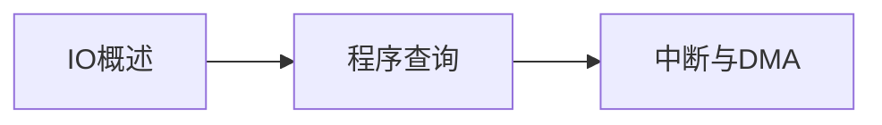

# 第7章-IO输入输出系统

> [!abstract] 本章定位
> 本章介绍IO系统的组成、接口和控制方式，是理解计算机与外部设备通信的基础。

## 学习主线

## 章节内容

- [[7.1-IO系统概述.md]]：IO设备、接口、控制方式
- [[7.2-程序查询方式.md]]：查询式IO的流程和特点
- [[7.3-中断与DMA方式.md]]：中断机制、DMA原理

## 考点汇总

> [!important] 核心考点
> 1. IO设备的分类：按用途、按传输方式、按速度
> 2. IO接口的作用：连接CPU和IO设备，提供缓冲和控制
> 3. IO控制方式：程序查询方式、中断方式、DMA方式、通道方式
> 4. 中断的概念：中断源、中断向量、中断处理流程
> 5. DMA的概念：直接内存访问，不需要CPU干预
> 6. DMA的流程：初始化、数据传输、结束处理

## 前后章节依赖

| 方向 | 章节 | 依赖关系 |
|-----|------|---------|
| 先修 | 第6章 | IO设备通过总线与CPU通信 |
| 后续 | 无 | 最后一章 |

## 复习自测

> [!question] 自测题
> 1. IO设备如何分类？各有什么特点？
> 2. IO接口的作用是什么？IO接口的组成有哪些？
> 3. IO控制方式有哪些？各有什么特点？
> 4. 中断的概念是什么？中断处理流程是怎样的？
> 5. DMA的原理是什么？DMA和中断的区别是什么？