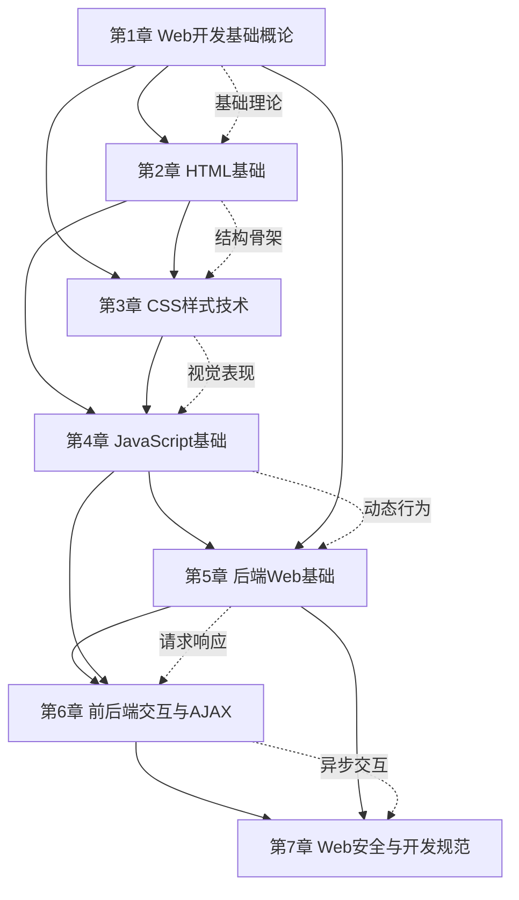

# MOC - Web开发技术

> [!info] 课程定位
> Web开发技术是软件工程专业核心课程，涵盖 HTML/CSS/JavaScript 前端技术及前后端交互基础。它解决的核心问题是：如何基于 B/S 架构，使用 Web 标准技术构建跨平台、可访问、可交互的应用界面，并理解浏览器与服务器之间的请求-响应协作机制。课程从前端三剑客（HTML 结构、CSS 表现、JavaScript 行为）出发，贯穿协议原理、页面渲染与事件机制，为后续学习前端框架、后端服务与全栈开发打下基础。

## 课程摘要

本课程围绕“**协议—结构—表现—行为—交互—工程**”六条主线展开。学生需要掌握：

1. Web 发展历程、B/S 架构与 HTTP/HTTPS 协议的工作原理；
2. HTML5 文档结构、语义化标签、常用标签与表单多媒体标签的使用；
3. CSS3 引入方式、选择器体系、盒模型、浮动定位与 Flex 响应式布局；
4. JavaScript 语法、变量类型、函数数组对象、DOM 操作与事件机制；
5. 浏览器从输入 URL 到页面渲染的完整流程及其背后的网络与渲染原理；
6. 客户端/服务端交互模型、GET/POST 与表单提交、Cookie/Session 状态保持；
7. AJAX 与 Fetch 异步请求、JSON 数据格式、RESTful 接口与跨域处理；
8. XSS/CSRF 安全防护、Web 开发规范与主流前后端框架生态。

## 章节结构与依赖关系

> [!note] 章节依赖说明
> 第1章提供协议与架构基础，是后续所有章节的理论前提；HTML 提供页面结构骨架，CSS 在结构之上叠加视觉表现，JavaScript 在结构与表现之上叠加动态行为，三者层层递进、不可跳跃。第4章的 JavaScript 与第1章的协议基础共同支撑第5章后端 Web 基础；第5章的请求-响应模型与第4章的异步能力汇合为第6章前后端交互与 AJAX；第6章的接口通信与第5章的 Cookie/Session 为第7章 Web 安全防护提供落地场景。

## 章节导航

| 章节 | 主题 | 入口 |
| --- | --- | --- |
| 第1章 | Web开发基础概论 | [[MOC - 第1章]] |
| 第2章 | HTML基础 | [[MOC - 第2章]] |
| 第3章 | CSS样式技术 | [[MOC - 第3章]] |
| 第4章 | JavaScript基础 | [[MOC - 第4章]] |
| 第5章 | 后端Web基础 | [[MOC - 第5章]] |
| 第6章 | 前后端交互与AJAX | [[MOC - 第6章]] |
| 第7章 | Web安全与开发规范 | [[MOC - 第7章]] |

## 分阶段学习目标

> [!example] 基础概念阶段（第1章）
> 建立 Web 开发的整体认知：理解 Web 发展历程与 B/S 架构优势，掌握 HTTP/HTTPS 协议的请求-响应模型，能完整描述从输入 URL 到页面渲染的全流程，区分静态网站与动态网站。

> [!example] 前端三剑客阶段（第2–3章）
> 掌握 HTML5 语义化文档结构与表单多媒体标签的使用，能够独立编写结构清晰的网页骨架；掌握 CSS3 选择器体系、盒模型、浮动定位与 Flex 布局，能够实现响应式页面排版与视觉美化。

> [!example] 动态行为阶段（第4章）
> 掌握 JavaScript 语法、变量类型与函数对象，能够通过 DOM API 动态操作页面内容与样式，理解事件冒泡、事件捕获与事件委托机制，实现页面交互逻辑。

> [!example] 后端交互阶段（第5章）
> 理解客户端/服务端交互模型与请求-响应完整流程，掌握 GET/POST 请求特点与表单提交机制，理解 Cookie 与 Session 在无状态 HTTP 之上维持会话状态的原理，能够描述一次完整的前后端数据交互闭环。

> [!example] 异步通信阶段（第6章）
> 掌握 AJAX 原理与 XMLHttpRequest/Fetch API 的使用，能用 async/await 编写异步请求代码；掌握 JSON 数据格式的序列化与反序列化；理解 RESTful API 设计与 CORS 跨域解决方案，完成前后端分离架构下的接口通信。

> [!example] 安全与工程化阶段（第7章）
> 掌握 XSS 与 CSRF 两类常见 Web 攻击的原理与防护手段；遵循 HTML/CSS/JS 开发规范与项目结构约定，能用 Git 管理代码版本；了解 Vue/React/Angular 主流框架与前端工程化趋势，建立从功能实现到工程质量的完整认知。

## 先修与关联课程

- **计算机网络基础**：提供 TCP/IP、DNS、HTTP 协议的底层支撑，是理解第1章 Web 工作原理的前提。
- **软件工程**：提供软件生命周期、需求分析与工程化开发思想，帮助理解 Web 项目的工程组织。
- 关联延伸：[[软件工程]]（工程化流程）、[[软件测试技术]]（Web 应用测试）、可视化程序设计（界面布局思想可对照参考）。

## 开发工具推荐

| 工具 | 作用 | 推荐版本 / 说明 |
| --- | --- | --- |
| Visual Studio Code | 主开发 IDE | 内置 Emmet、Live Server 插件，支持 HTML/CSS/JS 智能提示与调试 |
| Chrome DevTools | 浏览器调试工具 | 元素审查、Network 面板、Console、Performance 性能分析 |
| Postman | 接口测试工具 | 模拟 HTTP 请求，调试 GET/POST 等方法与响应状态 |
| Node.js | JS 运行环境 | 用于本地搭建开发服务器、运行构建工具与前端工程化工具 |
| Git | 版本控制 | 管理代码版本，配合 GitHub/Gitee 进行协作 |
| Live Server (VS Code 插件) | 本地静态服务器 | 保存即热重载，便于 HTML/CSS 实时预览 |

> [!tip] 环境建议
> 建议安装 VS Code 后启用 Live Server 插件，右键 HTML 文件选择 "Open with Live Server" 即可在浏览器中实时预览页面修改效果，无需手动刷新。

## 复习与查询入口

- 协议与原理速查：[[1.1 Web发展历程与B-S架构]]、[[1.2 HTTP与HTTPS协议基础]]、[[1.3 Web工作基本原理]]
- HTML 速查：[[2.1 HTML文档结构]]、[[2.2 常用标签使用]]、[[2.3 表单与多媒体标签]]
- CSS 速查：[[3.1 CSS引入方式、选择器]]、[[3.2 盒模型、浮动与布局]]、[[3.3 Flex布局、响应式基础]]
- JavaScript 速查：[[4.1 JS语法、变量、数据类型]]、[[4.2 函数、数组、对象]]、[[4.3 DOM操作、事件机制]]
- 后端基础速查：[[5.1 客户端与服务端交互模型]]、[[5.2 GET-POST请求、表单提交]]、[[5.3 Cookie、Session基础]]
- 前后端交互速查：[[6.1 AJAX基本原理]]、[[6.2 JSON数据格式]]、[[6.3 接口通信基础]]
- 安全与规范速查：[[7.1 XSS、CSRF基础防护]]、[[7.2 Web开发规范]]、[[7.3 主流前后端框架简介]]
