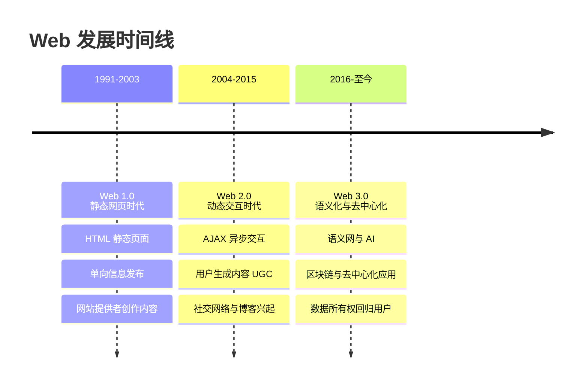
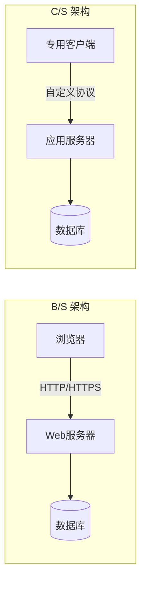
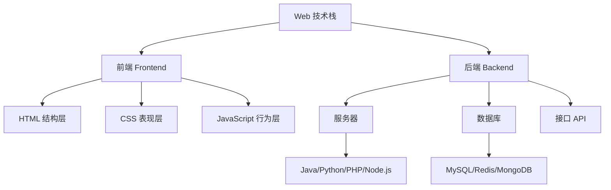

# 1.1 Web发展历程与B-S架构

Web 的发展历程决定了今天前端技术的形态，而 B/S 架构是理解所有 Web 应用的组织基础。本节解决的问题是：Web 经历了哪些阶段、各阶段有何特征；为什么大多数现代应用选择 B/S 架构而非传统的 C/S 架构；Web 技术栈由哪些部分组成。

## Web 发展历程

Web 的发展可划分为三个阶段，每个阶段在内容生产方式、交互模式与技术能力上均有显著差异。

### Web 1.0：静态网页时代

Web 1.0（约 1991–2003）以**静态内容**为核心特征。网站由 HTML 静态页面组成，内容由网站提供者单向发布，用户只能浏览，无法参与内容生产。典型代表是早期的门户网站（Yahoo、新浪）。

- 内容：静态 HTML，少量 GIF 图片与超链接
- 交互：以超链接跳转为主，无动态交互
- 技术：HTML、简单 CGI 脚本

### Web 2.0：动态交互时代

Web 2.0（约 2004–2015）的核心是**用户参与与动态交互**。AJAX 技术的普及使页面可以局部刷新而不必整页重载，社交网络、博客、Wiki 等平台让普通用户成为内容创作者（UGC，User Generated Content）。

- 内容：动态生成，用户生成内容
- 交互：AJAX 局部刷新、富交互
- 技术：JavaScript、AJAX、CSS、动态语言（PHP/Java/Python）

### Web 3.0：语义化与去中心化

Web 3.0（约 2016 至今）强调**语义化、智能化与去中心化**。语义网让机器可理解数据含义，人工智能提供个性化服务，区块链技术推动数据所有权回归用户，去中心化应用（DApp）挑战传统中心化平台。

- 内容：语义化数据、可被机器理解
- 交互：AI 驱动的智能交互
- 技术：语义网标准、区块链、AI、WebAssembly

## B/S 架构 vs C/S 架构

> [!definition] B/S 架构
> B/S（Browser/Server，浏览器/服务器）架构是一种以浏览器为客户端、服务器提供业务逻辑与数据的软件架构。用户通过浏览器访问服务器，无需安装专用客户端。

> [!definition] C/S 架构
> C/S（Client/Server，客户端/服务器）架构是一种需要安装专用客户端程序、客户端与服务器协同工作的软件架构。客户端承担部分业务逻辑与界面渲染。

### 架构对比

| 维度 | B/S 架构 | C/S 架构 |
| --- | --- | --- |
| 客户端 | 浏览器，无需安装 | 专用客户端，需安装 |
| 维护升级 | 服务器端集中维护，用户无感 | 需逐个客户端升级 |
| 跨平台 | 天然跨平台，仅需浏览器 | 需为不同平台分别开发 |
| 性能体验 | 受浏览器与网络限制 | 可充分利用本地资源，体验流畅 |
| 通信协议 | HTTP/HTTPS 标准协议 | 自定义或标准协议 |
| 典型应用 | 门户网站、电商、OA 系统 | 网游、即时通讯、专业软件 |

### B/S 架构优缺点

> [!tip] B/S 架构优点
> 1. **零安装部署**：用户通过浏览器即可访问，降低使用门槛。
> 2. **集中维护**：升级与维护集中在服务器端，客户端无感知。
> 3. **跨平台**：一次开发，多平台访问（PC、手机、平板）。
> 4. **易于推广**：URL 即入口，便于分享与传播。

> [!warning] B/S 架构缺点
> 1. **依赖网络**：无网络或网络差时无法使用。
> 2. **响应速度受限**：受浏览器渲染与网络延迟影响，不如本地应用流畅。
> 3. **本地资源访问弱**：受浏览器安全沙箱限制，难以直接操作本地文件与硬件。
> 4. **复杂交互受限**：对图形密集型、实时性要求高的场景支持较弱。

## Web 技术栈概览

Web 技术栈分为前端与后端两层，前端负责界面展示与用户交互，后端负责业务逻辑与数据存储。

### 前端三剑客

前端由三种核心技术构成，俗称"前端三剑客"，分别对应网页的三个层次：

| 技术 | 层次 | 职责 | 类比 |
| --- | --- | --- | --- |
| HTML | 结构层 | 定义页面内容与结构骨架 | 人的骨骼 |
| CSS | 表现层 | 控制页面外观与布局样式 | 人的衣着 |
| JavaScript | 行为层 | 实现页面动态效果与交互逻辑 | 人的行为 |

### 后端技术

后端负责处理业务逻辑、数据存储与接口提供，常见技术包括：

- **服务器语言**：Java、Python、PHP、Node.js、Go 等
- **数据库**：MySQL（关系型）、Redis（缓存）、MongoDB（文档型）
- **Web 服务器**：Apache、Nginx、Tomcat

## 小结

Web 从 1.0 的静态单向发布，演进到 2.0 的动态用户参与，再到 3.0 的语义化与去中心化，每个阶段都伴随着技术与交互模式的革新。B/S 架构凭借零安装、跨平台、集中维护的优势成为主流，但牺牲了部分性能与本地能力。Web 技术栈以前端三剑客（HTML/CSS/JS）为核心，配合后端服务器与数据库，共同构成完整的 Web 应用体系。

## 关联

- 上一级：[[MOC - 第1章]]
- 下一节：[[1.2 HTTP与HTTPS协议基础]]
- 关联概念：[[1.3 Web工作基本原理]]
