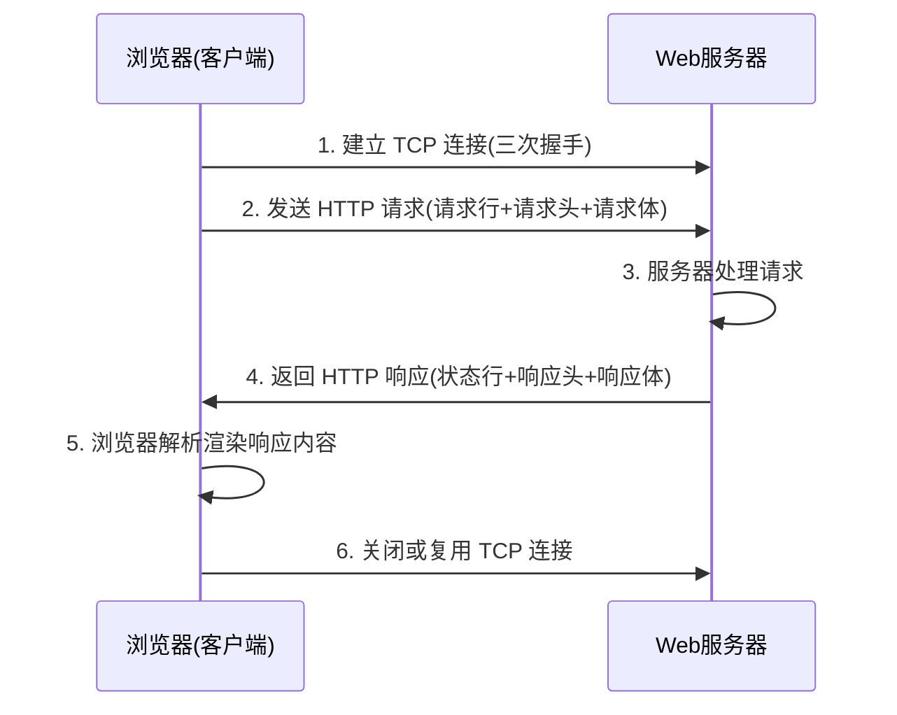
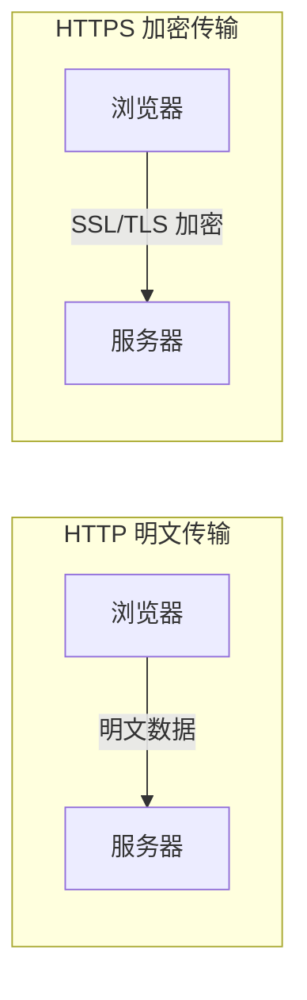

# 1.2 HTTP与HTTPS协议基础

HTTP（HyperText Transfer Protocol，超文本传输协议）是 Web 通信的基础协议。理解 HTTP 的请求-响应模型、方法语义、状态码分类与报文结构，是进行前后端开发与调试的前提。HTTPS 在 HTTP 之上增加加密层，保障数据传输安全。

## HTTP 协议定义

> [!definition] HTTP 协议
> HTTP 是一种**无状态、基于请求-响应模型**的应用层协议，用于在客户端（浏览器）与服务器之间传输超文本数据。它默认使用 80 端口，基于 TCP 协议提供可靠传输。

HTTP 的核心特征：

- **无状态（Stateless）**：服务器不保留客户端的请求历史，每次请求独立。需要状态保持时借助 Cookie、Session 或 Token。
- **请求-响应模型**：客户端发送请求，服务器返回响应，一问一答。
- **基于文本**：HTTP 报文以文本形式传输，可读性强，便于调试。

## HTTP 请求-响应流程



## HTTP 请求方法

HTTP 定义了一组请求方法（也称动词），表示对资源的不同操作意图：

| 方法 | 语义 | 安全 | 幂等 | 典型场景 |
| --- | --- | --- | --- | --- |
| GET | 获取资源 | 是 | 是 | 浏览网页、查询数据 |
| POST | 提交数据 | 否 | 否 | 表单提交、创建资源 |
| PUT | 更新/替换资源 | 否 | 是 | 更新整条记录 |
| DELETE | 删除资源 | 否 | 是 | 删除记录 |
| HEAD | 获取响应头 | 是 | 是 | 检查资源是否存在 |
| OPTIONS | 查询支持的方法 | 是 | 是 | 跨域预检请求 |

> [!note] 安全与幂等
> - **安全**：方法不修改服务器资源（GET、HEAD、OPTIONS）。
> - **幂等**：同一请求执行多次与一次效果相同（GET、PUT、DELETE、HEAD）。
> - POST 既不安全也不幂等，重复提交可能创建多条记录。

### GET 与 POST 的区别

| 维度 | GET | POST |
| --- | --- | --- |
| 参数位置 | URL 查询字符串 `?key=value` | 请求体中 |
| 长度限制 | 受 URL 长度限制（浏览器约 2KB） | 理论上无限制 |
| 安全性 | 参数暴露在 URL，不安全 | 相对安全 |
| 缓存 | 可被浏览器缓存 | 默认不缓存 |
| 幂等性 | 幂等 | 非幂等 |

## HTTP 状态码

HTTP 状态码（Status Code）由三位数字组成，表示服务器对请求的处理结果，按首位分为五大类：

| 分类 | 范围 | 含义 | 常见状态码 |
| --- | --- | --- | --- |
| 1xx | 100–101 | 信息性，请求已接收继续处理 | 100 Continue |
| 2xx | 200–206 | 成功 | 200 OK、201 Created、204 No Content |
| 3xx | 300–305 | 重定向 | 301 永久重定向、302 临时重定向、304 Not Modified |
| 4xx | 400–417 | 客户端错误 | 400 Bad Request、401 Unauthorized、403 Forbidden、404 Not Found |
| 5xx | 500–505 | 服务器错误 | 500 Internal Server Error、502 Bad Gateway、503 Service Unavailable |

> [!tip] 常见状态码速记
> - **200**：请求成功
> - **301**：资源永久跳转（如旧域名跳新域名）
> - **302**：资源临时跳转（如登录后跳转）
> - **304**：资源未修改，使用浏览器缓存
> - **401**：未认证（需登录）
> - **403**：已认证但无权限访问
> - **404**：资源不存在
> - **500**：服务器内部错误
> - **502**：网关错误（上游服务异常）
> - **503**：服务不可用（维护中或过载）

## HTTP 请求结构

HTTP 请求报文由三部分组成：**请求行、请求头、请求体**。

```http
POST /api/login HTTP/1.1
Host: www.example.com
Content-Type: application/x-www-form-urlencoded
Content-Length: 27
User-Agent: Mozilla/5.0

username=admin&password=123456
```

### 请求行

```
方法 请求URL HTTP版本
POST /api/login HTTP/1.1
```

包含三个部分：请求方法、请求资源路径、HTTP 协议版本。

### 请求头

请求头是键值对形式的元信息，常见请求头：

| 请求头 | 含义 |
| --- | --- |
| `Host` | 目标主机域名 |
| `User-Agent` | 客户端浏览器信息 |
| `Content-Type` | 请求体的数据类型 |
| `Content-Length` | 请求体字节长度 |
| `Accept` | 客户端可接受的响应类型 |
| `Cookie` | 携带的 Cookie 信息 |
| `Referer` | 请求来源页面 URL |

### 请求体

请求体携带客户端提交的数据，GET 请求通常无请求体，POST/PUT 请求有请求体。常见 `Content-Type`：

- `application/x-www-form-urlencoded`：表单数据，`key=value&key=value`
- `application/json`：JSON 格式数据
- `multipart/form-data`：文件上传

## HTTP 响应结构

HTTP 响应报文同样由三部分组成：**状态行、响应头、响应体**。

```http
HTTP/1.1 200 OK
Content-Type: text/html; charset=UTF-8
Content-Length: 1234
Server: nginx/1.18.0

<!DOCTYPE html>
<html>...</html>
```

### 状态行

```
HTTP版本 状态码 状态描述
HTTP/1.1 200 OK
```

### 响应头

常见响应头：

| 响应头 | 含义 |
| --- | --- |
| `Content-Type` | 响应体数据类型与编码 |
| `Content-Length` | 响应体字节长度 |
| `Server` | 服务器软件信息 |
| `Set-Cookie` | 服务器设置 Cookie |
| `Cache-Control` | 缓存策略 |
| `Location` | 重定向目标 URL（配合 3xx） |

### 响应体

响应体是服务器返回的实际数据，可能是 HTML 页面、JSON 数据、图片二进制等。

## HTTPS

> [!definition] HTTPS
> HTTPS（HyperText Transfer Protocol Secure）是 HTTP 与 SSL/TLS 协议的组合，在 HTTP 通信基础上增加加密层，默认使用 443 端口。它能保证数据传输的**机密性、完整性与身份认证**。



### HTTPS 与 HTTP 的区别

| 维度 | HTTP | HTTPS |
| --- | --- | --- |
| 协议 | 明文传输 | SSL/TLS 加密传输 |
| 端口 | 80 | 443 |
| 证书 | 不需要 | 需要 CA 颁发的数字证书 |
| 安全性 | 易被窃听、篡改、伪造 | 防窃听、防篡改、防伪装 |
| 性能 | 略快 | 加密握手有少量开销 |

### HTTPS 的安全机制

HTTPS 通过 SSL/TLS 协议提供三重保障：

1. **加密**：对称加密传输数据，防止窃听。
2. **完整性**：MAC 校验保证数据不被篡改。
3. **身份认证**：数字证书验证服务器身份，防止中间人攻击。

> [!warning] 注意
> HTTPS 并不等于"绝对安全"，它只保证传输层安全。应用层的安全（如 SQL 注入、XSS）仍需开发者自行防护。现代 Web 开发已普遍要求使用 HTTPS，浏览器会对 HTTP 站点标记"不安全"。

## 小结

HTTP 是 Web 通信的基础协议，采用无状态的请求-响应模型，通过不同的请求方法与状态码表达操作语义与处理结果。请求与响应报文均由行、头、体三部分组成。HTTPS 在 HTTP 之上叠加 SSL/TLS 加密层，解决明文传输的安全隐患，是现代 Web 应用的标配。

## 关联

- 上一节：[[1.1 Web发展历程与B-S架构]]
- 下一节：[[1.3 Web工作基本原理]]
- 上一级：[[MOC - 第1章]]
