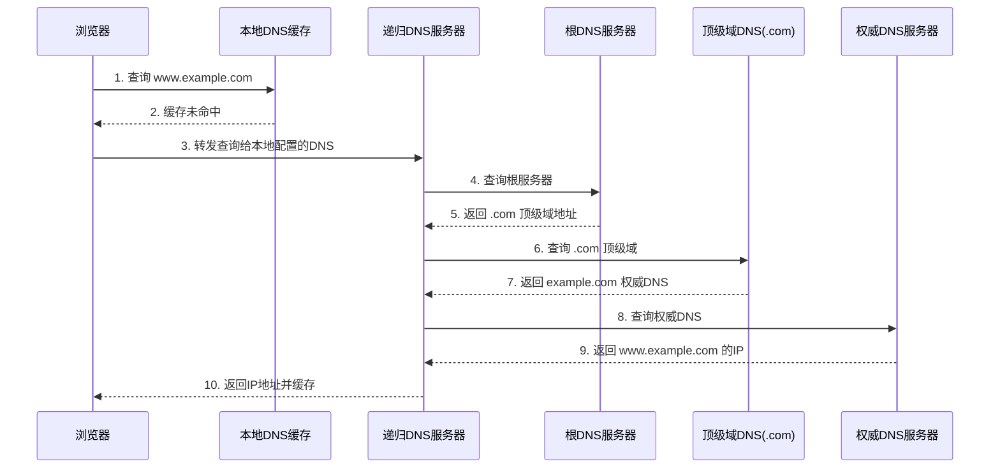
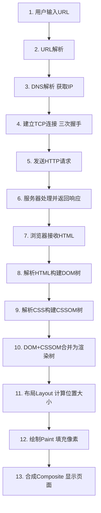
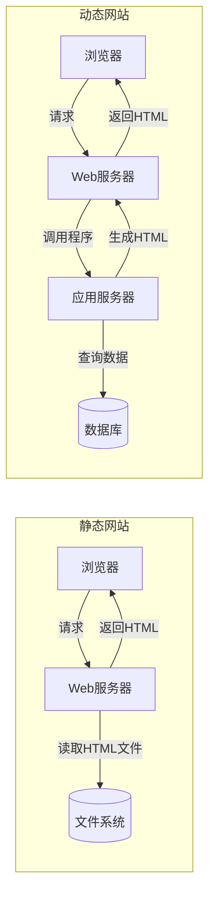

# 1.3 Web工作基本原理

本节解决的问题是：当用户在浏览器输入 URL 到看到完整页面，中间经历了哪些步骤？URL 的结构如何？DNS 如何将域名转为 IP？浏览器如何解析与渲染页面？理解这一完整流程，是进行前端性能优化与问题排查的基础。

## URL 与 URI 结构

> [!definition] URL
> URL（Uniform Resource Locator，统一资源定位符）是 URI 的子集，用于标识互联网上资源的位置与访问方式。

URL 的标准结构：

```
协议://主机:端口/路径?查询参数#锚点
```

以 `https://www.example.com:443/article/list?page=2#section-3` 为例：

| 组成部分 | 值 | 说明 |
| --- | --- | --- |
| 协议（scheme） | `https` | 访问资源使用的协议 |
| 主机（host） | `www.example.com` | 服务器域名或 IP 地址 |
| 端口（port） | `443` | 服务器端口，HTTP 默认 80，HTTPS 默认 443，可省略 |
| 路径（path） | `/article/list` | 资源在服务器上的路径 |
| 查询参数（query） | `page=2` | 以 `?` 开头，键值对用 `&` 分隔 |
| 锚点（fragment） | `section-3` | 以 `#` 开头，定位页面内位置，不发送到服务器 |

> [!note] URL 与 URI 的区别
> - **URI**（统一资源标识符）：标识资源的字符串，强调"是什么"。
> - **URL**（统一资源定位符）：通过位置标识资源，强调"在哪里、怎么访问"，是 URI 的子集。
> - **URN**（统一资源名称）：通过名称标识资源，如 `urn:isbn:978-3-16-148410-0`，也是 URI 的子集。

## DNS 解析流程

DNS（Domain Name System，域名系统）的作用是将人类易记的域名（如 `www.example.com`）转换为机器使用的 IP 地址（如 `93.184.216.34`）。



DNS 解析的查找顺序（命中即返回）：

1. **浏览器 DNS 缓存**：浏览器自身维护的域名-IP 映射。
2. **操作系统 DNS 缓存**：OS 级别的缓存。
3. **本地 hosts 文件**：系统 hosts 文件中的手动配置。
4. **本地 DNS 服务器（递归解析器）**：如运营商或公共 DNS（8.8.8.8、114.114.114.114）。
5. **根域名服务器 → 顶级域服务器 → 权威域名服务器**：逐级递归查询。

## 浏览器渲染流程

从输入 URL 到页面渲染完成，浏览器经历以下完整步骤：



### 各步骤详解

**1. URL 解析**：浏览器将用户输入解析为协议、域名、端口、路径等部分。若输入的是搜索词而非 URL，则交给默认搜索引擎处理。

**2. DNS 解析**：按上文流程获取服务器 IP 地址。

**3. 建立 TCP 连接**：浏览器与服务器通过三次握手建立 TCP 连接。若使用 HTTPS，还需进行 TLS 握手协商加密参数。

**4. 发送 HTTP 请求**：浏览器构造 HTTP 请求报文并发送（参见 [[1.2 HTTP与HTTPS协议基础]]）。

**5. 服务器处理与响应**：服务器接收请求，执行业务逻辑，返回 HTTP 响应（HTML 文档、JSON 数据等）。

**6. HTML 解析与 DOM 构建**：浏览器从上到下解析 HTML，将标签转为节点（Node），构建 DOM（Document Object Model）树。

**7. CSS 解析与 CSSOM 构建**：遇到 CSS 时，浏览器解析样式规则，构建 CSSOM（CSS Object Model）树。

**8. 渲染树合成**：将 DOM 树与 CSSOM 树合并为渲染树（Render Tree）。渲染树只包含可见节点（`display: none` 的元素不纳入）。

**9. 布局（Layout / Reflow）**：计算渲染树中每个节点的几何信息（位置、大小）。

**10. 绘制（Paint）**：将布局后的节点填充为像素，绘制到屏幕。

**11. 合成（Composite）**：将各图层合成最终显示的页面。

> [!warning] 关键概念
> - **DOM 树**：HTML 解析产物，描述页面结构。
> - **CSSOM 树**：CSS 解析产物，描述样式规则。
> - **渲染树**：DOM + CSSOM 的合并，只含可见元素。
> - **重排（Reflow）**：几何变化触发布局重新计算，开销大。
> - **重绘（Repaint）**：外观变化（如颜色）触发重新绘制，开销较小。
> - **JS 阻塞**：`<script>` 默认阻塞 HTML 解析，故建议放在 `</body>` 前或使用 `defer`/`async`。

## 静态网站 vs 动态网站

| 维度 | 静态网站 | 动态网站 |
| --- | --- | --- |
| 内容来源 | 预先写好的 HTML 文件 | 服务器运行程序实时生成 |
| 页面变化 | 所有用户看到相同内容 | 不同用户、不同条件显示不同内容 |
| 数据库 | 不需要 | 通常需要数据库支持 |
| 文件后缀 | `.html` | `.php`、`.jsp`、`.aspx` 等 |
| 典型场景 | 企业官网、文档站 | 电商、社交、后台管理 |



> [!tip] 现代趋势
> 现代网站常采用前后端分离模式：前端是静态资源（HTML/CSS/JS），后端提供 API 接口返回 JSON 数据，前端通过 JavaScript 动态渲染页面。这种模式兼具静态网站的快速与动态网站的灵活。

## 小结

Web 工作流程是一条从 URL 到渲染的完整链路：URL 解析定位资源，DNS 将域名转为 IP，TCP 建立连接，HTTP 完成请求-响应，浏览器解析 HTML/CSS 构建 DOM 与 CSSOM，合成渲染树后经历布局、绘制、合成最终显示页面。区分静态与动态网站有助于理解不同 Web 应用的数据流与架构选择。

## 关联

- 上一节：[[1.2 HTTP与HTTPS协议基础]]
- 上一级：[[MOC - 第1章]]
- 关联概念：[[1.1 Web发展历程与B-S架构]]、[[4.3 DOM操作、事件机制]]
