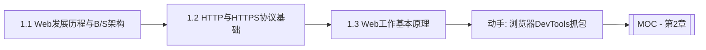

# MOC - 第1章 Web开发基础概论

> [!info] 本章定位
> 第1章是整门课程的理论地基。它回答三个问题：Web“从哪里来、如何演进”、浏览器与服务器“靠什么协议通信”、从输入 URL 到看到页面“中间发生了什么”。掌握本章后，才能理解后续 HTML/CSS/JavaScript 各自承担的职责。

## 学习路线图

## 知识点导航

| 节 | 主题 | 核心要点 | 入口 |
| --- | --- | --- | --- |
| 1.1 | Web发展历程与B-S架构 | Web 1.0/2.0/3.0、B/S vs C/S、Web技术栈 | [[1.1 Web发展历程与B-S架构]] |
| 1.2 | HTTP与HTTPS协议基础 | 请求方法、状态码、请求响应结构、HTTPS加密 | [[1.2 HTTP与HTTPS协议基础]] |
| 1.3 | Web工作基本原理 | URL结构、DNS解析、浏览器渲染流程、静态vs动态 | [[1.3 Web工作基本原理]] |

## 核心考点

> [!warning] 重点掌握
> 1. Web 三个发展阶段（Web 1.0 静态、Web 2.0 动态交互、Web 3.0 语义化/去中心化）的特征区分。
> 2. B/S 架构与 C/S 架构的对比及 B/S 架构的优缺点。
> 3. HTTP 请求方法（GET/POST/PUT/DELETE 等）的语义与使用场景。
> 4. HTTP 状态码五大分类（1xx–5xx）及常见状态码含义。
> 5. HTTP 请求与响应的结构组成（请求行/请求头/请求体、状态行/响应头/响应体）。
> 6. HTTPS 相比 HTTP 增加了 SSL/TLS 加密层，能保证数据机密性与完整性。
> 7. 浏览器从输入 URL 到渲染页面的完整流程（DNS→TCP→HTTP→解析→渲染）。

## 自测题

> [!question] 题1
> 简述 Web 1.0、Web 2.0、Web 3.0 三个阶段的核心特征差异。
> > [!check]- 参考答案
> > Web 1.0 以静态页面为主，用户只能浏览内容由网站提供者单向发布；Web 2.0 强调动态交互与用户参与，用户既是读者也是创作者（博客、社交、Wiki）；Web 3.0 强调语义化与去中心化，结合区块链、AI 与语义网，数据所有权回归用户。

> [!question] 题2
> 对比 B/S 架构与 C/S 架构，说明 B/S 架构的主要优缺点。
> > [!check]- 参考答案
> > B/S（浏览器/服务器）无需安装客户端，通过浏览器访问，维护升级集中在服务器端，跨平台优势明显；缺点是依赖网络、响应速度受限于浏览器与网络、对复杂图形交互支持较弱。C/S（客户端/服务器）体验流畅、可充分利用本地资源，但需安装升级、跨平台成本高。

> [!question] 题3
> HTTP 请求由哪几部分组成？列举至少五种常见请求方法及其语义。
> > [!check]- 参考答案
> > HTTP 请求由请求行（方法 URL 版本）、请求头（键值对元信息）、请求体（可选数据）组成。常见方法：GET（获取资源）、POST（提交数据）、PUT（更新资源）、DELETE（删除资源）、HEAD（获取响应头）、OPTIONS（查询服务器支持的方法）。

> [!question] 题4
> 简述浏览器从输入 URL 到页面渲染完成的完整流程。
> > [!check]- 参考答案
> > 流程：URL 解析 → DNS 解析获取 IP → 建立 TCP 连接（三次握手）→ 发送 HTTP 请求 → 服务器处理并返回响应 → 浏览器解析 HTML 构建 DOM 树 → 解析 CSS 构建 CSSOM → 合并生成渲染树 → 布局（Layout）计算位置大小 → 绘制（Paint）像素 → 合成显示。

## 章节导航

- 上一级：[[MOC - Web开发技术]]
- 下一章：[[MOC - 第2章]]
