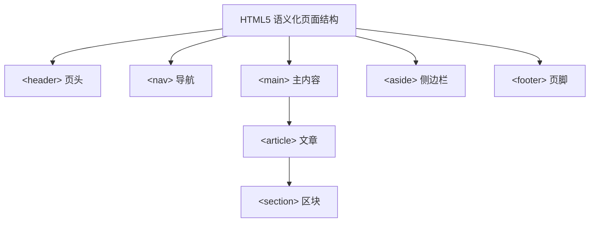

# 2.1 HTML文档结构

HTML（HyperText Markup Language，超文本标记语言）是构建网页结构的标记语言。本节解决的问题是：一个标准的 HTML 文档由哪些部分组成，head 与 body 各承担什么职责，HTML5 提供了哪些语义化标签来更清晰地表达页面结构。

## HTML 基本结构

一个标准的 HTML5 文档由文档类型声明、根元素、头部与主体四部分组成：

```html
<!DOCTYPE html>
<html lang="zh-CN">
<head>
    <meta charset="UTF-8">
    <title>页面标题</title>
</head>
<body>
    <h1>Hello World</h1>
    <p>这是我的第一个网页</p>
</body>
</html>
```

### 各部分说明

| 部分 | 作用 |
| --- | --- |
| `<!DOCTYPE html>` | 文档类型声明，告诉浏览器以 HTML5 标准模式解析 |
| `<html lang="zh-CN">` | 根元素，`lang` 属性声明文档语言，利于 SEO 与无障碍 |
| `<head>` | 头部，包含页面元信息，不显示在页面正文中 |
| `<body>` | 主体，包含所有可见的页面内容 |

> [!warning] DOCTYPE 不可省略
> 若省略 `<!DOCTYPE html>`，浏览器可能进入**怪异模式（Quirks Mode）**，导致盒模型、表格布局等渲染行为与标准不一致。始终在文档第一行写 `<!DOCTYPE html>`。

## head 内元素

`<head>` 内的元素为浏览器和搜索引擎提供页面元信息，本身不显示在页面正文中。

```html
<head>
    <meta charset="UTF-8">
    <meta name="viewport" content="width=device-width, initial-scale=1.0">
    <meta name="description" content="这是一个Web开发技术学习页面">
    <meta name="keywords" content="HTML,CSS,JavaScript">
    <title>Web开发技术 - 学习笔记</title>
    <link rel="stylesheet" href="style.css">
    <script src="app.js" defer></script>
    <style>
        body { font-family: sans-serif; }
    </style>
</head>
```

### head 常见元素

| 元素 | 作用 | 示例 |
| --- | --- | --- |
| `<title>` | 页面标题，显示在浏览器标签页 | `<title>首页</title>` |
| `<meta charset>` | 声明字符编码 | `<meta charset="UTF-8">` |
| `<meta name="viewport">` | 移动端视口设置，响应式必备 | `<meta name="viewport" content="width=device-width, initial-scale=1.0">` |
| `<meta name="description">` | 页面描述，搜索引擎展示 | `<meta name="description" content="页面简介">` |
| `<link>` | 引入外部资源，常用于 CSS | `<link rel="stylesheet" href="style.css">` |
| `<script>` | 引入或内嵌 JavaScript | `<script src="app.js"></script>` |
| `<style>` | 内嵌 CSS 样式 | `<style>p{color:red;}</style>` |

> [!tip] viewport 必记
> `<meta name="viewport" content="width=device-width, initial-scale=1.0">` 是移动端适配的基础设置，缺少它会导致移动端页面缩放异常。详见 [[3.3 Flex布局、响应式基础]]。

## HTML5 语义化标签

HTML5 引入了一组语义化标签，用有意义的标签名表达页面结构区块，取代过去用 `<div>` 堆砌的"无语义"布局。



### 语义化标签说明

| 标签 | 语义 | 典型用途 |
| --- | --- | --- |
| `<header>` | 页面或区块的头部 | 网站页头、文章标题区 |
| `<nav>` | 导航链接区域 | 主导航菜单、面包屑 |
| `<main>` | 页面主要内容，每页唯一 | 主体内容区 |
| `<article>` | 独立完整的内容单元 | 一篇博客、一条评论 |
| `<section>` | 内容分区块 | 章节划分、功能分组 |
| `<aside>` | 附属信息、侧边栏 | 相关推荐、广告、侧栏 |
| `<footer>` | 页面或区块的底部 | 版权信息、联系方式 |

### 语义化的好处

> [!tip] 为什么使用语义化标签
> 1. **可读性**：代码结构清晰，开发者一眼看出各区块用途。
> 2. **SEO 友好**：搜索引擎能更好理解页面结构与重点内容。
> 3. **无障碍**：屏幕阅读器等辅助设备可依据语义为视障用户导航。
> 4. **代码维护**：减少无意义的 div 嵌套，降低维护成本。

## HTML 注释与特殊字符

### 注释

HTML 注释以 `<!--` 开头，`-->` 结尾，浏览器不解析注释内容：

```html
<!-- 这是一个注释，不会显示在页面上 -->
<p>这段文字会显示</p>
```

### 常用特殊字符

HTML 中某些字符有特殊含义（如 `<`、`>`、`&`），需用字符实体表示：

| 字符 | 实体 | 说明 |
| --- | --- | --- |
| `<` | `&lt;` | 小于号 |
| `>` | `&gt;` | 大于号 |
| `&` | `&amp;` | 与号 |
| `"` | `&quot;` | 双引号 |
| `'` | `&apos;` | 单引号 |
| 空格 | `&nbsp;` | 不换行空格 |
| `©` | `&copy;` | 版权符号 |

## 完整 HTML 文档模板示例

以下是一个包含完整结构与语义化标签的 HTML 文档模板，可直接保存为 `.html` 文件用浏览器打开：

```html
<!DOCTYPE html>
<html lang="zh-CN">
<head>
    <meta charset="UTF-8">
    <meta name="viewport" content="width=device-width, initial-scale=1.0">
    <meta name="description" content="Web开发技术学习页面">
    <title>我的学习笔记</title>
    <style>
        body { font-family: "Microsoft YaHei", sans-serif; margin: 20px; }
        header { background: #f0f0f0; padding: 10px; }
        nav a { margin-right: 15px; }
        footer { margin-top: 30px; color: #888; font-size: 12px; }
    </style>
</head>
<body>
    <header>
        <h1>Web开发技术学习笔记</h1>
        <nav>
            <a href="#html">HTML</a>
            <a href="#css">CSS</a>
            <a href="#js">JavaScript</a>
        </nav>
    </header>

    <main>
        <article id="html">
            <h2>第二章 HTML基础</h2>
            <p>HTML 用于构建网页的结构骨架。</p>
            <section>
                <h3>语义化标签</h3>
                <p>使用 header、nav、main 等标签提升结构清晰度。</p>
            </section>
        </article>

        <article id="css">
            <h2>第三章 CSS样式技术</h2>
            <p>CSS 负责页面的视觉表现。</p>
        </article>
    </main>

    <aside>
        <h3>相关推荐</h3>
        <ul>
            <li><a href="#">JavaScript 高级教程</a></li>
            <li><a href="#">前端工程化指南</a></li>
        </ul>
    </aside>

    <footer>
        <p>&copy; 2026 Web开发技术课程. 保留所有权利。</p>
    </footer>
</body>
</html>
```

## 小结

HTML 文档由 `<!DOCTYPE html>` 声明、`<html>` 根元素、`<head>` 头部与 `<body>` 主体构成。head 内的 title、meta、link、script、style 提供页面元信息与资源引用。HTML5 语义化标签（header、nav、main、article、section、aside、footer）让页面结构更清晰、更利于 SEO 与无障碍。注释与字符实体是日常编写中常用的辅助手段。

## 关联

- 上一级：[[MOC - 第2章]]
- 下一节：[[2.2 常用标签使用]]
- 关联概念：[[1.3 Web工作基本原理]]、[[3.1 CSS引入方式、选择器]]
