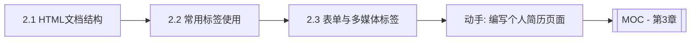

# MOC - 第2章 HTML基础

> [!info] 本章定位
> 第2章是前端开发的起点。HTML（HyperText Markup Language）是构建网页结构的标记语言，它定义了页面的内容骨架。本章解决的问题是：如何编写结构规范、语义清晰的 HTML 文档，如何使用各类标签组织文本、列表、链接、图片、表格与表单。

## 学习路线图

## 知识点导航

| 节 | 主题 | 核心要点 | 入口 |
| --- | --- | --- | --- |
| 2.1 | HTML文档结构 | DOCTYPE、html/head/body、语义化标签、head元素 | [[2.1 HTML文档结构]] |
| 2.2 | 常用标签使用 | 标题段落、文本格式化、列表、链接、图片、表格、div与span | [[2.2 常用标签使用]] |
| 2.3 | 表单与多媒体标签 | form表单、input类型、select/textarea、audio/video、iframe | [[2.3 表单与多媒体标签]] |

## 核心考点

> [!warning] 重点掌握
> 1. HTML 文档基本结构：`<!DOCTYPE html>`、`<html>`、`<head>`、`<body>` 的作用。
> 2. head 内常见元素：title、meta、link、script、style 的用途。
> 3. HTML5 语义化标签：header、nav、main、article、section、aside、footer 的语义与使用场景。
> 4. 文本格式化标签：strong、em、mark、del、ins、sub、sup 的区别。
> 5. 列表标签：ol（有序）、ul（无序）、dl（定义列表）的使用。
> 6. 超链接 a 标签的 href、target 属性及锚点链接实现。
> 7. 表格结构：table、tr、td、th、thead、tbody、tfoot 及 colspan、rowspan 合并单元格。
> 8. 表单元素：form 的 action/method/enctype，各类 input 类型及表单验证属性。
> 9. 音频 audio 与视频 video 标签的基本用法。

## 自测题

> [!question] 题1
> 简述 HTML 文档的标准结构，并说明 `<!DOCTYPE html>` 的作用。
> > [!check]- 参考答案
> > 标准结构包含 `<!DOCTYPE html>`（文档类型声明）、`<html>`（根元素）、`<head>`（头部，含元信息）、`<body>`（主体内容）。`<!DOCTYPE html>` 告诉浏览器使用 HTML5 标准模式解析文档，不写会触发怪异模式（Quirks Mode），导致渲染不一致。

> [!question] 题2
> 列举至少五个 HTML5 语义化标签并说明其语义。
> > [!check]- 参考答案
> > header（页头/标题区）、nav（导航栏）、main（主要内容）、article（独立文章内容）、section（内容分区块）、aside（侧边栏/附属信息）、footer（页脚）。语义化标签提升可读性与可访问性，利于 SEO 与屏幕阅读器。

> [!question] 题3
> 说明表格中 colspan 和 rowspan 属性的作用，并各举一例。
> > [!check]- 参考答案
> > colspan（跨列合并）让单元格横向占据多列，如 `<td colspan="2">` 表示该单元格占两列宽度；rowspan（跨行合并）让单元格纵向占据多行，如 `<td rowspan="3">` 表示该单元格占三行高度。合并后需删除被合并的对应单元格。

> [!question] 题4
> 表单提交时 GET 与 POST 方法的区别是什么？enctype 有哪些常见取值？
> > [!check]- 参考答案
> > GET 将表单数据拼接在 URL 后以查询字符串提交，可见且有长度限制，适合查询；POST 将数据放在请求体中，相对安全且无长度限制，适合提交敏感或大量数据。enctype 常见取值：`application/x-www-form-urlencoded`（默认，表单数据）、`multipart/form-data`（文件上传）、`text/plain`（纯文本，少用）。

## 章节导航

- 上一级：[[MOC - Web开发技术]]
- 上一章：[[MOC - 第1章]]
- 下一章：[[MOC - 第3章]]
