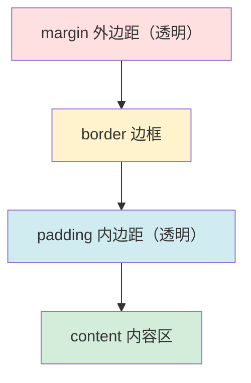
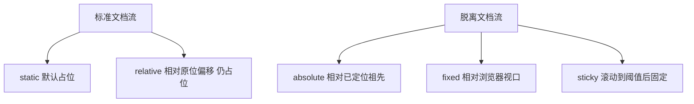

# 3.2 盒模型、浮动与布局

盒模型是 CSS 布局的核心概念，所有 HTML 元素在页面中都被视为一个矩形盒子。本节解决的问题是：盒模型由哪些部分组成，标准盒模型与 IE 盒模型有何区别，浮动如何使用与清除，定位机制如何控制元素位置。

## 盒模型

> [!definition] CSS 盒模型
> CSS 盒模型（Box Model）将每个 HTML 元素视为一个矩形盒子，由 content（内容）、padding（内边距）、border（边框）、margin（外边距）四部分组成，从内到外层层嵌套。



### 盒模型四部分

| 部分 | 作用 | 是否占据空间 |
| --- | --- | --- |
| content | 内容区，显示文字、图片等 | 是 |
| padding | 内容与边框之间的间距，透明 | 是 |
| border | 边框，可设宽度样式颜色 | 是 |
| margin | 盒子与其他元素之间的间距，透明 | 是（但相邻 margin 会合并） |

```css
.box {
    width: 200px;        /* content 宽度 */
    height: 100px;       /* content 高度 */
    padding: 20px;       /* 内边距 */
    border: 5px solid #333;  /* 边框 */
    margin: 15px;        /* 外边距 */
}
```

> [!note] margin 合并
> 相邻块级元素的垂直 margin 会发生合并（取较大值），这种现象称为 margin collapse。解决方法：使用 padding 代替、设为浮动或 flex 布局、给父元素设 overflow: hidden 或 border。

## box-sizing

`box-sizing` 属性决定 width/height 包含哪些部分，是控制盒模型计算方式的关键。

### content-box（标准盒模型，默认）

```css
.box { box-sizing: content-box; width: 200px; padding: 20px; border: 5px solid #333; }
```

- `width` 只包含 content
- 实际占用宽度 = width + padding×2 + border×2 + margin×2
- 上例实际宽度 = 200 + 40 + 10 = 250px

### border-box（IE 盒模型）

```css
.box { box-sizing: border-box; width: 200px; padding: 20px; border: 5px solid #333; }
```

- `width` 包含 content + padding + border
- 实际占用宽度 = width + margin×2
- 上例实际宽度 = 200px（content 自动缩小为 150px）

### 两种盒模型对比

| 模式 | width 包含 | 实际宽度计算 | 特点 |
| --- | --- | --- | --- |
| content-box | 仅 content | width + padding + border + margin | 默认，计算繁琐 |
| border-box | content + padding + border | width + margin | 直观，便于布局 |

> [!tip] 全局 border-box 推荐
> 实际开发中通常全局设置 `box-sizing: border-box`，让 width 即元素可见宽度，避免 padding 与 border 撑大布局：
> ```css
> * { margin: 0; padding: 0; box-sizing: border-box; }
> ```

## 浮动 float

浮动（float）最初用于实现文字环绕图片，后被广泛用于多列布局，但会带来脱离文档流的副作用。

```css
img { float: left; margin-right: 10px; }  /* 图片左浮动，文字环绕 */
.box { float: left; width: 33.33%; }       /* 三列等宽布局 */
```

| float 值 | 作用 |
| --- | --- |
| `left` | 元素向左浮动 |
| `right` | 元素向右浮动 |
| `none` | 不浮动（默认） |

### 浮动的问题

浮动元素脱离标准文档流，导致**父元素高度塌陷**：父元素无法包含浮动子元素的高度，表现为高度为 0。

```html
<div class="parent">
    <div class="child" style="float: left; width: 100px; height: 100px;">浮动子元素</div>
</div>
<!-- .parent 高度塌陷为 0 -->
```

### 清除浮动的方法

**方法一：clear 属性**

在浮动元素后添加一个空元素并设置 clear：

```html
<div style="clear: both;"></div>
```

**方法二：clearfix 伪元素（推荐）**

给父元素添加 clearfix 类，用 `::after` 伪元素清除浮动：

```css
.clearfix::after {
    content: "";
    display: block;
    clear: both;
}
```

```html
<div class="parent clearfix">
    <div class="child" style="float: left;">浮动子元素</div>
</div>
```

**方法三：父元素 overflow**

```css
.parent { overflow: hidden; }  /* 或 auto */
```

> [!tip] 推荐 clearfix
> clearfix 伪元素法无需添加额外 HTML 元素，是最干净的清除浮动方案，已被现代开发广泛采用。但若布局需求复杂，建议直接使用 Flex 或 Grid 布局替代浮动。

## 定位 position

`position` 属性控制元素的定位方式，配合 `top`、`right`、`bottom`、`left`、`z-index` 调整位置。

### static（静态定位，默认）

```css
.box { position: static; }
```

元素按标准文档流排列，`top`/`left` 等属性无效。

### relative（相对定位）

```css
.box { position: relative; top: 10px; left: 20px; }
```

相对**元素原本在文档流中的位置**偏移，仍占据原位置空间，不脱离文档流。

### absolute（绝对定位）

```css
.box { position: absolute; top: 0; right: 0; }
```

相对**最近的已定位祖先元素**（非 static）定位；若无已定位祖先则相对 `<html>`。完全脱离文档流，不占据空间。

### fixed（固定定位）

```css
.header { position: fixed; top: 0; left: 0; width: 100%; }
```

相对**浏览器视口**定位，滚动页面时位置不变，脱离文档流。常用于固定导航栏、悬浮按钮。

### sticky（粘性定位）

```css
.nav { position: sticky; top: 0; }
```

在视口内时表现为 relative，滚动到指定阈值（如 `top: 0`）后表现为 fixed。常用于吸顶导航。

### 定位对比

| position | 参照物 | 是否占位 | 是否脱离文档流 |
| --- | --- | --- | --- |
| static | 默认文档流 | 是 | 否 |
| relative | 元素原位置 | 是 | 否（偏移但不影响布局） |
| absolute | 最近已定位祖先 | 否 | 是 |
| fixed | 浏览器视口 | 否 | 是 |
| sticky | 视口阈值 | 是 | 滚动到阈值时脱离 |



## z-index 层级

`z-index` 控制定位元素在 Z 轴（垂直屏幕方向）上的堆叠顺序，仅对已定位元素（非 static）生效。

```css
.modal { position: fixed; z-index: 999; }  /* 弹窗在最上层 */
.overlay { position: fixed; z-index: 100; } /* 遮罩层 */
```

- `z-index` 值越大越靠上
- 默认 auto，按 DOM 顺序堆叠
- 仅对 position 非 static 的元素生效

> [!warning] z-index 失效排查
> 若 z-index 不生效，检查元素是否设置了 `position`（static 无效）。另外，父元素的 z-index 会限制子元素的堆叠范围（层叠上下文）。

## 文档流与脱离文档流

> [!definition] 文档流
> 文档流（Normal Flow）是元素默认的排列规则：块级元素从上到下垂直排列，行内元素从左到右水平排列。

脱离文档流的情形：

- 浮动 float（left/right）
- 绝对定位 absolute
- 固定定位 fixed

脱离文档流的元素不再参与标准流布局，可能导致父元素高度塌陷或元素重叠，需通过清除浮动或合理使用定位处理。

## 小结

盒模型将每个元素视为 content、padding、border、margin 四层盒子，box-sizing 决定 width 的计算范围，border-box 更适合实际布局。浮动用于多列布局但需清除（推荐 clearfix 伪元素）。position 定位提供 static、relative、absolute、fixed、sticky 五种方式，z-index 控制层叠顺序。理解文档流与脱离文档流的概念，是掌握 CSS 布局的关键。

## 关联

- 上一节：[[3.1 CSS引入方式、选择器]]
- 下一节：[[3.3 Flex布局、响应式基础]]
- 上一级：[[MOC - 第3章]]
