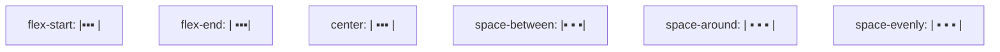

# 3.3 Flex布局、响应式基础

Flex 布局是现代 CSS 布局的首选方案，响应式设计让页面适配不同设备。本节解决的问题是：如何使用 Flex 一维布局实现各种常见排列，如何通过媒体查询与 viewport 实现多设备适配。

## Flex 布局

> [!definition] Flex 布局
> Flex（Flexible Box）布局是一种一维布局模型，通过主轴与交叉轴两个方向排列子元素，能高效实现居中、等分、自适应等布局需求，取代了传统浮动布局的繁琐。

```css
.container {
    display: flex;           /* 定义 flex 容器 */
    flex-direction: row;     /* 主轴方向 */
    justify-content: center; /* 主轴对齐 */
    align-items: center;     /* 交叉轴对齐 */
}
```

```mermaid
flowchart LR
    subgraph Flex容器
        direction horizontal
        A[项目1] --- B[项目2] --- C[项目3]
    end
    MAIN["主轴 main axis →"] -.-> Flex容器
    CROSS["交叉轴 cross axis ↓"] -.垂直于主轴.- Flex容器
```

### Flex 容器属性

设置在父容器（`display: flex`）上的属性：

| 属性 | 作用 | 常用值 |
| --- | --- | --- |
| `flex-direction` | 主轴方向 | `row`（默认，水平）、`row-reverse`、`column`（垂直）、`column-reverse` |
| `justify-content` | 主轴对齐方式 | `flex-start`、`flex-end`、`center`、`space-between`、`space-around`、`space-evenly` |
| `align-items` | 交叉轴对齐方式 | `flex-start`、`flex-end`、`center`、`stretch`（默认，拉伸）、`baseline` |
| `flex-wrap` | 是否换行 | `nowrap`（默认，不换行）、`wrap`（换行）、`wrap-reverse` |
| `align-content` | 多行交叉轴对齐（需 flex-wrap） | `flex-start`、`center`、`space-between`、`stretch` |
| `gap` | 项目间距 | `10px`、`10px 20px`（行列） |

#### justify-content 对齐效果



### Flex 项目属性

设置在子元素上的属性：

| 属性 | 作用 | 说明 |
| --- | --- | --- |
| `flex-grow` | 放大比例 | 0（默认）不放大；1 等分剩余空间 |
| `flex-shrink` | 缩小比例 | 1（默认）等比缩小；0 不缩小 |
| `flex-basis` | 初始尺寸 | auto（默认）或具体值如 `200px` |
| `flex` | 上述三者简写 | `flex: 1` 等价于 `1 1 0%` |
| `order` | 排列顺序 | 默认 0，值越小越靠前 |
| `align-self` | 单独对齐 | 覆盖父级 align-items |

> [!tip] flex 简写常用值
> - `flex: 1`：等分剩余空间（常用于自适应宽度）
> - `flex: 0 0 200px`：固定 200px 不放大不缩小
> - `flex: auto`：`1 1 auto`，按内容尺寸放大缩小

### Flex 布局实战

#### 水平居中

```css
.container {
    display: flex;
    justify-content: center;
}
```

#### 垂直居中

```css
.container {
    display: flex;
    align-items: center;
}
```

#### 水平垂直居中

```css
.container {
    display: flex;
    justify-content: center;
    align-items: center;
    height: 100vh;  /* 需有明确高度 */
}
```

#### 等分布局

```css
.container { display: flex; }
.item { flex: 1; }  /* 每个项目等分宽度 */
```

#### 两栏布局（固定+自适应）

```css
.container { display: flex; }
.sidebar { flex: 0 0 200px; }  /* 固定 200px */
.main { flex: 1; }             /* 自适应剩余空间 */
```

#### 底部固定布局

```css
.layout {
    display: flex;
    flex-direction: column;
    min-height: 100vh;
}
.header { flex: 0 0 60px; }
.content { flex: 1; }   /* 占据剩余空间 */
.footer { flex: 0 0 40px; }
```

### 可运行 Flex 示例

```html
<!DOCTYPE html>
<html lang="zh-CN">
<head>
    <meta charset="UTF-8">
    <title>Flex布局演示</title>
    <style>
        * { margin: 0; padding: 0; box-sizing: border-box; }
        body { font-family: "Microsoft YaHei", sans-serif; padding: 20px; }
        .demo { border: 2px dashed #999; margin-bottom: 20px; padding: 10px; }
        .demo h3 { margin-bottom: 10px; }
        .box { display: flex; min-height: 60px; background: #f0f0f0; padding: 10px; gap: 10px; }
        .item { background: #4CAF50; color: white; padding: 10px 20px; border-radius: 4px; }

        /* 水平居中 */
        .center-h { justify-content: center; }

        /* 两端对齐 */
        .between { justify-content: space-between; }

        /* 垂直居中 */
        .center-v { align-items: center; min-height: 100px; }

        /* 等分 */
        .equal .item { flex: 1; text-align: center; }

        /* 两栏布局 */
        .two-col .sidebar { flex: 0 0 120px; background: #2196F3; }
        .two-col .main { flex: 1; background: #FF9800; }
    </style>
</head>
<body>
    <div class="demo">
        <h3>水平居中 justify-content: center</h3>
        <div class="box center-h">
            <div class="item">项目1</div>
            <div class="item">项目2</div>
            <div class="item">项目3</div>
        </div>
    </div>

    <div class="demo">
        <h3>两端对齐 justify-content: space-between</h3>
        <div class="box between">
            <div class="item">项目1</div>
            <div class="item">项目2</div>
            <div class="item">项目3</div>
        </div>
    </div>

    <div class="demo">
        <h3>垂直居中 align-items: center</h3>
        <div class="box center-v">
            <div class="item">垂直居中的项目</div>
        </div>
    </div>

    <div class="demo">
        <h3>等分布局 flex: 1</h3>
        <div class="box equal">
            <div class="item">1/3</div>
            <div class="item">1/3</div>
            <div class="item">1/3</div>
        </div>
    </div>

    <div class="demo">
        <h3>两栏布局（固定+自适应）</h3>
        <div class="box two-col">
            <div class="item sidebar">侧栏 120px</div>
            <div class="item main">主内容自适应</div>
        </div>
    </div>
</body>
</html>
```

## 响应式设计

响应式设计（Responsive Design）让同一套页面在不同设备（PC、平板、手机）上自动调整布局与样式，核心手段是媒体查询与 viewport 设置。

### 视口 viewport 设置

在 HTML 的 `<head>` 中设置 viewport 元标签，是移动端适配的前提：

```html
<meta name="viewport" content="width=device-width, initial-scale=1.0">
```

| 参数 | 作用 |
| --- | --- |
| `width=device-width` | 视口宽度等于设备宽度 |
| `initial-scale=1.0` | 初始缩放比例为 1 |
| `maximum-scale=1.0` | 最大缩放比例（限制用户缩放） |
| `user-scalable=no` | 禁止用户缩放 |

> [!warning] viewport 必记
> 若不设置 viewport，移动端浏览器会以默认 980px 宽度渲染页面再缩放显示，导致字体过小、布局错乱。所有移动端页面必须包含此 meta 标签。

### 媒体查询 @media

媒体查询根据设备特性（宽度、高度、方向等）应用不同 CSS，是响应式的核心技术。

```css
/* 默认样式（移动端优先） */
body { font-size: 14px; }
.container { flex-direction: column; }

/* 屏幕宽度 >= 768px 时（平板） */
@media (min-width: 768px) {
    body { font-size: 16px; }
    .container { flex-direction: row; }
}

/* 屏幕宽度 >= 1024px 时（桌面） */
@media (min-width: 1024px) {
    body { font-size: 18px; }
    .container { max-width: 1200px; margin: 0 auto; }
}
```

### 媒体查询语法

```css
@media (条件) { /* 满足条件时应用的样式 */ }
```

| 条件 | 含义 |
| --- | --- |
| `min-width: 768px` | 视口宽度 >= 768px |
| `max-width: 768px` | 视口宽度 <= 768px |
| `orientation: landscape` | 横屏 |
| `orientation: portrait` | 竖屏 |
| `min-width: 768px and max-width: 1024px` | 范围（用 and 连接） |

### 常见断点

| 设备 | 宽度范围 | 典型断点 |
| --- | --- | --- |
| 手机 | < 768px | 默认样式 |
| 平板 | 768px – 1024px | `min-width: 768px` |
| 桌面 | > 1024px | `min-width: 1024px` |
| 大屏 | > 1440px | `min-width: 1440px` |

> [!tip] 移动优先策略
> 推荐采用"移动优先"：先写移动端基础样式，再用 `min-width` 逐步增强大屏样式。这样默认样式体积小，且符合移动端性能优化原则。

### 移动端适配基础

除媒体查询外，移动端适配还常用以下技术：

| 技术 | 作用 |
| --- | --- |
| 响应式图片 | `img { max-width: 100%; height: auto; }` 防止图片溢出 |
| 相对单位 | 使用 `%`、`vw`、`vh`、`rem` 代替固定 px |
| Flex/Grid 布局 | 自适应排列，配合媒体查询切换方向 |
| 触摸优化 | 按钮点击区域不小于 44×44px |

```css
/* 响应式图片 */
img { max-width: 100%; height: auto; }

/* 使用 rem 单位（配合根字号） */
html { font-size: 16px; }
.title { font-size: 1.5rem; }  /* 24px */

/* 视口单位 */
.fullscreen { width: 100vw; height: 100vh; }
```

### 可运行响应式示例

```html
<!DOCTYPE html>
<html lang="zh-CN">
<head>
    <meta charset="UTF-8">
    <meta name="viewport" content="width=device-width, initial-scale=1.0">
    <title>响应式卡片布局</title>
    <style>
        * { margin: 0; padding: 0; box-sizing: border-box; }
        body { font-family: "Microsoft YaHei", sans-serif; padding: 20px; background: #f5f5f5; }

        .cards {
            display: flex;
            flex-wrap: wrap;
            gap: 15px;
        }

        .card {
            flex: 1 1 100%;   /* 移动端：单列 */
            background: white;
            padding: 20px;
            border-radius: 8px;
            box-shadow: 0 2px 4px rgba(0,0,0,0.1);
        }

        .card h3 { color: #333; margin-bottom: 10px; }
        .card p { color: #666; line-height: 1.6; }

        /* 平板：两列 */
        @media (min-width: 768px) {
            .card { flex: 1 1 calc(50% - 15px); }
        }

        /* 桌面：三列 */
        @media (min-width: 1024px) {
            .card { flex: 1 1 calc(33.33% - 15px); }
            .cards { max-width: 1200px; margin: 0 auto; }
        }
    </style>
</head>
<body>
    <h1 style="margin-bottom: 20px; text-align: center;">响应式卡片布局</h1>
    <div class="cards">
        <div class="card">
            <h3>卡片一</h3>
            <p>调整浏览器窗口宽度，卡片会从单列变为两列、三列。</p>
        </div>
        <div class="card">
            <h3>卡片二</h3>
            <p>移动端单列显示，平板两列，桌面端三列。</p>
        </div>
        <div class="card">
            <h3>卡片三</h3>
            <p>使用 flex-wrap 与媒体查询实现自适应排列。</p>
        </div>
        <div class="card">
            <h3>卡片四</h3>
            <p>flex-basis 配合 calc 计算每行项目数。</p>
        </div>
        <div class="card">
            <h3>卡片五</h3>
            <p>这是响应式布局的经典模式。</p>
        </div>
        <div class="card">
            <h3>卡片六</h3>
            <p>移动优先，逐步增强。</p>
        </div>
    </div>
</body>
</html>
```

## 小结

Flex 布局通过主轴与交叉轴两个方向高效实现居中、等分、两栏等常见布局，容器属性控制整体排列，项目属性控制个体放大缩小。响应式设计以 viewport 设置为基础，通过媒体查询根据设备宽度切换样式，配合相对单位与 Flex 布局实现多设备适配。移动优先策略是现代响应式开发的推荐做法。

## 关联

- 上一节：[[3.2 盒模型、浮动与布局]]
- 上一级：[[MOC - 第3章]]
- 关联概念：[[2.1 HTML文档结构]]（viewport meta）、[[4.3 DOM操作、事件机制]]（响应式交互）
