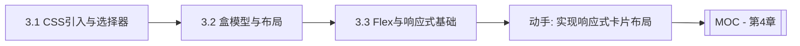

# MOC - 第3章 CSS样式技术

> [!info] 本章定位
> 第3章在 HTML 结构之上叠加视觉表现。CSS（Cascading Style Sheets，层叠样式表）解决的问题是：如何控制网页的颜色、字体、间距、布局与响应式适配，让页面从"纯文本骨架"变为"美观可用的界面"。本章涵盖 CSS 引入与选择器、盒模型与布局、Flex 与响应式三大模块。

## 学习路线图



## 知识点导航

| 节 | 主题 | 核心要点 | 入口 |
| --- | --- | --- | --- |
| 3.1 | CSS引入方式、选择器 | 行内/内部/外部引入、基础与复合选择器、伪类伪元素、优先级 | [[3.1 CSS引入方式、选择器]] |
| 3.2 | 盒模型、浮动与布局 | content/padding/border/margin、box-sizing、浮动清除、定位position | [[3.2 盒模型、浮动与布局]] |
| 3.3 | Flex布局、响应式基础 | flex容器与项目属性、水平垂直居中、媒体查询、viewport | [[3.3 Flex布局、响应式基础]] |

## 核心考点

> [!warning] 重点掌握
> 1. CSS 四种引入方式（行内、内部、外部、@import）及优先级。
> 2. 基础选择器（标签、类、ID、通配符）与复合选择器（后代、子代、相邻兄弟、通用兄弟）。
> 3. 伪类选择器（:hover、:first-child、:nth-child(n)）与伪元素选择器（::before、::after）。
> 4. CSS 选择器优先级计算：`!important > 行内 > ID > 类 > 标签`。
> 5. 盒模型四部分（content、padding、border、margin）及 box-sizing 两种模式。
> 6. 浮动 float 与清除浮动的方法（clear、clearfix）。
> 7. position 定位五种值（static、relative、absolute、fixed、sticky）及区别。
> 8. Flex 布局容器属性（flex-direction、justify-content、align-items）与项目属性。
> 9. 媒体查询 @media 与移动端 viewport 设置。

## 自测题

> [!question] 题1
> 列举 CSS 的三种基本引入方式，并说明它们的优先级关系。
> > [!check]- 参考答案
> > 三种引入方式：行内样式（style 属性）、内部样式表（`<style>` 标签）、外部样式表（`<link>` 引入 .css 文件）。优先级：行内样式 > 内部样式表 = 外部样式表（后者取决于书写顺序，后写的覆盖先写的）。注意 @import 引入的外部样式优先级低于 link。所有这些都低于 `!important`。

> [!question] 题2
> 计算以下选择器的优先级：`#nav .item a:hover` 与 `div.menu a`。
> > [!check]- 参考答案
> > 优先级按 (ID, 类, 标签) 三元组计算：`#nav .item a:hover` = (1, 2, 1)（1 个 ID + 2 个类/伪类 + 1 个标签）；`div.menu a` = (0, 1, 2)（1 个类 + 2 个标签）。比较：先比 ID 数，(1,2,1) > (0,1,2)，故 `#nav .item a:hover` 优先级更高。

> [!question] 题3
> 说明标准盒模型与 IE 盒模型（border-box）的区别，box-sizing 如何切换？
> > [!check]- 参考答案
> > 标准盒模型（content-box）：width/height 只包含 content，实际占用宽度 = content + padding + border + margin。IE 盒模型（border-box）：width/height 包含 content + padding + border，实际占用宽度 = width + margin。通过 `box-sizing: content-box`（默认）或 `box-sizing: border-box` 切换。实际开发常全局设置 border-box 以简化尺寸计算。

> [!question] 题4
> 使用 Flex 实现一个元素水平垂直居中，写出关键 CSS。
> > [!check]- 参考答案
> > 父容器设为 flex 并设置主轴与交叉轴居中：
> > ```css
> > .parent { display: flex; justify-content: center; align-items: center; }
> > ```
> > 也可在父容器设 `display: flex`，子元素设 `margin: auto`。

## 章节导航

- 上一级：[[MOC - Web开发技术]]
- 上一章：[[MOC - 第2章]]
- 下一章：[[MOC - 第4章]]
