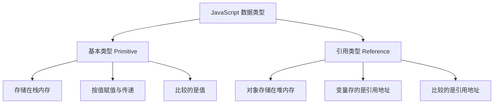

# 4.1 JS语法、变量、数据类型

JavaScript 是 Web 的脚本语言，为页面注入动态行为。本节解决的问题是：如何把 JS 引入 HTML 页面，如何声明变量并选择合适的声明方式，JavaScript 有哪些数据类型，如何进行类型转换与运算。

## JS 引入方式

JavaScript 有三种引入方式，与 CSS 类似：

### 行内 JS

直接写在 HTML 标签的事件属性中：

```html
<button onclick="alert('Hello!')">点击我</button>
```

### 内部 JS

在 HTML 中用 `<script>` 标签包裹：

```html
<script>
    console.log("页面加载完成");
</script>
```

### 外部 JS（推荐）

将 JS 写在独立的 `.js` 文件中，用 `<script src>` 引入：

```html
<script src="app.js"></script>
```

### 三种引入方式对比

| 方式 | 位置 | 优点 | 缺点 |
| --- | --- | --- | --- |
| 行内 | 标签属性 | 简单直接 | 结构与行为混杂，无法复用 |
| 内部 | `<script>` 标签 | 单文件管理 | 无法跨页面复用 |
| 外部 | `.js` 文件 | 可复用、可缓存、分离 | 多一次请求 |

> [!tip] script 放置位置
> `<script>` 默认会阻塞 HTML 解析。建议将外部 JS 放在 `</body>` 前，或使用 `defer` 属性：
> ```html
> <script src="app.js" defer></script>
> ```
> `defer` 让 JS 在 HTML 解析完成后才执行，不阻塞页面渲染。`async` 则异步加载，加载完立即执行（可能阻塞）。

## 变量声明

JavaScript 有三种变量声明关键字：`var`、`let`、`const`。

### var（旧版，避免使用）

```javascript
var a = 10;
var a = 20;  // 可重复声明
a = 30;      // 可重新赋值
```

### let（现代，可变变量）

```javascript
let b = 10;
b = 20;      // 可重新赋值
// let b = 30;  // 报错：不可重复声明
```

### const（现代，常量）

```javascript
const c = 10;
// c = 20;  // 报错：不可重新赋值
const obj = { name: "张三" };
obj.name = "李四";  // 允许：修改对象属性
// obj = {};  // 报错：不可重新赋值整个变量
```

### var、let、const 区别

| 特性 | var | let | const |
| --- | --- | --- | --- |
| 作用域 | 函数作用域 | 块级作用域 | 块级作用域 |
| 变量提升 | 有（值为 undefined） | 有（暂时性死区，不可访问） | 有（暂时性死区） |
| 重复声明 | 允许 | 不允许 | 不允许 |
| 重新赋值 | 允许 | 允许 | 不允许 |
| 初始值 | 可不赋值 | 可不赋值 | 必须赋值 |

> [!warning] var 的变量提升
> `var` 声明的变量会被提升到作用域顶部，但赋值留在原地。这导致变量在声明前可访问（值为 undefined），容易引发 bug：
> ```javascript
> console.log(x);  // undefined（不报错）
> var x = 5;
> ```
> `let` 和 `const` 在声明前访问会抛出 ReferenceError（暂时性死区），更安全。

> [!tip] 现代开发建议
> 默认使用 `const`，仅在需要重新赋值时用 `let`，避免使用 `var`。

## 数据类型

JavaScript 数据类型分为**基本类型**（原始类型）与**引用类型**两大类。

### 基本类型（7 种）

| 类型 | 说明 | 示例 |
| --- | --- | --- |
| `string` | 字符串 | `"hello"`、`'world'`、`` `模板` `` |
| `number` | 数字（整数与浮点） | `42`、`3.14`、`NaN`、`Infinity` |
| `boolean` | 布尔 | `true`、`false` |
| `null` | 空值（人为赋值） | `null` |
| `undefined` | 未定义（声明未赋值） | `undefined` |
| `symbol` | 唯一标识（ES6） | `Symbol("id")` |
| `bigint` | 大整数（ES2020） | `9007199254740991n` |

### 引用类型

| 类型 | 说明 | 示例 |
| --- | --- | --- |
| `object` | 对象 | `{ name: "张三", age: 20 }` |
| `array` | 数组（特殊的对象） | `[1, 2, 3]` |
| `function` | 函数（特殊的对象） | `function() {}` |
| `Date` | 日期对象 | `new Date()` |
| `RegExp` | 正则对象 | `/^\d+$/` |

### 基本类型与引用类型的区别



```javascript
// 基本类型：按值传递
let a = 10;
let b = a;
b = 20;
console.log(a);  // 10（a 不变）

// 引用类型：按引用传递
let obj1 = { value: 10 };
let obj2 = obj1;
obj2.value = 20;
console.log(obj1.value);  // 20（obj1 也变了，指向同一对象）
```

## typeof 运算符

`typeof` 用于检测变量类型，返回字符串：

```javascript
typeof "hello"     // "string"
typeof 42          // "number"
typeof true        // "boolean"
typeof undefined   // "undefined"
typeof null        // "object"（历史遗留 bug）
typeof Symbol()    // "symbol"
typeof 10n         // "bigint"
typeof {}          // "object"
typeof []          // "object"（数组也是 object）
typeof function(){} // "function"
```

> [!warning] typeof 的两个坑
> 1. `typeof null` 返回 `"object"`，这是 JS 早期遗留 bug，判断 null 应使用 `=== null`。
> 2. `typeof []` 返回 `"object"`，无法区分数组与对象。判断数组应使用 `Array.isArray([])`。

## 类型转换

### 隐式转换（自动）

JavaScript 在运算时会自动转换类型，容易引发意外：

```javascript
console.log("5" + 3);    // "53"（数字转字符串拼接）
console.log("5" - 3);    // 2（字符串转数字相减）
console.log("5" * "2");  // 10（字符串转数字）
console.log(0 == false);  // true（隐式转换后相等）
console.log(0 === false); // false（严格相等，不转换）
```

> [!tip] 始终用 === 严格相等
> `==` 会进行隐式类型转换，容易产生意外结果；`===` 严格比较类型与值，更安全可靠。建议始终使用 `===`。

### 显式转换

```javascript
// 转 number
Number("123");      // 123
Number("12.5");     // 12.5
Number("abc");      // NaN
parseInt("123px");  // 123（提取整数部分）
parseInt("12.9");   // 12
parseFloat("12.9"); // 12.9

// 转 string
String(123);        // "123"
String(true);       // "true"
(123).toString();   // "123"

// 转 boolean
Boolean(0);         // false
Boolean("");        // false
Boolean(null);      // false
Boolean(undefined); // false
Boolean(NaN);       // false
Boolean("hello");   // true
Boolean(1);         // true
Boolean([]);        // true
Boolean({});        // true
```

### falsy 值（转为 false 的值）

以下值在布尔上下文中会被转为 `false`，称为 falsy 值：

- `false`
- `0`、`-0`、`0n`
- `""`（空字符串）
- `null`
- `undefined`
- `NaN`

其他所有值转为 `true`（truthy），包括 `[]`、`{}`、`"0"`、`"false"`。

## 运算符

### 算术运算符

```javascript
5 + 3   // 8
5 - 3   // 2
5 * 3   // 15
5 / 2   // 2.5
5 % 3   // 2（取余）
5 ** 2  // 25（幂，ES7）
let a = 5; a++;  // 5（后置自增，先返回再 +1）
let b = 5; ++b;  // 6（前置自增，先 +1 再返回）
```

### 比较运算符

```javascript
5 > 3    // true
5 >= 5   // true
5 < 3    // false
5 <= 5   // true
5 == "5" // true（隐式转换）
5 === "5" // false（严格相等）
5 != "5" // false
5 !== "5" // true
```

### 逻辑运算符

```javascript
true && false  // false（与）
true || false  // true（或）
!true          // false（非）

// 短路求值
let name = user && user.name;  // user 存在才取 name
let display = name || "匿名";   // name 为 falsy 时用默认值
```

### 赋值运算符

```javascript
let a = 10;
a += 5;   // a = a + 5 = 15
a -= 3;   // a = 12
a *= 2;   // a = 24
a /= 4;   // a = 6
a %= 4;   // a = 2
```

### 条件（三元）运算符

```javascript
let age = 18;
let result = age >= 18 ? "成年" : "未成年";
console.log(result);  // "成年"
```

## 可运行代码示例

以下代码可在浏览器控制台或 Node.js 中直接运行，演示变量、类型与转换：

```javascript
// 变量声明
const name = "张三";
let age = 20;
let isStudent = true;

// 类型检测
console.log(typeof name);      // string
console.log(typeof age);       // number
console.log(typeof isStudent); // boolean

// 基本类型按值传递
let score = 90;
let copyScore = score;
copyScore = 100;
console.log(score);      // 90（不变）

// 引用类型按引用传递
let student = { name: "张三", age: 20 };
let copyStudent = student;
copyStudent.age = 21;
console.log(student.age);  // 21（变了）

// 类型转换
console.log(Number("42"));       // 42
console.log(parseInt("42px"));   // 42
console.log(String(true));       // "true"
console.log(Boolean(0));         // false

// 严格相等
console.log(5 === 5);            // true
console.log(5 === "5");          // false

// 三元运算符
const status = age >= 18 ? "成年" : "未成年";
console.log(`${name} 是 ${status}`);  // 张三 是 成年
```

## 小结

JavaScript 通过行内、内部、外部三种方式引入，外部 JS 配合 `defer` 是推荐做法。变量声明优先用 `const`，需修改用 `let`，避免 `var`。数据类型分基本类型（7 种）与引用类型，基本类型按值传递，引用类型按引用传递。`typeof` 用于类型检测但有 null 与数组的坑。类型转换分隐式与显式，建议用 `===` 严格相等避免隐式转换的坑。

## 关联

- 上一级：[[MOC - 第4章]]
- 下一节：[[4.2 函数、数组、对象]]
- 关联概念：[[2.1 HTML文档结构]]（script 标签）、[[3.1 CSS引入方式、选择器]]（引入方式对比）
