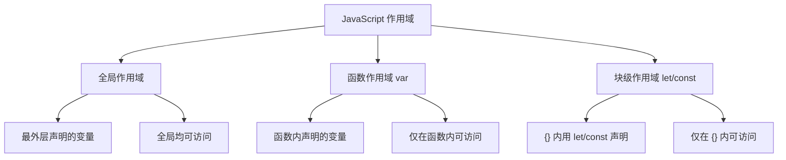

# 4.2 函数、数组、对象

函数、数组与对象是 JavaScript 组织逻辑与数据的三大核心结构。本节解决的问题是：如何定义与调用函数，如何管理作用域，如何使用数组的各种方法处理数据集合，如何创建与遍历对象。

## 函数

函数是一段可复用的代码块，接收输入（参数），执行逻辑，返回输出（返回值）。

### 函数声明

```javascript
// 函数声明（有提升）
function add(a, b) {
    return a + b;
}
console.log(add(2, 3));  // 5
```

### 函数表达式

```javascript
// 函数表达式（无提升）
const subtract = function(a, b) {
    return a - b;
};
console.log(subtract(5, 2));  // 3
```

### 箭头函数（ES6）

```javascript
// 箭头函数：简洁写法
const multiply = (a, b) => a * b;
console.log(multiply(3, 4));  // 12

// 单参数可省略括号
const double = x => x * 2;

// 无参数需空括号
const sayHi = () => console.log("Hi");

// 多行语句需大括号与 return
const compute = (a, b) => {
    let sum = a + b;
    return sum * 2;
};
```

### 三种函数定义对比

| 方式 | 语法 | 提升 | this 指向 | 适用 |
| --- | --- | --- | --- | --- |
| 函数声明 | `function fn(){}` | 有 | 调用时确定 | 通用 |
| 函数表达式 | `const fn = function(){}` | 无 | 调用时确定 | 回调、赋值 |
| 箭头函数 | `const fn = () => {}` | 无 | 继承外层 | 简洁回调 |

> [!warning] 箭头函数的 this
> 箭头函数没有自己的 `this`，继承外层作用域的 `this`。这既是优势（回调中保持 this）也是陷阱（对象方法中 this 不指向对象）。需要自身 this 时用普通函数。

### 函数参数

```javascript
// 默认参数
function greet(name = "访客") {
    return `你好，${name}`;
}
console.log(greet());       // "你好，访客"
console.log(greet("张三")); // "你好，张三"

// 剩余参数（收集为数组）
function sum(...nums) {
    return nums.reduce((total, n) => total + n, 0);
}
console.log(sum(1, 2, 3, 4));  // 10

// arguments 对象（仅普通函数有）
function showArgs() {
    console.log(arguments);  // 类数组对象
}
showArgs("a", "b", "c");
```

### 返回值 return

```javascript
// 有返回值
function getMax(a, b) {
    return a > b ? a : b;
}

// 无 return 或 return; 返回 undefined
function log(msg) {
    console.log(msg);
    // 隐式 return undefined
}
```

## 作用域

作用域决定变量的可访问范围。



### 全局作用域

```javascript
let globalVar = "我是全局变量";
function test() {
    console.log(globalVar);  // 可访问
}
```

### 函数作用域

```javascript
function test() {
    var functionVar = "函数内";
}
// console.log(functionVar);  // 报错：函数外不可访问
```

### 块级作用域

```javascript
{
    let blockVar = "块内";
    const PI = 3.14;
}
// console.log(blockVar);  // 报错：块外不可访问

if (true) {
    let x = 10;
}
// console.log(x);  // 报错
```

## 闭包基础概念

> [!definition] 闭包
> 闭包（Closure）是函数与其引用的外层变量的组合。函数内部可以访问外层作用域的变量，即使外层函数已执行完毕，这些变量仍被保留不被回收。

```javascript
function makeCounter() {
    let count = 0;  // 外层变量
    return function() {  // 内层函数（闭包）
        count++;
        return count;
    };
}

const counter = makeCounter();
console.log(counter());  // 1
console.log(counter());  // 2
console.log(counter());  // 3
// count 变量被闭包保留，无法从外部直接访问
```

> [!tip] 闭包的用途与风险
> 闭包常用于：创建私有变量、实现模块化、回调中保留状态。但闭包会持有外层变量不被回收，使用不当可能造成内存泄漏。

## 数组

数组是存储有序数据集合的引用类型。

### 创建与访问

```javascript
// 创建数组
let arr1 = [1, 2, 3, 4, 5];
let arr2 = new Array(1, 2, 3);
let arr3 = [];  // 空数组

// 访问与修改（下标从 0 开始）
console.log(arr1[0]);   // 1
arr1[0] = 10;
console.log(arr1[0]);   // 10

// 数组长度
console.log(arr1.length);  // 5

// 数组解构
const [first, second, ...rest] = arr1;
console.log(first, second, rest);  // 10, 2, [3,4,5]
```

### 遍历数组

```javascript
const arr = ["a", "b", "c"];

// for 循环
for (let i = 0; i < arr.length; i++) {
    console.log(i, arr[i]);
}

// forEach（无返回值）
arr.forEach((item, index) => {
    console.log(index, item);
});

// for...of（遍历值）
for (const item of arr) {
    console.log(item);
}
```

### 数组方法

```javascript
const arr = [1, 2, 3, 4, 5];

// 增删（修改原数组）
arr.push(6);          // 末尾添加，返回新长度 → [1,2,3,4,5,6]
arr.pop();             // 末尾删除，返回删除值 → [1,2,3,4,5]
arr.unshift(0);        // 开头添加 → [0,1,2,3,4,5]
arr.shift();           // 开头删除 → [1,2,3,4,5]

// splice（万能增删改，修改原数组）
arr.splice(1, 2);      // 从下标1删2个 → [1,4,5]
arr.splice(1, 0, "a", "b");  // 从下标1插入 → [1,"a","b",4,5]
arr.splice(1, 2, "x");      // 从下标1删2个并插入"x" → [1,"x",4,5]

// slice（截取，返回新数组，不改原数组）
const sub = arr.slice(1, 3);  // 下标1到3（不含3） → ["x",4]

// 查找
arr.indexOf(4);        // 返回下标，不存在返回 -1
arr.includes(4);       // 返回布尔值
arr.find(x => x > 2);  // 返回第一个满足条件的元素
arr.findIndex(x => x > 2);  // 返回第一个满足条件的下标

// 排序与反转（修改原数组）
const nums = [3, 1, 4, 1, 5];
nums.sort();                  // 默认按字符串排序（坑！）
nums.sort((a, b) => a - b);   // 数字升序 → [1,1,3,4,5]
nums.sort((a, b) => b - a);   // 数字降序
nums.reverse();               // 反转

// 拼接与展开
const merged = [1, 2].concat([3, 4]);  // [1,2,3,4]
const spread = [...[1, 2], ...[3, 4]]; // [1,2,3,4]
```

### 数组迭代方法（返回新数组或值）

```javascript
const nums = [1, 2, 3, 4, 5];

// map：映射，返回新数组
const doubled = nums.map(x => x * 2);
console.log(doubled);  // [2, 4, 6, 8, 10]

// filter：过滤，返回满足条件的新数组
const evens = nums.filter(x => x % 2 === 0);
console.log(evens);  // [2, 4]

// reduce：累积，返回单个值
const sum = nums.reduce((total, x) => total + x, 0);
console.log(sum);  // 15

// every：全部满足才 true
const allPositive = nums.every(x => x > 0);  // true

// some：任一满足即 true
const hasEven = nums.some(x => x % 2 === 0);  // true

// 链式调用
const result = nums
    .filter(x => x % 2 === 0)   // [2, 4]
    .map(x => x * 10)            // [20, 40]
    .reduce((sum, x) => sum + x); // 60
```

> [!example] 数组方法分类
> - **修改原数组**：push、pop、shift、unshift、splice、sort、reverse
> - **返回新数组**：slice、concat、map、filter
> - **返回单个值**：reduce、find、findIndex、indexOf、includes、every、some

## 对象

对象是键值对（key-value）的集合，是 JavaScript 组织数据的核心结构。

### 创建与访问

```javascript
// 对象字面量（推荐）
const person = {
    name: "张三",
    age: 20,
    isStudent: true,
    hobbies: ["阅读", "编程"],
    address: {
        city: "北京",
        street: "长安街"
    },
    // 方法
    sayHi() {
        return `你好，我是${this.name}`;
    }
};

// 点语法访问
console.log(person.name);        // 张三
console.log(person.address.city); // 北京

// 方括号语法（键为变量或含特殊字符时）
const key = "age";
console.log(person[key]);        // 20
console.log(person["isStudent"]); // true

// 调用方法
console.log(person.sayHi());     // 你好，我是张三
```

### 修改与新增

```javascript
person.age = 21;            // 修改属性
person.email = "a@b.com";   // 新增属性
person.greet = function() {  // 新增方法
    return "Hello";
};
delete person.email;        // 删除属性
```

### this 指向

`this` 在不同调用场景下指向不同对象：

```javascript
const obj = {
    name: "对象方法",
    show() {
        console.log(this.name);  // this 指向 obj
    }
};
obj.show();  // "对象方法"

// 普通函数（非严格模式）this 指向 window/global
function showThis() {
    console.log(this);
}
showThis();  // window（浏览器）

// 箭头函数继承外层 this
const obj2 = {
    name: "箭头",
    show: () => {
        // this 不指向 obj2，继承外层
    }
};
```

| 调用方式 | this 指向 |
| --- | --- |
| 对象方法 `obj.fn()` | 调用对象 obj |
| 普通函数 `fn()` | window（非严格模式）/ undefined（严格模式） |
| 箭头函数 `() => {}` | 继承外层作用域的 this |
| 构造函数 `new Fn()` | 新创建的实例对象 |
| 事件处理函数 | 触发事件的 DOM 元素 |

### 对象遍历

```javascript
const person = { name: "张三", age: 20, city: "北京" };

// for...in 遍历键
for (const key in person) {
    console.log(key, person[key]);
}

// Object.keys 获取所有键（返回数组）
const keys = Object.keys(person);
console.log(keys);  // ["name", "age", "city"]

// Object.values 获取所有值
const values = Object.values(person);
console.log(values);  // ["张三", 20, "北京"]

// Object.entries 获取键值对数组
const entries = Object.entries(person);
console.log(entries);  // [["name","张三"], ["age",20], ["city","北京"]]

// 遍历键值对
Object.entries(person).forEach(([key, value]) => {
    console.log(`${key}: ${value}`);
});
```

### 对象解构

```javascript
const person = { name: "张三", age: 20, city: "北京" };

// 解构赋值
const { name, age } = person;
console.log(name, age);  // 张三 20

// 重命名
const { name: userName } = person;
console.log(userName);  // 张三

// 默认值
const { email = "未填写" } = person;
console.log(email);  // 未填写
```

## 可运行代码示例

以下代码演示函数、数组、对象的综合应用，可在浏览器控制台或 Node.js 运行：

```javascript
// 学生管理示例
const students = [
    { name: "张三", age: 20, score: 85 },
    { name: "李四", age: 21, score: 92 },
    { name: "王五", age: 19, score: 78 },
    { name: "赵六", age: 22, score: 95 }
];

// 1. 过滤及格学生并提取姓名
const passed = students
    .filter(s => s.score >= 60)
    .map(s => s.name);
console.log("及格学生:", passed);  // ["张三","李四","王五","赵六"]

// 2. 计算平均分
const avg = students.reduce((sum, s) => sum + s.score, 0) / students.length;
console.log("平均分:", avg);  // 87.5

// 3. 按分数降序排序
const ranked = [...students].sort((a, b) => b.score - a.score);
console.log("排名:");
ranked.forEach((s, i) => console.log(`  ${i + 1}. ${s.name} - ${s.score}分`));

// 4. 使用闭包创建分数过滤器
function createFilter(threshold) {
    return function(list) {
        return list.filter(s => s.score >= threshold);
    };
}
const getExcellent = createFilter(90);
console.log("优秀学生:", getExcellent(students).map(s => s.name));  // ["李四","赵六"]
```

## 小结

函数有声明、表达式、箭头函数三种定义方式，箭头函数简洁但 this 行为不同。作用域分全局、函数、块级三层，闭包让内层函数保留外层变量。数组提供丰富的增删改查与迭代方法（push/pop/splice/map/filter/reduce 等），分为修改原数组与返回新数组两类。对象以键值对组织数据，支持点语法与方括号访问，this 指向随调用方式变化，Object.keys/values/entries 用于遍历。

## 关联

- 上一节：[[4.1 JS语法、变量、数据类型]]
- 下一节：[[4.3 DOM操作、事件机制]]
- 上一级：[[MOC - 第4章]]
