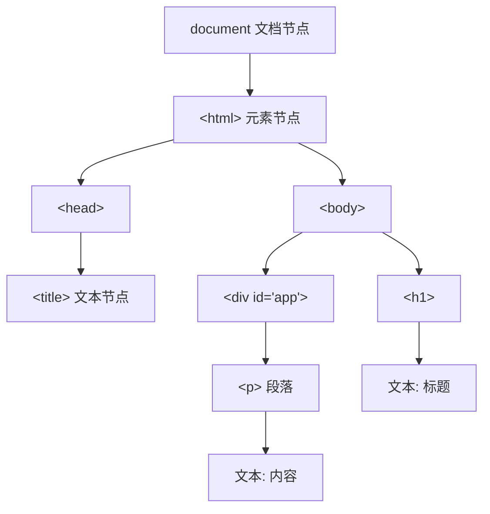
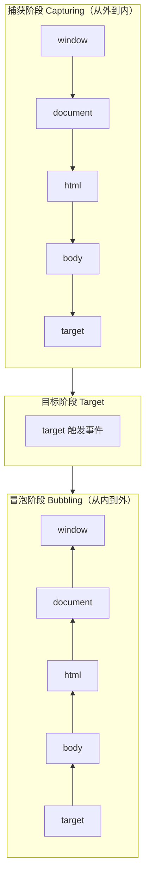

# 4.3 DOM操作、事件机制

DOM（Document Object Model）是 JavaScript 操作页面内容的桥梁，事件机制是用户与页面交互的入口。本节解决的问题是：如何获取页面元素并修改其内容与样式，如何创建插入删除节点，如何绑定与处理事件，以及事件冒泡、捕获与委托的原理。

## DOM 树结构

> [!definition] DOM
> DOM（Document Object Model，文档对象模型）是 HTML 文档的对象化表示。浏览器将 HTML 解析为一棵由节点（Node）组成的树形结构，JavaScript 通过 DOM API 操作这棵树来动态修改页面内容、结构与样式。



DOM 中的节点类型：

| 节点类型 | 说明 | 示例 |
| --- | --- | --- |
| 元素节点 | HTML 标签 | `<div>`、`<p>` |
| 文本节点 | 标签内的文字 | `"标题内容"` |
| 属性节点 | 标签的属性 | `id`、`class`、`src` |
| 文档节点 | 整个文档 | `document` |

## 获取元素

JavaScript 提供多种方法获取 DOM 元素：

```javascript
// 按 ID 获取（返回单个元素，最常用）
const el = document.getElementById("app");

// 按 class 获取（返回 HTMLCollection，类数组）
const items = document.getElementsByClassName("item");

// 按标签名获取（返回 HTMLCollection）
const paragraphs = document.getElementsByTagName("p");

// CSS 选择器获取（推荐）
const el = document.querySelector("#app .title");      // 第一个匹配
const items = document.querySelectorAll(".item");      // 所有匹配（NodeList）
```

### 获取方法对比

| 方法 | 返回类型 | 参数 | 说明 |
| --- | --- | --- | --- |
| `getElementById` | 单个元素 | id 字符串 | 最快，id 唯一 |
| `getElementsByClassName` | HTMLCollection | class 名 | 动态集合 |
| `getElementsByTagName` | HTMLCollection | 标签名 | 动态集合 |
| `querySelector` | 单个元素 | CSS 选择器 | 返回第一个匹配 |
| `querySelectorAll` | NodeList | CSS 选择器 | 返回所有匹配 |

> [!tip] 推荐使用 querySelector
> `querySelector` / `querySelectorAll` 支持 CSS 选择器语法，灵活强大，是现代开发的首选。注意 NodeList 可直接用 `forEach`，HTMLCollection 需转为数组后才能用。

```javascript
// NodeList 可直接 forEach
document.querySelectorAll(".item").forEach(el => {
    console.log(el.textContent);
});

// HTMLCollection 需转换
Array.from(document.getElementsByClassName("item")).forEach(el => {
    console.log(el.textContent);
});
```

## 操作元素

### 修改内容

```javascript
const el = document.getElementById("title");

// innerHTML：解析 HTML 标签
el.innerHTML = "<strong>新标题</strong>";

// textContent：纯文本，不解析标签（更安全）
el.textContent = "<strong>这会原样显示</strong>";

// innerText：考虑样式，性能略低
el.innerText = "新文字";
```

> [!warning] innerHTML 的 XSS 风险
> `innerHTML` 会解析 HTML，若内容来自用户输入，可能导致 XSS（跨站脚本攻击）。渲染用户输入时应使用 `textContent` 或对内容进行转义。

### 操作属性

```javascript
const img = document.querySelector("img");

// 通用方法
img.setAttribute("src", "new.jpg");
const src = img.getAttribute("src");
img.removeAttribute("title");

// 直接访问常用属性
img.src = "new.jpg";
img.alt = "图片说明";
img.id = "logo";
img.className = "thumbnail";  // 注意是 className 不是 class
```

### 修改样式

```javascript
const box = document.getElementById("box");

// style 属性：修改内联样式（驼峰命名）
box.style.color = "red";
box.style.backgroundColor = "#f0f0f0";  // CSS 的 background-color → backgroundColor
box.style.fontSize = "18px";

// className：替换整个 class
box.className = "active";

// classList：灵活操作 class（推荐）
box.classList.add("highlight");       // 添加
box.classList.remove("old");          // 移除
box.classList.toggle("visible");      // 切换（有则删，无则加）
box.classList.contains("active");     // 是否包含
```

> [!tip] classList 优先于 className
> `classList` 提供增删查改方法，不会覆盖原有 class，比直接操作 `className` 字符串更安全方便。

## 创建、插入、删除节点

```javascript
// 创建元素
const newDiv = document.createElement("div");
newDiv.textContent = "我是新元素";
newDiv.className = "box";

// 末尾添加（作为最后一个子元素）
document.body.appendChild(newDiv);

// 在指定元素前插入
const reference = document.getElementById("target");
document.body.insertBefore(newDiv, reference);

// 新 API：append（可添加多个，支持文本）
document.body.append(newDiv, "纯文本");

// 新 API：prepend（作为第一个子元素）
document.body.prepend(newDiv);

// 删除节点
document.body.removeChild(newDiv);  // 旧 API
newDiv.remove();                     // 新 API（推荐）

// 克隆节点
const clone = newDiv.cloneNode(true);  // true 深克隆（含子节点）
```

### 节点操作方法

| 方法 | 作用 |
| --- | --- |
| `createElement(tag)` | 创建元素节点 |
| `createTextNode(text)` | 创建文本节点 |
| `appendChild(node)` | 末尾添加子节点 |
| `insertBefore(new, ref)` | 在 ref 前插入 |
| `removeChild(node)` | 删除子节点 |
| `replaceChild(new, old)` | 替换子节点 |
| `cloneNode(deep)` | 克隆节点 |
| `append(...nodes)` | 末尾添加多个（新 API） |
| `prepend(...nodes)` | 开头添加多个（新 API） |
| `remove()` | 删除自身（新 API） |

## 事件基础

事件是用户或浏览器执行的动作（点击、输入、加载等），JavaScript 通过事件监听响应用户交互。

### 常见事件类型

| 类别 | 事件 | 触发时机 |
| --- | --- | --- |
| 鼠标 | `click` | 单击 |
| | `dblclick` | 双击 |
| | `mouseover` / `mouseenter` | 鼠标移入 |
| | `mouseout` / `mouseleave` | 鼠标移出 |
| | `mousedown` / `mouseup` | 按下 / 释放 |
| 键盘 | `keydown` | 按键按下 |
| | `keyup` | 按键释放 |
| 表单 | `submit` | 表单提交 |
| | `change` | 值改变并失焦 |
| | `input` | 输入时（实时） |
| | `focus` / `blur` | 获焦 / 失焦 |
| 页面 | `load` | 页面及资源加载完成 |
| | `DOMContentLoaded` | DOM 解析完成（不等图片） |
| | `resize` | 窗口大小改变 |
| | `scroll` | 滚动 |

> [!tip] load 与 DOMContentLoaded
> - `DOMContentLoaded`：HTML 解析完成即触发，不等图片等外部资源，适合尽早绑定事件。
> - `load`：所有资源（图片、CSS、iframe）加载完成才触发，时机较晚。
> 若 script 在 `<head>` 中且未用 defer，需用 DOMContentLoaded 确保 DOM 已就绪。

## 事件绑定

### 方式一：addEventListener（推荐）

```javascript
const btn = document.getElementById("btn");

btn.addEventListener("click", function(event) {
    console.log("被点击了");
});

// 可绑定多个监听器
btn.addEventListener("click", handler2);

// 移除监听（需引用同一函数）
btn.removeEventListener("click", handler2);

// 使用箭头函数
btn.addEventListener("click", (e) => {
    console.log(e.target);
});
```

### 方式二：onclick 属性

```javascript
btn.onclick = function() {
    console.log("被点击了");
};

// 移除
btn.onclick = null;
```

### 两种方式对比

| 特性 | addEventListener | onclick |
| --- | --- | --- |
| 绑定数量 | 可绑定多个 | 仅一个（后写覆盖） |
| 事件流控制 | 可选捕获/冒泡 | 仅冒泡 |
| 移除方式 | removeEventListener | 赋值 null |
| 兼容性 | 现代浏览器 | 全兼容 |
| 推荐度 | ⭐⭐⭐⭐⭐ | ⭐⭐ |

> [!warning] addEventListener 移除注意
> `removeEventListener` 必须传入与 `addEventListener` **相同的函数引用**才能移除。若用匿名函数或箭头函数绑定，无法移除。需移除时应使用具名函数。

```javascript
// ✅ 可移除
function handleClick(e) { console.log("click"); }
btn.addEventListener("click", handleClick);
btn.removeEventListener("click", handleClick);  // 成功

// ❌ 无法移除（每次新建函数）
btn.addEventListener("click", () => console.log("click"));
btn.removeEventListener("click", () => console.log("click"));  // 无效
```

## 事件对象 event

事件处理函数接收一个事件对象参数，包含事件相关信息：

```javascript
btn.addEventListener("click", function(event) {
    console.log(event.type);      // "click" 事件类型
    console.log(event.target);    // 实际触发事件的元素
    console.log(event.currentTarget);  // 绑定监听的元素
    console.log(event.clientX);   // 鼠标 X 坐标
    console.log(event.clientY);   // 鼠标 Y 坐标
});
```

### 常用事件对象方法

```javascript
form.addEventListener("submit", function(event) {
    event.preventDefault();  // 阻止默认行为（如表单提交跳转）
});

child.addEventListener("click", function(event) {
    event.stopPropagation();  // 阻止事件冒泡
});
```

| 方法 | 作用 |
| --- | --- |
| `preventDefault()` | 阻止默认行为（如链接跳转、表单提交） |
| `stopPropagation()` | 阻止事件冒泡或捕获 |
| `stopImmediatePropagation()` | 阻止冒泡并阻止同元素其他监听器 |

## 事件冒泡与事件捕获



### 事件流三个阶段

1. **捕获阶段（Capturing）**：事件从 window 向下传播到目标元素的祖先，直到目标元素。
2. **目标阶段（Target）**：事件到达目标元素并触发。
3. **冒泡阶段（Bubbling）**：事件从目标元素向上冒泡到 window。

```javascript
// addEventListener 第三参数：true 捕获阶段，false 冒泡阶段（默认）
parent.addEventListener("click", () => {
    console.log("父元素（捕获）");
}, true);

parent.addEventListener("click", () => {
    console.log("父元素（冒泡）");
}, false);

child.addEventListener("click", () => {
    console.log("子元素");
}, false);

// 点击 child 时输出顺序：
// 父元素（捕获） → 子元素 → 父元素（冒泡）
```

> [!note] 冒泡与捕获的选择
> 大多数事件默认在冒泡阶段触发（第三参数 false 或省略）。捕获阶段较少使用，主要用于在事件到达子元素前拦截处理。

## 事件委托

> [!definition] 事件委托
> 事件委托（Event Delegation）利用事件冒泡机制，将子元素的事件监听器绑定在共同父元素上，通过 `event.target` 判断实际触发的子元素，统一处理。

```javascript
// 传统方式：给每个 li 绑定（性能差，动态添加的元素无效）
document.querySelectorAll("li").forEach(li => {
    li.addEventListener("click", () => {
        console.log(li.textContent);
    });
});

// 事件委托：在父元素 ul 上绑定一次
const ul = document.querySelector("ul");
ul.addEventListener("click", function(event) {
    if (event.target.tagName === "LI") {
        console.log(event.target.textContent);
    }
});
```

### 事件委托的优点

1. **减少监听器数量**：只需一个父级监听器，节省内存。
2. **动态元素自动生效**：后添加的子元素无需重新绑定。
3. **代码更简洁**：集中管理事件逻辑。

> [!tip] 事件委托适用场景
> 适合大量相似子元素的事件处理，如列表项点击、表格行操作、动态生成的按钮等。但若子元素事件逻辑差异大，或需要阻止冒泡的场景，则不适合委托。

## 可运行代码示例

以下是一个完整的待办列表交互示例，包含 DOM 操作与事件委托，保存为 `.html` 文件即可在浏览器中运行：

```html
<!DOCTYPE html>
<html lang="zh-CN">
<head>
    <meta charset="UTF-8">
    <title>待办列表 - DOM与事件演示</title>
    <style>
        * { margin: 0; padding: 0; box-sizing: border-box; }
        body { font-family: "Microsoft YaHei", sans-serif; padding: 30px; max-width: 500px; }
        h2 { margin-bottom: 15px; }
        .input-row { display: flex; gap: 8px; margin-bottom: 15px; }
        input[type="text"] { flex: 1; padding: 8px; border: 1px solid #ccc; border-radius: 4px; }
        button { padding: 8px 16px; background: #4CAF50; color: white; border: none; border-radius: 4px; cursor: pointer; }
        button:hover { background: #45a049; }
        ul { list-style: none; }
        li { display: flex; justify-content: space-between; align-items: center; padding: 10px; border-bottom: 1px solid #eee; }
        li.done span { text-decoration: line-through; color: #999; }
        .delete { background: #f44336; padding: 4px 10px; font-size: 12px; }
        .delete:hover { background: #d32f2f; }
    </style>
</head>
<body>
    <h2>待办列表</h2>
    <div class="input-row">
        <input type="text" id="todoInput" placeholder="输入待办事项..." autofocus>
        <button id="addBtn">添加</button>
    </div>
    <ul id="todoList">
        <li><span>学习 HTML</span><button class="delete">删除</button></li>
        <li><span>学习 CSS</span><button class="delete">删除</button></li>
    </ul>

    <script>
        const input = document.getElementById("todoInput");
        const addBtn = document.getElementById("addBtn");
        const list = document.getElementById("todoList");

        // 添加待办
        function addTodo() {
            const text = input.value.trim();
            if (!text) return;

            const li = document.createElement("li");
            const span = document.createElement("span");
            span.textContent = text;
            const delBtn = document.createElement("button");
            delBtn.className = "delete";
            delBtn.textContent = "删除";

            li.appendChild(span);
            li.appendChild(delBtn);
            list.appendChild(li);

            input.value = "";
            input.focus();
        }

        // 点击添加按钮
        addBtn.addEventListener("click", addTodo);

        // 回车添加
        input.addEventListener("keydown", function(event) {
            if (event.key === "Enter") addTodo();
        });

        // 事件委托：在 ul 上统一处理点击
        list.addEventListener("click", function(event) {
            const target = event.target;

            // 点击删除按钮
            if (target.classList.contains("delete")) {
                target.parentElement.remove();
            }
            // 点击文字标记完成
            else if (target.tagName === "SPAN") {
                target.parentElement.classList.toggle("done");
            }
        });
    </script>
</body>
</html>
```

## 小结

DOM 是 HTML 的对象化表示，JavaScript 通过 `getElementById`、`querySelector` 等方法获取元素，通过 `innerHTML`、`textContent`、`setAttribute`、`style`、`classList` 操作内容与样式，通过 `createElement`、`appendChild`、`removeChild` 增删节点。事件机制通过 `addEventListener` 绑定（推荐，可绑多个），事件对象提供 `target`、`preventDefault`、`stopPropagation` 等信息与方法。事件流分捕获、目标、冒泡三阶段，事件委托利用冒泡在父元素统一处理子元素事件，减少监听器数量并支持动态元素。

## 关联

- 上一节：[[4.2 函数、数组、对象]]
- 上一级：[[MOC - 第4章]]
- 关联概念：[[1.3 Web工作基本原理]]（DOM 构建流程）、[[2.3 表单与多媒体标签]]（表单事件）
