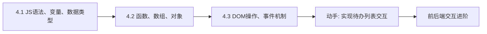

# MOC - 第4章 JavaScript基础

> [!info] 本章定位
> 第4章为前端注入动态行为。JavaScript（JS）是 Web 的脚本语言，负责页面的交互逻辑、动态内容与数据操作。本章解决的问题是：如何编写 JS 代码（语法、变量、类型），如何组织逻辑（函数、数组、对象），以及如何操作页面与响应用户交互（DOM 与事件）。

## 学习路线图

## 知识点导航

| 节 | 主题 | 核心要点 | 入口 |
| --- | --- | --- | --- |
| 4.1 | JS语法、变量、数据类型 | 引入方式、var/let/const、数据类型、类型转换、运算符 | [[4.1 JS语法、变量、数据类型]] |
| 4.2 | 函数、数组、对象 | 函数声明/箭头函数、作用域、数组方法、对象遍历 | [[4.2 函数、数组、对象]] |
| 4.3 | DOM操作、事件机制 | 获取元素、操作节点、事件绑定、事件冒泡与委托 | [[4.3 DOM操作、事件机制]] |

## 核心考点

> [!warning] 重点掌握
> 1. JavaScript 三种引入方式：行内、内部 `<script>`、外部 `<script src>`。
> 2. var、let、const 的区别（作用域、提升、可变性）。
> 3. JavaScript 数据类型：基本类型（string、number、boolean、null、undefined、symbol、bigint）与引用类型（object）。
> 4. typeof 运算符的返回值及类型判断。
> 5. 显式类型转换方法（Number、String、Boolean、parseInt、parseFloat）。
> 6. 函数声明、函数表达式与箭头函数的写法与区别。
> 7. 数组常用方法：push、pop、shift、unshift、splice、slice、map、filter、reduce。
> 8. 获取 DOM 元素的方法：getElementById、querySelector、querySelectorAll。
> 9. 事件绑定方式：addEventListener 与 onclick 的区别。
> 10. 事件冒泡与事件捕获的区别，事件委托的实现原理。

## 自测题

> [!question] 题1
> 说明 var、let、const 三者的区别。
> > [!check]- 参考答案
> > - **var**：函数作用域，有变量提升（声明提到作用域顶部，值为 undefined），可重复声明，可重新赋值。
> > - **let**：块级作用域，有暂时性死区（声明前不可访问），不可重复声明，可重新赋值。
> > - **const**：块级作用域，声明时必须初始化，不可重新赋值（但对象/数组内部属性可修改）。
> > 现代开发优先用 const，需修改时用 let，避免使用 var。

> [!question] 题2
> 列举 JavaScript 的基本数据类型，并说明 typeof null 的返回值及其原因。
> > [!check]- 参考答案
> > 基本类型有 7 种：string、number、boolean、null、undefined、symbol、bigint。引用类型为 object（含数组、函数、对象等）。`typeof null` 返回 `"object"`，这是 JavaScript 早期设计的遗留 bug：null 在底层以 000 开头，与对象类型标志相同。判断 null 应使用 `=== null`。

> [!question] 题3
> 简述 map、filter、reduce 三个数组方法的作用，并各举一例。
> > [!check]- 参考答案
> > - **map**：对每个元素执行函数，返回新数组，长度不变。`[1,2,3].map(x => x*2)` → `[2,4,6]`。
> > - **filter**：按条件过滤，返回满足条件元素组成的新数组。`[1,2,3,4].filter(x => x>2)` → `[3,4]`。
> > - **reduce**：从左到右累积计算，返回单个值。`[1,2,3].reduce((sum,x) => sum+x, 0)` → `6`。

> [!question] 题4
> 什么是事件冒泡与事件捕获？事件委托是如何利用事件冒泡的？
> > [!check]- 参考答案
> > 事件冒泡：事件从最内层目标元素向外层父元素依次触发。事件捕获：事件从最外层祖先向内层目标依次触发。addEventListener 第三参数 true 表示捕获阶段，false（默认）表示冒泡阶段。事件委托：把子元素的事件监听绑定在共同父元素上，利用事件冒泡统一处理。当子元素触发事件时，事件冒泡到父元素，通过 `event.target` 判断实际触发的子元素。优点是减少监听器数量、对动态添加的子元素自动生效。

## 章节导航

- 上一级：[[MOC - Web开发技术]]
- 上一章：[[MOC - 第3章]]
- 下一阶段：前后端交互进阶（AJAX、Fetch、跨域）
