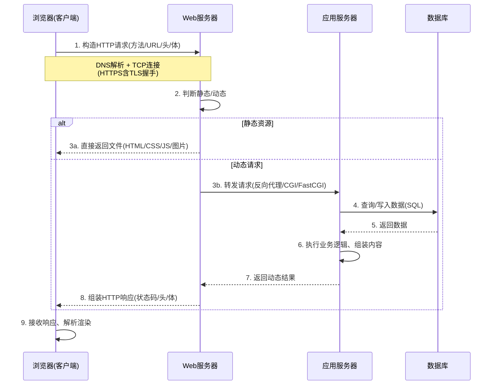

# 5.1 客户端与服务端交互模型

Web 应用的核心是客户端与服务端的协作。本节解决的问题是：客户端与服务端各自承担什么职责，一次完整的请求-响应流程如何流转，静态资源服务与动态内容生成有何差异，Web 服务器与应用服务器如何分工。

## 客户端/服务端模型

> [!definition] 客户端/服务端模型
> 客户端/服务端（Client/Server，C/S）模型是一种分布式应用架构：客户端发起请求，服务端接收请求并返回响应。Web 应用采用基于浏览器的 B/S（Browser/Server）架构，是 C/S 模型的特例——客户端统一为浏览器，无需单独安装，跨平台访问。

- **客户端（浏览器）职责**：渲染 HTML/CSS、执行 JavaScript、构造并发送 HTTP 请求、接收并解析响应、维护用户交互。
- **服务端职责**：监听网络端口接收请求、路由分发、执行业务逻辑、访问数据库、组装并返回 HTTP 响应。

> [!note] B/S 相对 C/S 的优势
> B/S 架构客户端零安装、跨平台、统一升级（只需更新服务端），是 Web 应用普及的根本原因。代价是浏览器能力受限、依赖网络，且实时性与本地性能不及原生 C/S 客户端。参见 [[1.1 Web发展历程与B-S架构]]。

## 请求-响应完整流程

一次完整的请求-响应包含以下环节：



### 流程关键环节

| 环节 | 说明 |
| --- | --- |
| DNS 解析 | 域名解析为服务器 IP，参见 [[1.3 Web工作基本原理]] |
| TCP/TLS 连接 | 三次握手建立 TCP，HTTPS 额外进行 TLS 握手 |
| 请求构造 | 浏览器按方法（GET/POST）、URL、请求头、请求体组装报文 |
| 路由分发 | Web 服务器按 URL 与配置决定直接响应静态文件或转发给应用服务器 |
| 业务处理 | 应用服务器执行代码、访问数据库、生成响应内容 |
| 响应组装 | 设置状态码、响应头（Content-Type 等）与响应体 |
| 客户端渲染 | 浏览器解析 HTML、构建 DOM/CSSOM、执行 JS、渲染页面 |

## 静态资源服务 vs 动态内容生成

| 维度 | 静态资源服务 | 动态内容生成 |
| --- | --- | --- |
| 内容来源 | 服务器上现成的文件（HTML/CSS/JS/图片） | 应用服务器运行代码生成 |
| 是否执行后端代码 | 否 | 是 |
| 响应速度 | 快（直接读文件返回） | 较慢（需执行逻辑、访问数据库） |
| 个性化 | 所有人看到相同内容 | 可按用户、参数动态变化 |
| 典型服务器 | Nginx、Apache 静态托管 | Tomcat、Node.js、PHP-FPM |

> [!tip] 现代实践：动静分离
> 生产环境常将静态资源（CSS/JS/图片）交给 Nginx 或 CDN 直接服务，动态接口交给应用服务器处理，称为"动静分离"。Nginx 处理静态文件性能极高，可大幅减轻应用服务器压力。

## Web 服务器软件

> [!definition] Web 服务器
> Web 服务器是接收 HTTP 请求并返回响应的软件，核心职责是监听端口、处理请求、服务静态资源、反向代理与负载均衡。它通常不执行业务代码，而是将动态请求转发给应用服务器。

| 服务器 | 说明 | 典型场景 |
| --- | --- | --- |
| Apache | 老牌开源 Web 服务器，模块化、`.htaccess` 灵活配置 | 传统 LAMP 架构、共享主机 |
| Nginx | 高性能、事件驱动，擅长静态资源与反向代理 | 高并发站点、动静分离、负载均衡 |
| IIS | 微软出品，Windows 平台，深度集成 .NET | ASP.NET 应用、企业内网 |

```nginx
# Nginx 动静分离示例（节选 nginx.conf）
server {
    listen 80;
    server_name example.com;

    # 静态资源直接服务
    location /static/ {
        root /var/www/html;
        expires 30d;
    }

    # 动态请求反向代理到应用服务器
    location /api/ {
        proxy_pass http://127.0.0.1:3000;
        proxy_set_header Host $host;
    }
}
```

## 应用服务器

> [!definition] 应用服务器
> 应用服务器是执行业务代码、访问数据库、生成动态内容的运行环境。它通常不直接面向公网，而是接收 Web 服务器转发的请求。

| 应用服务器 | 语言/运行时 | 说明 |
| --- | --- | --- |
| Tomcat | Java | Servlet/JSP 容器，常与 Nginx 配合 |
| Node.js | JavaScript | 既是运行时也是服务器，可单进程处理高并发 I/O |
| PHP-FPM | PHP | FastCGI 进程管理器，配合 Nginx/Apache |
| uWSGI / Gunicorn | Python | 部署 WSGI 应用（Flask/Django） |

> [!note] Web 服务器 vs 应用服务器
> 二者职责可重叠（Nginx 也能执行少量逻辑、Node.js 也能直接服务静态文件），但分工的核心理念是：Web 服务器擅长 I/O 与静态资源，应用服务器擅长业务逻辑。生产环境通常前后串联，各取所长。

## 后端语言与框架

| 语言 | 典型框架 | 特点 |
| --- | --- | --- |
| PHP | Laravel、ThinkPHP | 部署简单、Web 原生、适合中小站点 |
| Java | Servlet/JSP、Spring Boot | 企业级、强类型、生态成熟 |
| Python | Flask（轻量）、Django（全栈） | 语法简洁、适合快速开发与数据场景 |
| Node.js | Express、Koa | 前后端同构 JS、异步 I/O、高并发 |
| Go | Gin、Echo | 编译型、并发强、部署单文件 |

> [!example] 极简服务端示例
> 以下 Node.js（Express）示例展示最简单的服务端：监听端口、路由分发、返回 JSON。需先 `npm install express` 后运行 `node server.js`，访问 `http://localhost:3000/api/hello`。

```javascript
// server.js —— Node.js + Express 极简服务端
const express = require("express");
const app = express();

// 解析 JSON 请求体（POST 需要）
app.use(express.json());

// GET 路由：返回 JSON
app.get("/api/hello", (req, res) => {
    res.json({ code: 0, msg: "hello", data: { name: "Web开发技术" } });
});

// POST 路由：接收请求体并回显
app.post("/api/echo", (req, res) => {
    const body = req.body;
    res.json({ code: 0, received: body });
});

app.listen(3000, () => {
    console.log("Server running at http://localhost:3000");
});
```

> [!warning] 运行环境说明
> 上述代码需 Node.js 14+ 与 Express 4.x。监听 1024 以下端口（如 80）需管理员权限，开发时常用 3000/8080 等高端口。生产环境应由 Nginx 监听 80/443 再反向代理到应用服务器。

## 小结

客户端/服务端模型是 Web 应用的基础架构，B/S 架构以浏览器为统一客户端。一次完整请求-响应经历 DNS、TCP/TLS、请求构造、Web 服务器分发、应用服务器处理、数据库访问、响应组装、客户端渲染等环节。静态资源服务由 Web 服务器（Nginx/Apache）直接完成，动态内容由应用服务器（Tomcat/Node.js 等）执行后端代码生成。Web 服务器与应用服务器分工协作、动静分离是现代 Web 部署的主流模式。

## 关联

- 上一级：[[MOC - 第5章]]
- 下一节：[[5.2 GET-POST请求、表单提交]]
- 关联概念：[[1.2 HTTP与HTTPS协议基础]]（HTTP 报文结构）、[[1.3 Web工作基本原理]]（DNS、TCP 连接）
