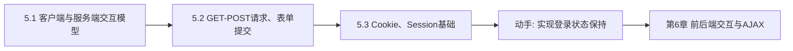

# MOC - 第5章 后端Web基础

> [!info] 本章定位
> 第5章将视线从浏览器转向服务器。前端三剑客解决了"页面如何呈现与交互"，本章解决的问题是：浏览器与服务器如何协作完成一次完整的数据交互——客户端与服务端的请求-响应模型如何运转，GET 与 POST 两种请求方式各有什么语义与差异，表单如何把用户输入送到后端，以及 Cookie 与 Session 如何在无状态的 HTTP 协议之上维持用户会话状态。

## 学习路线图

## 知识点导航

| 节 | 主题 | 核心要点 | 入口 |
| --- | --- | --- | --- |
| 5.1 | 客户端与服务端交互模型 | C/S 与 B/S 模型、请求-响应完整流程、静态资源 vs 动态内容、Web 服务器与应用服务器 | [[5.1 客户端与服务端交互模型]] |
| 5.2 | GET-POST请求、表单提交 | GET/POST 特点与对比、表单提交机制、编码类型、文件上传 | [[5.2 GET-POST请求、表单提交]] |
| 5.3 | Cookie、Session基础 | Cookie 机制与属性、Session 机制与 Session ID、两者对比 | [[5.3 Cookie、Session基础]] |

## 核心考点

> [!warning] 重点掌握
> 1. 客户端/服务端模型的基本概念与请求-响应完整流程。
> 2. Web 服务器（Apache、Nginx、IIS）与应用服务器（Tomcat、Node.js）的职责区别。
> 3. 静态资源服务与动态内容生成的差异。
> 4. GET 与 POST 请求的特点与对比（参数位置、缓存、长度、安全性、语义）。
> 5. 表单提交的 `action`、`method`、`submit` 三要素及编码类型 `application/x-www-form-urlencoded` 与 `multipart/form-data`。
> 6. Cookie 的常见属性：`name`、`value`、`expires`/`max-age`、`path`、`domain`、`secure`、`httpOnly`。
> 7. Session 机制：服务端存储、Session ID 通过 Cookie 传递。
> 8. Cookie 与 Session 的区别（存储位置、安全性、容量、生命周期）。

## 自测题

> [!question] 题1
> 描述一次完整的客户端到服务端请求-响应流程，并指出 Web 服务器与应用服务器在其中各自的职责。
> > [!check]- 参考答案
> > 完整流程：浏览器构造 HTTP 请求（方法、URL、头、体）→ 经 DNS 解析与 TCP 连接（HTTPS 还含 TLS 握手）→ 请求到达 Web 服务器 → Web 服务器判断是静态资源还是动态请求：静态资源直接返回文件，动态请求转发给应用服务器（如 Tomcat、Node.js）→ 应用服务器执行业务逻辑并访问数据库 → 将结果返回 Web 服务器 → Web 服务器组装 HTTP 响应（状态码、头、体）→ 浏览器接收并渲染。Web 服务器（Nginx/Apache）负责接收请求、静态资源服务与反向代理转发；应用服务器负责执行业务代码、操作数据库、生成动态内容。

> [!question] 题2
> 对比 GET 与 POST 请求的参数位置、缓存、长度限制与安全性，并说明为什么不能仅凭"POST 比 GET 安全"就放心传输密码。
> > [!check]- 参考答案
> > - 参数位置：GET 参数拼接在 URL 查询串中；POST 参数放在请求体中。
> > - 缓存：GET 可被浏览器/代理缓存，会留在历史记录与日志中；POST 默认不缓存。
> > - 长度：GET 受 URL 长度限制（浏览器约定，约 2KB）；POST 理论上无限制（受服务器配置约束）。
> > - 安全性：POST 参数不在 URL 中暴露，相对安全，但 HTTP 明文传输时两者均会被抓包窃取，必须配合 HTTPS 才能真正保护密码。因此"POST 比 GET 安全"只是相对的，不能替代 HTTPS。

> [!question] 题3
> 简述 Cookie 与 Session 的区别，并说明 Session ID 是如何在浏览器与服务器之间传递的。
> > [!check]- 参考答案
> > - 存储位置：Cookie 存储在客户端（浏览器）；Session 存储在服务端（内存或 Redis 等）。
> > - 容量：Cookie 单条约 4KB，数量受限；Session 大小由服务端配置决定，理论更大。
> > - 安全性：Cookie 易被读取与篡改；Session 不直接暴露给客户端，相对安全。
> > - 生命周期：Cookie 可设 `expires`/`max-age` 长期保存；Session 默认随会话结束或超时销毁。
> > 传递机制：服务器创建 Session 后生成唯一 Session ID，通过响应头 `Set-Cookie` 写入浏览器；浏览器后续请求自动携带该 Cookie，服务器据此识别会话。

> [!question] 题4
> 列举 Cookie 的 `httpOnly` 与 `secure` 属性的作用，并说明它们如何提升 Web 安全。
> > [!check]- 参考答案
> > - `httpOnly`：禁止 JavaScript 通过 `document.cookie` 读取该 Cookie，可防御 XSS 攻击窃取会话凭证。
> > - `secure`：限定该 Cookie 只在 HTTPS 加密通道下发送，防止在明文 HTTP 中被中间人窃听。
> > 两者结合可显著提升会话 Cookie 的安全性，登录态 Cookie 应同时设置 `httpOnly` 与 `secure`。

## 章节导航

- 上一级：[[MOC - Web开发技术]]
- 上一章：[[MOC - 第4章]]
- 下一章：[[MOC - 第6章]]
