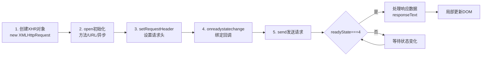

# 6.1 AJAX基本原理

传统 Web 页面每次与服务器交互都要整页刷新，体验割裂、流量浪费。本节解决的问题是：如何在不刷新页面的前提下异步向服务器请求数据并局部更新页面，XMLHttpRequest 如何使用，以及现代 Fetch API 与 async/await 如何简化异步代码。

## AJAX 概念

> [!definition] AJAX
> AJAX（Asynchronous JavaScript and XML，异步 JavaScript 与 XML）是一组 Web 开发技术的组合，核心是通过浏览器内置对象在不刷新整个页面的情况下，异步向服务器发送请求并接收数据，再用 JavaScript 局部更新页面。虽然名字含 XML，但现代 AJAX 传输的数据格式主要是 JSON。

AJAX 的核心价值：

- **异步**：请求发送后不阻塞页面，用户可继续操作。
- **无刷新**：不重新加载整个页面，只更新需要变化的部分。
- **局部更新**：按需获取数据，减少流量与渲染开销。

## XMLHttpRequest 对象

> [!definition] XMLHttpRequest
> XMLHttpRequest（XHR）是浏览器提供的原生对象，用于在后台与服务器通信。它通过事件回调通知请求状态变化，是 AJAX 的传统实现方式。

### XHR 关键属性与方法

| 成员 | 类型 | 作用 |
| --- | --- | --- |
| `open(method, url, async)` | 方法 | 初始化请求，`async` 默认 true |
| `send(body)` | 方法 | 发送请求，GET 传 null |
| `setRequestHeader(k, v)` | 方法 | 设置请求头 |
| `onreadystatechange` | 事件 | 状态变化回调 |
| `readyState` | 属性 | 请求状态 0~4 |
| `status` | 属性 | HTTP 状态码（200、404、500） |
| `responseText` | 属性 | 响应体文本 |
| `responseJSON` | 属性 | 响应体 JSON（部分浏览器） |

### readyState 取值

| 值 | 状态 | 说明 |
| --- | --- | --- |
| 0 | UNSENT | XHR 已创建，未调 open |
| 1 | OPENED | 已调 open，未调 send |
| 2 | HEADERS_RECEIVED | 已调 send，收到响应头 |
| 3 | LOADING | 正在接收响应体 |
| 4 | DONE | 响应体接收完毕 |

## AJAX 请求步骤



### XHR 完整示例

```javascript
// 用 XHR 发起 GET 请求并处理 JSON 响应
function loadUser(userId) {
    const xhr = new XMLHttpRequest();
    xhr.open("GET", `/api/user/${userId}`, true);  // true=异步
    xhr.setRequestHeader("Accept", "application/json");

    xhr.onreadystatechange = function() {
        if (xhr.readyState === 4) {                // 请求完成
            if (xhr.status === 200) {              // 成功
                try {
                    const user = JSON.parse(xhr.responseText);
                    console.log("用户：", user);
                    document.getElementById("name").textContent = user.name;
                } catch (e) {
                    console.error("JSON 解析失败", e);
                }
            } else if (xhr.status === 404) {
                console.error("用户不存在");
            } else {
                console.error("请求失败，状态码：", xhr.status);
            }
        }
    };

    xhr.onerror = function() {
        console.error("网络错误");
    };

    xhr.send(null);  // GET 无请求体
}

loadUser(1001);
```

### XHR 发送 POST 请求

```javascript
function login(username, password) {
    const xhr = new XMLHttpRequest();
    xhr.open("POST", "/api/login", true);
    xhr.setRequestHeader("Content-Type", "application/json");

    xhr.onreadystatechange = function() {
        if (xhr.readyState === 4 && xhr.status === 200) {
            const res = JSON.parse(xhr.responseText);
            console.log("登录结果：", res);
        }
    };

    // 请求体为 JSON 字符串
    xhr.send(JSON.stringify({ username, password }));
}
```

## 同步 vs 异步请求

| 维度 | 异步请求（推荐） | 同步请求（避免） |
| --- | --- | --- |
| `open` 第三参数 | `true` | `false` |
| 阻塞主线程 | 否 | 是 |
| 页面可交互 | 是 | 否（卡死） |
| 主流建议 | 默认使用 | 已废弃，浏览器警告 |

> [!warning] 禁用同步请求
> `xhr.open(method, url, false)` 会让 JavaScript 主线程阻塞等待响应，期间整个页面冻结（无法滚动、点击、动画）。现代浏览器已在主线程上废弃同步 XHR，应始终使用异步。需要"顺序执行"的语义请用 Promise 或 async/await，而不是同步请求。

## Fetch API

> [!definition] Fetch API
> Fetch 是现代浏览器提供的基于 Promise 的网络请求接口，是 XHR 的替代方案。语法简洁、可链式调用、流式处理响应，已成为前后端数据交互的主流方式。

### 基本用法

```javascript
// GET 请求
fetch("/api/user/1001")
    .then(response => {
        if (!response.ok) {                       // response.ok 即 status 200-299
            throw new Error("HTTP " + response.status);
        }
        return response.json();                   // 解析 JSON，返回 Promise
    })
    .then(user => console.log("用户：", user))
    .catch(err => console.error("请求失败：", err));

// POST 请求（发送 JSON）
fetch("/api/login", {
    method: "POST",
    headers: { "Content-Type": "application/json" },
    body: JSON.stringify({ username: "alice", password: "123456" })
})
    .then(res => res.json())
    .then(data => console.log(data))
    .catch(err => console.error(err));
```

### Fetch 常用配置

| 选项 | 作用 | 常用值 |
| --- | --- | --- |
| `method` | 请求方法 | `"GET"` / `"POST"` / `"PUT"` / `"DELETE"` |
| `headers` | 请求头对象 | `{ "Content-Type": "application/json" }` |
| `body` | 请求体 | JSON 字符串、`FormData`、`URLSearchParams` |
| `credentials` | 携带 Cookie | `"include"`（跨域带）、`"same-origin"`（默认） |

> [!tip] Fetch 默认不带 Cookie
> Fetch 默认不携带跨域 Cookie，登录态接口需显式设置 `credentials: "include"`，且服务端 CORS 响应头需含 `Access-Control-Allow-Credentials: true`，同时 `Access-Control-Allow-Origin` 不能为 `*`。

## async/await 异步处理

> [!definition] async/await
> `async/await` 是基于 Promise 的语法糖，用同步书写风格编写异步代码。`async` 声明函数返回 Promise，`await` 等待 Promise 完成并取出结果，配合 `try/catch` 处理错误。

```javascript
// 用 async/await 改写 Fetch 请求
async function loadUser(userId) {
    try {
        const res = await fetch(`/api/user/${userId}`);
        if (!res.ok) throw new Error("HTTP " + res.status);
        const user = await res.json();
        console.log("用户：", user);
        document.getElementById("name").textContent = user.name;
        return user;
    } catch (err) {
        console.error("加载失败：", err);
        throw err;  // 重新抛出供调用方处理
    }
}

// 并发请求：Promise.all
async function loadDashboard() {
    const [user, posts] = await Promise.all([
        fetch("/api/user/1001").then(r => r.json()),
        fetch("/api/posts?uid=1001").then(r => r.json())
    ]);
    console.log("用户与文章：", user, posts);
}

loadUser(1001);
```

> [!note] async/await 注意事项
> 1. `await` 只能在 `async` 函数内使用（顶层 await 需 ES2022+ 与模块环境）。
> 2. `await` 会暂停当前 async 函数，但不阻塞主线程。
> 3. 串行 `await` 会顺序等待，无依赖的请求应使用 `Promise.all` 并发以提速。
> 4. 未捕获的 Promise 异常会变成 unhandled rejection，应使用 `try/catch` 或 `.catch()`。

## 可运行代码示例

以下 HTML 整合 XHR、Fetch 与 async/await 三种方式，调用公开接口演示 AJAX。保存为 `.html` 文件即可在浏览器中运行：

```html
<!DOCTYPE html>
<html lang="zh-CN">
<head>
    <meta charset="UTF-8">
    <title>AJAX 三种方式演示</title>
    <style>
        body { font-family: "Microsoft YaHei", sans-serif; padding: 30px; max-width: 560px; }
        button { padding: 8px 16px; margin-right: 8px; margin-bottom: 12px;
                 background: #2196F3; color: #fff; border: none; border-radius: 4px; cursor: pointer; }
        button:hover { background: #1976D2; }
        pre { background: #f4f4f4; padding: 12px; border-radius: 4px;
              white-space: pre-wrap; word-break: break-all; max-height: 260px; overflow: auto; }
    </style>
</head>
<body>
    <h2>AJAX 三种方式演示</h2>
    <p>调用公开接口 https://jsonplaceholder.typicode.com/users/1</p>
    <button onclick="loadByXHR()">1. XMLHttpRequest</button>
    <button onclick="loadByFetch()">2. Fetch + Promise</button>
    <button onclick="loadByAsync()">3. async/await</button>
    <pre id="output">点击按钮查看结果...</pre>

    <script>
        const API = "https://jsonplaceholder.typicode.com/users/1";
        const output = document.getElementById("output");

        // 方式一：XMLHttpRequest
        function loadByXHR() {
            output.textContent = "请求中...";
            const xhr = new XMLHttpRequest();
            xhr.open("GET", API, true);
            xhr.onreadystatechange = function() {
                if (xhr.readyState === 4) {
                    if (xhr.status === 200) {
                        const user = JSON.parse(xhr.responseText);
                        output.textContent = "XHR 结果：\n" + JSON.stringify(user, null, 2);
                    } else {
                        output.textContent = "失败，状态码：" + xhr.status;
                    }
                }
            };
            xhr.onerror = () => output.textContent = "网络错误";
            xhr.send(null);
        }

        // 方式二：Fetch + Promise 链
        function loadByFetch() {
            output.textContent = "请求中...";
            fetch(API)
                .then(res => {
                    if (!res.ok) throw new Error("HTTP " + res.status);
                    return res.json();
                })
                .then(user => output.textContent = "Fetch 结果：\n" + JSON.stringify(user, null, 2))
                .catch(err => output.textContent = "失败：" + err.message);
        }

        // 方式三：async/await
        async function loadByAsync() {
            output.textContent = "请求中...";
            try {
                const res = await fetch(API);
                if (!res.ok) throw new Error("HTTP " + res.status);
                const user = await res.json();
                output.textContent = "async/await 结果：\n" + JSON.stringify(user, null, 2);
            } catch (err) {
                output.textContent = "失败：" + err.message;
            }
        }
    </script>
</body>
</html>
```

## 小结

AJAX 通过浏览器内置对象异步请求服务器并局部更新页面，核心价值是"无刷新、异步、局部更新"。XMLHttpRequest 是传统实现，通过 `open`→`send`→`onreadystatechange` 完成，需判断 `readyState===4 && status===200`。现代开发优先使用基于 Promise 的 Fetch API，配合 async/await 用同步风格写异步代码，错误处理用 try/catch。同步请求会阻塞主线程，已废弃，应始终用异步。无依赖的并发请求可用 `Promise.all` 提速。

## 关联

- 上一级：[[MOC - 第6章]]
- 下一节：[[6.2 JSON数据格式]]
- 关联概念：[[4.2 函数、数组、对象]]（Promise 与回调）、[[5.1 客户端与服务端交互模型]]（请求-响应模型）、[[6.3 接口通信基础]]（API 调用）
