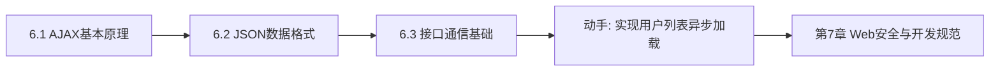

# MOC - 第6章 前后端交互与AJAX

> [!info] 本章定位
> 第6章解决"如何在不刷新整个页面的前提下与服务器交换数据"这一核心问题。传统表单提交会整页刷新，体验割裂；AJAX 与 Fetch 让浏览器异步发起请求、局部更新页面，是现代 Web 应用的交互基石。本章覆盖 AJAX 原理、JSON 数据格式与接口通信基础，把第5章的"请求-响应"模型升级为前端可控的异步数据流。

## 学习路线图

## 知识点导航

| 节 | 主题 | 核心要点 | 入口 |
| --- | --- | --- | --- |
| 6.1 | AJAX基本原理 | AJAX 定义、XMLHttpRequest、Fetch API、async/await、同步 vs 异步 | [[6.1 AJAX基本原理]] |
| 6.2 | JSON数据格式 | JSON 数据类型、语法规则、序列化与反序列化、JSON vs XML | [[6.2 JSON数据格式]] |
| 6.3 | 接口通信基础 | RESTful API、HTTP 方法语义、请求/响应格式、跨域与 CORS | [[6.3 接口通信基础]] |

## 核心考点

> [!warning] 重点掌握
> 1. AJAX 的概念与核心价值：异步、无刷新、局部更新。
> 2. XMLHttpRequest 的请求步骤：创建 → `open` → `send` → `onreadystatechange` 回调。
> 3. `readyState` 的五个取值（0~4）与 `status` 状态码判断（200、404、500）。
> 4. Fetch API 的 Promise 链式调用与 async/await 写法。
> 5. 同步请求与异步请求的区别，为何禁用同步请求。
> 6. JSON 的六种数据类型与语法规则（键用双引号、无注释、无尾逗号）。
> 7. `JSON.stringify()` 与 `JSON.parse()` 的用法及常见异常处理。
> 8. RESTful API 中 GET/POST/PUT/DELETE 的语义。
> 9. 同源策略与 CORS 跨域解决方案。

## 自测题

> [!question] 题1
> 简述 AJAX 的工作原理，并说明 XMLHttpRequest 的 `readyState` 各取值含义。
> > [!check]- 参考答案
> > AJAX（Asynchronous JavaScript and XML）通过浏览器内置的 XMLHttpRequest（XHR）对象在不刷新页面的情况下异步向服务器发送请求并更新页面局部内容。`readyState` 取值：0=未初始化（XHR 已创建未调 open）；1=已打开（已调 open 未调 send）；2=已发送（已调 send，收到响应头）；3=接收中（正在接收响应体）；4=完成（响应体接收完毕）。通常在 `readyState===4 && status===200` 时处理响应数据。

> [!question] 题2
> 对比 XMLHttpRequest 与 Fetch API，并说明 async/await 相对 Promise 链的优势。
> > [!check]- 参考答案
> > - XHR：基于事件回调（`onreadystatechange`），API 较老，错误处理分散，配置项多。
> > - Fetch：基于 Promise，链式调用 `fetch().then().catch()`，API 更简洁，默认不带 Cookie（需 `credentials`）。
> > - async/await：用同步书写风格写异步代码，避免回调嵌套与长 Promise 链，配合 try/catch 错误处理更直观。
> > 优势：可读性强、错误处理集中、便于顺序控制。但 async/await 本质是 Promise 语法糖，不改变异步本质。

> [!question] 题3
> 列举 JSON 支持的数据类型，并说明 `JSON.stringify()` 与 `JSON.parse()` 的作用及常见异常。
> > [!check]- 参考答案
> > JSON 支持六种类型：string、number、boolean、null、array、object。注意：undefined、函数、Symbol 不在 JSON 中，`stringify` 会跳过或转 null。
> > - `JSON.stringify(obj)`：把 JS 对象序列化为 JSON 字符串。常见异常：对象含循环引用时抛 `TypeError`。
> > - `JSON.parse(str)`：把 JSON 字符串反序列化为 JS 对象。常见异常：字符串不合法（单引号、尾逗号、注释）时抛 `SyntaxError`，应包裹 try/catch。

> [!question] 题4
> 什么是同源策略？跨域请求为何会被拦截？说明 CORS 的基本工作原理。
> > [!check]- 参考答案
> > 同源策略：浏览器限制脚本只能访问与当前页面"同协议、同域名、同端口"的资源，防止恶意站点读取其他站点的数据。跨域请求会被浏览器拦截响应（请求实际已发送，但 JS 拿不到响应）。
> > CORS（跨域资源共享）：服务端在响应头中通过 `Access-Control-Allow-Origin` 声明允许访问的源，浏览器据此放行。对带自定义头或非简单方法（PUT/DELETE）的请求，浏览器会先发 OPTIONS 预检请求，服务端返回允许的方法与头后才发实际请求。

## 章节导航

- 上一级：[[MOC - Web开发技术]]
- 上一章：[[MOC - 第5章]]
- 下一章：[[MOC - 第7章]]
