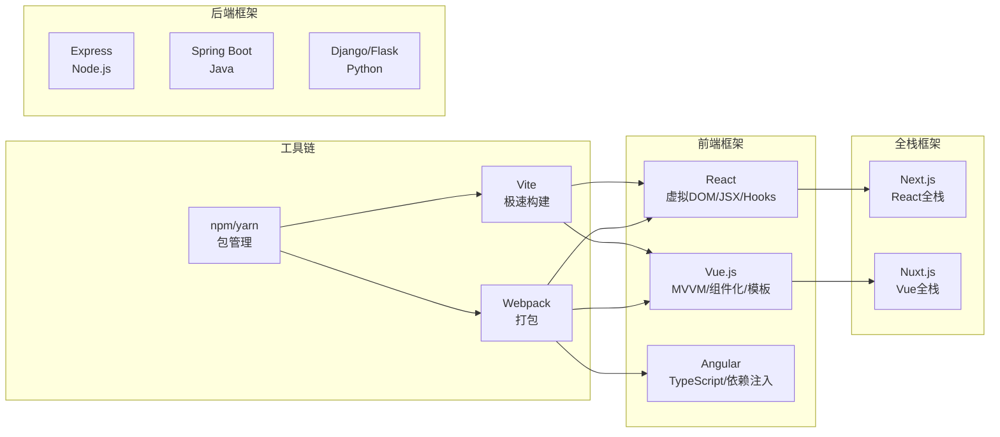

# 7.3 主流前后端框架简介

原生 HTML/CSS/JS 能完成页面开发，但面对复杂应用时代码难以组织、复用困难。本节解决的问题是：主流前端框架（Vue、React、Angular）各自的设计理念是什么，前端工具链如何工作，后端有哪些主流框架，以及全栈框架与前端工程化的趋势。

## 前端框架概览



## Vue.js

> [!definition] Vue.js
> Vue.js 是渐进式 JavaScript 框架，核心特性是 MVVM 双向数据绑定与组件化开发。Vue 采用模板语法，学习曲线平缓，中文生态完善，是国内主流前端框架之一。

### 核心特性

- **MVVM**：Model（数据）-View（视图）-ViewModel（视图模型），数据与视图双向绑定，改数据自动更新视图。
- **组件化**：页面拆分为可复用组件，每个组件含模板、脚本、样式。
- **模板语法**：基于 HTML，用指令（`v-if`、`v-for`、`v-bind`、`v-on`）扩展。
- **响应式系统**：数据变化自动触发视图更新。

```html
<!-- Vue 3 单文件组件示例 -->
<template>
    <div class="counter">
        <p>计数：{{ count }}</p>
        <button @click="increment">+1</button>
    </div>
</template>

<script setup>
import { ref } from "vue";

const count = ref(0);
function increment() {
    count.value++;
}
</script>

<style scoped>
.counter { padding: 20px; text-align: center; }
button { padding: 8px 16px; background: #42b983; color: #fff; border: none; }
</style>
```

## React

> [!definition] React
> React 是 Meta（Facebook）开源的 UI 库，核心特性是虚拟 DOM 与 JSX 语法。React 用组件 + 状态驱动视图，强调函数式编程，生态庞大灵活。

### 核心特性

- **虚拟 DOM（Virtual DOM）**：在内存中维护 DOM 树的副本，状态变化时先比对差异（diff），再最小化更新真实 DOM，提升性能。
- **JSX**：在 JS 中书写类 HTML 语法，编译后转为 `React.createElement` 调用。
- **组件化**：函数组件 + Hooks 是现代主流写法。
- **单向数据流**：数据自上而下流动，状态变更通过回调通知父组件。

```jsx
// React 函数组件 + Hooks 示例
import React, { useState } from "react";

function Counter() {
    const [count, setCount] = useState(0);
    return (
        <div className="counter">
            <p>计数：{count}</p>
            <button onClick={() => setCount(count + 1)}>+1</button>
        </div>
    );
}

export default Counter;
```

> [!note] 虚拟 DOM 的价值
> 虚拟 DOM 并非"比真实 DOM 快"，而是提供了一种声明式编程模型：开发者描述"视图应该是什么样"，框架负责高效地把真实 DOM 更新成目标状态，避免手动操作 DOM 的繁琐与不一致。

## Angular

> [!definition] Angular
> Angular 是 Google 开源的完整前端框架，基于 TypeScript，内置依赖注入、路由、表单、HTTP 等全套能力，适合大型企业级应用。学习曲线较陡，但规范严格、工程化程度高。

### 核心特性

- **TypeScript 原生**：强类型、面向对象，编译期发现错误。
- **依赖注入（DI）**：组件所需的服务由框架自动注入，便于测试与解耦。
- **装饰器**：用 `@Component`、`@Injectable` 等装饰器声明组件与服务。
- **全家桶**：路由、表单、HTTP、国际化等开箱即用。

```typescript
// Angular 组件示例
import { Component } from "@angular/core";

@Component({
    selector: "app-counter",
    template: `
        <div class="counter">
            <p>计数：{{ count }}</p>
            <button (click)="increment()">+1</button>
        </div>
    `,
    styles: [`
        .counter { padding: 20px; text-align: center; }
        button { padding: 8px 16px; background: #dd0031; color: #fff; }
    `]
})
export class CounterComponent {
    count = 0;
    increment() {
        this.count++;
    }
}
```

### 三大框架对比

| 维度 | Vue | React | Angular |
| --- | --- | --- | --- |
| 开发方 | 尤雨溪 / 社区 | Meta | Google |
| 语言 | JS/TS | JS/TS | TypeScript（必须） |
| 模板 | HTML 模板 + 指令 | JSX | HTML 模板 + 指令 |
| 数据绑定 | 双向 | 单向 | 双向 |
| 学习曲线 | 平缓 | 中等 | 陡峭 |
| 生态 | 渐进式、灵活 | 庞大灵活 | 全家桶、规范 |
| 国内使用 | 最广 | 广 | 较少 |

## 前端工具链

### 包管理：npm / yarn

> [!definition] npm
> npm（Node Package Manager）是 Node.js 的包管理工具，也是世界上最大的软件注册表。开发者通过 `npm install` 安装第三方库，通过 `package.json` 管理依赖。

```bash
# 初始化项目
npm init -y

# 安装依赖
npm install vue              # 生产依赖
npm install -D webpack       # 开发依赖

# 运行脚本
npm run dev
npm run build
```

| 工具 | 特点 |
| --- | --- |
| npm | Node.js 自带，最通用 |
| yarn | Facebook 出品，早期速度更快、确定性安装 |
| pnpm | 节省磁盘空间，硬链接共享依赖 |

### 构建工具：Webpack / Vite

> [!definition] Webpack
> Webpack 是模块打包工具，把 JS、CSS、图片等各种资源视为模块，通过 loader 与 plugin 处理后打包为浏览器可运行的静态文件。

> [!definition] Vite
> Vite 是新一代构建工具，开发期利用浏览器原生 ES 模块按需编译，启动极快；生产环境用 Rollup 打包。已成为 Vue、React 等新项目的首选。

| 维度 | Webpack | Vite |
| --- | --- | --- |
| 开发启动 | 慢（全量打包） | 极快（按需编译） |
| 热更新 | 较慢 | 极快 |
| 配置 | 复杂 | 简洁 |
| 生态 | 最成熟 | 快速成长 |
| 适用 | 老项目、复杂场景 | 新项目首选 |

```javascript
// Vite 配置示例 vite.config.js
import { defineConfig } from "vite";
import vue from "@vitejs/plugin-vue";

export default defineConfig({
    plugins: [vue()],
    server: {
        port: 5173,
        proxy: {
            "/api": "http://localhost:3000"   // 代理后端接口解决跨域
        }
    },
    build: {
        outDir: "dist"
    }
});
```

## 后端框架

| 框架 | 语言 | 特点 | 适用场景 |
| --- | --- | --- | --- |
| Express | Node.js | 极简、灵活、中间件机制 | 小型 API、全栈 JS |
| Koa | Node.js | Express 团队新作，async/await 原生 | 现代异步中间件 |
| Spring Boot | Java | 企业级、自动配置、强类型 | 大型企业应用 |
| Django | Python | 全栈、ORM、Admin 后台 | 内容管理、快速开发 |
| Flask | Python | 轻量、灵活 | 小型服务、API |
| Gin | Go | 高性能、简洁 | 高并发 API |

```javascript
// Express 极简 API
const express = require("express");
const app = express();
app.use(express.json());

app.get("/api/users", (req, res) => {
    res.json({ code: 0, data: [{ id: 1, name: "alice" }] });
});

app.listen(3000, () => console.log("http://localhost:3000"));
```

```python
# Flask 极简 API
from flask import Flask, jsonify

app = Flask(__name__)

@app.route("/api/users")
def get_users():
    return jsonify({"code": 0, "data": [{"id": 1, "name": "alice"}]})

if __name__ == "__main__":
    app.run(debug=True, port=3000)
```

## 全栈框架

> [!definition] 全栈框架
> 全栈框架（Meta-Framework）在前端框架之上扩展，集成服务端渲染（SSR）、静态生成（SSG）、API 路由等能力，一套代码覆盖前后端，是现代 Web 应用的趋势。

| 框架 | 基础 | 核心能力 |
| --- | --- | --- |
| Next.js | React | SSR、SSG、API 路由、文件系统路由 |
| Nuxt.js | Vue | SSR、SSG、自动路由、模块系统 |

```javascript
// Next.js 示例：一个文件既是页面又是 API
// pages/index.js —— 页面（SSR）
export async function getServerSideProps() {
    const res = await fetch("http://localhost:3000/api/users");
    const data = await res.json();
    return { props: { users: data.data } };
}

export default function Home({ users }) {
    return <ul>{users.map(u => <li key={u.id}>{u.name}</li>)}</ul>;
}

// pages/api/users.js —— API 路由
export default function handler(req, res) {
    res.status(200).json({ code: 0, data: [{ id: 1, name: "alice" }] });
}
```

## 前端工程化趋势

> [!note] 前端工程化
> 前端工程化是用软件工程方法管理前端开发的全流程，包括模块化、组件化、自动化构建、代码规范、测试、CI/CD 等，目标是提升代码质量与开发效率。

主要趋势：

1. **模块化与组件化**：代码按功能拆分，组件可复用、可组合。
2. **类型化**：TypeScript 逐渐成为标配，编译期发现类型错误。
3. **构建工具革新**：Vite 等基于 ESM 的工具取代传统打包流程。
4. **SSR/SSG 普及**：Next.js、Nuxt.js 兼顾 SEO 与首屏性能。
5. **自动化测试**：单元测试（Jest）、端到端测试（Playwright/Cypress）。
6. **CI/CD**：代码推送后自动构建、测试、部署（GitHub Actions 等）。
7. **跨端开发**：React Native、Flutter、Taro 一套代码多端运行。

## 可运行代码示例

以下是一个可在浏览器中直接运行的 Vue 3 示例（通过 CDN 引入，无需构建），保存为 `.html` 文件即可运行：

```html
<!DOCTYPE html>
<html lang="zh-CN">
<head>
    <meta charset="UTF-8">
    <title>Vue 3 框架示例（CDN 版）</title>
    <script src="https://unpkg.com/vue@3/dist/vue.global.js"></script>
    <style>
        body { font-family: "Microsoft YaHei", sans-serif; padding: 30px; max-width: 520px; }
        .todo { background: #f9f9f9; padding: 20px; border-radius: 8px; }
        input[type="text"] { padding: 8px; border: 1px solid #ccc; border-radius: 4px; width: 60%; }
        button { padding: 8px 16px; background: #42b983; color: #fff; border: none; border-radius: 4px; cursor: pointer; }
        ul { list-style: none; padding: 0; }
        li { display: flex; justify-content: space-between; padding: 8px 0; border-bottom: 1px solid #eee; }
        li.done span { text-decoration: line-through; color: #999; }
        .del { background: #f44336; padding: 4px 10px; font-size: 12px; }
    </style>
</head>
<body>
    <div id="app" class="todo">
        <h2>Vue 3 待办列表</h2>
        <p>数据：{{ todos.length }} 条，已完成 {{ doneCount }} 条</p>
        <input type="text" v-model="newTodo" @keydown.enter="addTodo" placeholder="输入待办...">
        <button @click="addTodo">添加</button>
        <ul>
            <li v-for="(todo, i) in todos" :key="i" :class="{ done: todo.done }">
                <span @click="todo.done = !todo.done">{{ todo.text }}</span>
                <button class="del" @click="todos.splice(i, 1)">删除</button>
            </li>
        </ul>
    </div>

    <script>
        const { createApp, ref, computed } = Vue;

        createApp({
            setup() {
                const newTodo = ref("");
                const todos = ref([
                    { text: "学习 Vue 3", done: false },
                    { text: "学习 React", done: false }
                ]);
                const doneCount = computed(() => todos.value.filter(t => t.done).length);

                function addTodo() {
                    const text = newTodo.value.trim();
                    if (!text) return;
                    todos.value.push({ text, done: false });
                    newTodo.value = "";
                }

                return { newTodo, todos, doneCount, addTodo };
            }
        }).mount("#app");
    </script>
</body>
</html>
```

## 小结

主流前端框架中，Vue 以 MVVM 双向绑定与模板语法见长，学习平缓；React 以虚拟 DOM 与 JSX 为核心，强调函数式与灵活性；Angular 基于 TypeScript，内置依赖注入与全家桶，适合大型应用。前端工具链以 npm/yarn 管理依赖，Webpack/Vite 负责构建，Vite 凭借 ESM 极速启动成为新项目首选。后端框架覆盖 Express（Node.js）、Spring Boot（Java）、Django/Flask（Python）等。全栈框架 Next.js、Nuxt.js 在前端框架之上集成 SSR/SSG 与 API 路由，是现代 Web 应用的趋势。前端工程化通过模块化、类型化、自动化构建、测试与 CI/CD 提升质量与效率。

## 关联

- 上一节：[[7.2 Web开发规范]]
- 上一级：[[MOC - 第7章]]
- 关联概念：[[4.3 DOM操作、事件机制]]（虚拟 DOM 与原生 DOM 对比）、[[6.1 AJAX基本原理]]（框架中的数据请求）、[[6.3 接口通信基础]]（前后端分离架构）
