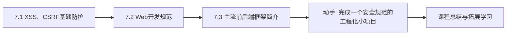

# MOC - 第7章 Web安全与开发规范

> [!info] 本章定位
> 第7章把视角从"功能实现"提升到"工程质量"。Web 应用天然面向公网，安全漏洞与代码混乱都会被放大。本章解决的问题是：最常见的两类 Web 攻击——XSS 与 CSRF——是如何发生、如何防护的；如何用规范约束 HTML/CSS/JS 与项目结构，让代码可维护、可协作；以及主流前后端框架与工程化工具如何把这些规范落地。

## 学习路线图

## 知识点导航

| 节 | 主题 | 核心要点 | 入口 |
| --- | --- | --- | --- |
| 7.1 | XSS、CSRF基础防护 | XSS 三种类型与防护、CSRF 原理与防护、两者区别 | [[7.1 XSS、CSRF基础防护]] |
| 7.2 | Web开发规范 | HTML/CSS/JS 规范、BEM 命名、ESLint、目录结构、Git、WAI-ARIA | [[7.2 Web开发规范]] |
| 7.3 | 主流前后端框架简介 | Vue/React/Angular、Webpack/Vite、Express/Spring Boot/Django、Next.js | [[7.3 主流前后端框架简介]] |

## 核心考点

> [!warning] 重点掌握
> 1. XSS 的三种类型：存储型、反射型、DOM 型。
> 2. XSS 防护：输入过滤、输出编码、CSP、`HttpOnly` Cookie。
> 3. CSRF 的原理：冒用用户身份发送请求。
> 4. CSRF 防护：CSRF Token、Referer 验证、`SameSite` Cookie。
> 5. XSS 与 CSRF 的区别：XSS 是注入脚本执行，CSRF 是冒用身份发请求。
> 6. HTML 语义化标签与可访问性（alt 属性、WAI-ARIA）。
> 7. CSS 命名规范 BEM（Block Element Modifier）。
> 8. JavaScript 规范：`camelCase` 命名、严格模式、ESLint。
> 9. Git 基本操作：`init`、`add`、`commit`、`push`、`pull`、`branch`。
> 10. 主流框架特点：Vue（MVVM、组件化）、React（虚拟 DOM、JSX）、Angular（TS、依赖注入）。

## 自测题

> [!question] 题1
> 说明 XSS 的三种类型及其区别，并列举至少三种防护手段。
> > [!check]- 参考答案
> > - **存储型 XSS**：恶意脚本存入数据库（如评论），其他用户访问时被取出执行，危害最广。
> > - **反射型 XSS**：恶意脚本在 URL 参数中，服务器将其反射回页面执行，需诱导用户点击。
> > - **DOM 型 XSS**：纯前端漏洞，JavaScript 读取 URL 等不可信数据并写入 DOM（如 `innerHTML`），不经过服务器。
> > 防护：1) 输入过滤与校验；2) 输出编码（按上下文转义 HTML/JS/URL）；3) 设置 CSP（Content-Security-Policy）限制脚本来源；4) 关键 Cookie 设 `HttpOnly` 防 JS 读取；5) 避免用 `innerHTML` 渲染用户数据，改用 `textContent`。

> [!question] 题2
> 描述 CSRF 的攻击过程，并说明 CSRF Token 与 SameSite Cookie 各自如何防护。
> > [!check]- 参考答案
> > CSRF（跨站请求伪造）：用户登录 A 站后访问恶意 B 站，B 站用隐藏表单或图片自动向 A 站发送请求，浏览器自动携带 A 站的登录 Cookie，导致以用户身份执行非预期操作。
> > - **CSRF Token**：A 站在表单中下发随机 Token，提交时校验，恶意 B 站无法获取该 Token，请求被拒。
> > - **SameSite Cookie**：设 `SameSite=Lax` 或 `Strict`，浏览器在跨站请求中不携带 Cookie，CSRF 失去身份凭证。
> > 二者可结合使用：SameSite 是浏览器层面的低成本防护，Token 是应用层的强校验。

> [!question] 题3
> 对比 XSS 与 CSRF 的本质差异，并说明为什么 XSS 比 CSRF 危害更大。
> > [!check]- 参考答案
> > - **XSS**：攻击者注入恶意脚本在受害者浏览器**执行**，可读取 Cookie、窃取数据、伪造操作，前提是站点存在注入漏洞。
> > - **CSRF**：攻击者**冒用**受害者身份发送请求，浏览器自动带 Cookie，但攻击者**看不到**响应，只能触发操作。
> > XSS 危害更大：攻击者能在受害者上下文中执行任意 JS，可读取页面内容、盗取 Cookie（非 HttpOnly）、甚至进一步发起 CSRF；CSRF 只能"借身份发请求"，无法读取数据。

> [!question] 题4
> 简述 BEM 命名规范，并用 BEM 重写 `class="user-list-item active"`。
> > [!check]- 参考答案
> > BEM = Block（块）Element（元素）Modifier（修饰符），格式 `block__element--modifier`，强调结构清晰、避免层级嵌套。
> > 重写：假设块为 `user-list`，元素为 `item`，修饰符为 `active`：
> > `class="user-list__item user-list__item--active"`
> > 优点：命名自解释、避免冲突、CSS 选择器扁平，无需依赖 `.user-list .item.active` 这种深层选择器。

## 章节导航

- 上一级：[[MOC - Web开发技术]]
- 上一章：[[MOC - 第6章]]
- 下一阶段：课程总结与拓展学习（前端框架深入、后端服务开发）
