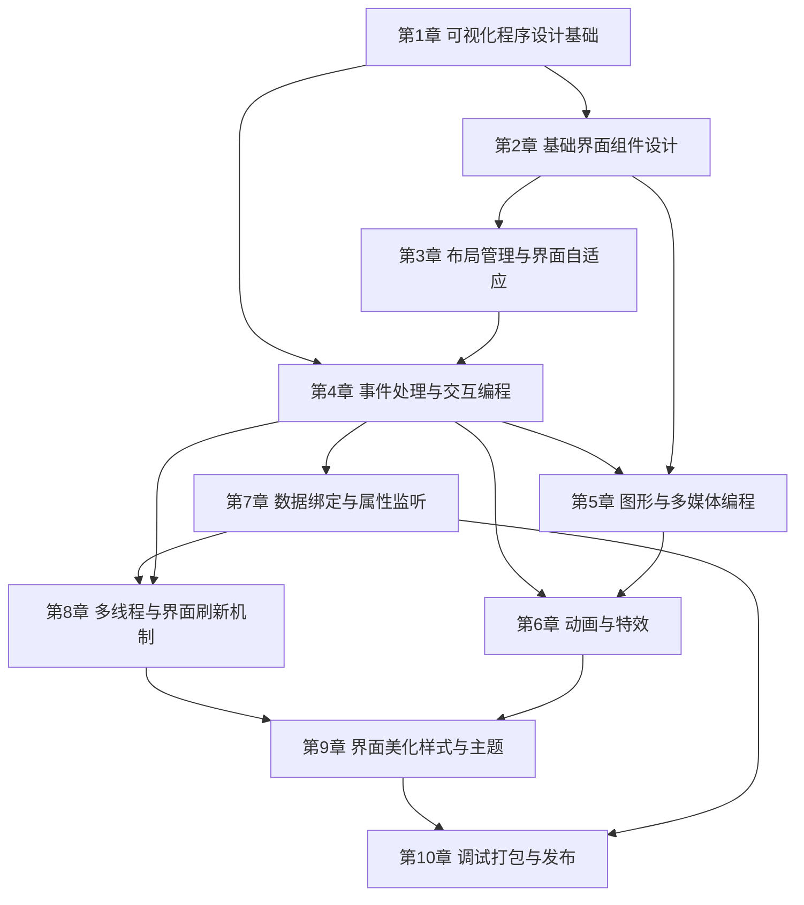

# MOC - 可视化程序设计

> [!info] 课程定位
> 可视化程序设计（Visual Programming）是软件工程专业的一门应用型核心课程。它解决的核心问题是：如何把面向对象的程序结构转化为可交互的图形用户界面（GUI），并通过事件驱动模型把用户操作映射为程序行为。课程以 JavaFX 为主要实践框架，覆盖从界面组件、布局管理、事件处理到动画、数据绑定、持久化与打包部署的完整桌面开发链路。

## 课程摘要

本课程围绕“**界面—交互—数据—部署**”四条主线展开。学生需要掌握：

1. 可视化开发模式与事件驱动编程模型的基本原理；
2. JavaFX 窗体生命周期、Scene Graph 节点树与 Stage/Scene 结构；
3. 基础与高级界面组件的使用、属性配置与自定义控件开发；
4. 布局面板体系与响应式界面适配策略；
5. 事件处理、属性绑定、动画特效、文件 IO 与多线程在 GUI 中的集成；
6. 使用 Scene Builder 进行 FXML 可视化设计并完成应用打包部署。

## 章节结构与依赖关系

## 章节导航

| 章节 | 主题 | 入口 |
| --- | --- | --- |
| 第1章 | 可视化程序设计基础 | [[MOC - 第1章]] |
| 第2章 | 基础界面组件设计 | [[MOC - 第2章]] |
| 第3章 | 布局管理与界面自适应 | [[MOC - 第3章]] |
| 第4章 | 事件处理与消息响应机制 | [[MOC - 第4章]] |
| 第5章 | 图形绘制、图像显示与动画 | [[MOC - 第5章]] |
| 第6章 | 对话框、菜单、工具栏设计 | [[MOC - 第6章]] |
| 第7章 | 文件交互与数据绑定 | [[MOC - 第7章]] |
| 第8章 | 多线程与界面刷新机制 | [[MOC - 第8章]] |
| 第9章 | 界面美化、样式与主题 | [[MOC - 第9章]] |
| 第10章 | 可视化项目调试、打包与发布 | [[MOC - 第10章]] |

## 分阶段学习目标

> [!example] 基础阶段（第1–3章）
> 建立可视化开发与事件驱动的心智模型，能够独立搭建 JavaFX 应用骨架，使用基础组件与布局面板完成静态界面，并通过 FXML + Scene Builder 实现界面与逻辑分离。

> [!example] 交互阶段（第4–7章）
> 掌握事件处理链、属性绑定与动画特效，能够把用户交互转化为数据流，并使用 Canvas、多媒体 API 丰富界面表现力。

> [!example] 工程阶段（第8–10章）
> 掌握多线程与界面刷新机制（`Platform.runLater`、`Task`/`Service`、并发集合），用 CSS 样式、主题切换与图标特效美化界面，并通过模块化构建（Maven/Gradle）与 `jlink`/`jpackage` 打包部署跨平台自包含应用。

## 先修与关联课程

- [[Java程序设计]]：提供 Java 语法、面向对象、集合与异常处理基础，是 JavaFX 编码的前提。
- [[面向对象程序设计]]：提供类继承、多态、接口与设计模式基础，是理解控件体系与 MVC 分离的关键。
- 关联延伸：[[软件工程]]（工程化流程）、Web 开发技术（前端布局思想可对照参考）。

## 工具与框架推荐

| 工具 / 框架 | 作用 | 推荐版本 / 说明 |
| --- | --- | --- |
| JavaFX | GUI 框架主体 | JavaFX 17+（LTS），独立模块化发布 |
| JDK | 运行与编译环境 | JDK 17 LTS 或 JDK 21 LTS |
| Scene Builder | FXML 可视化设计工具 | Gluon Scene Builder 17+ |
| IntelliJ IDEA | 主开发 IDE | 启用 JavaFX 插件与 Maven 支持 |
| Maven / Gradle | 依赖与构建管理 | 使用 `javafx-controls`、`javafx-fxml` 等模块 |
| Maven 控件库 | 扩展控件 | ControlsFX、JFoenix（Material 风格） |
| TestFX | GUI 自动化测试 | 用于事件流与界面断言 |

## 复习与查询入口

- 概念速查：[[1.1 可视化程序设计概念与开发模式]]、[[1.2 事件驱动编程基本原理]]、[[1.3 GUI框架、窗体与程序生命周期]]
- 组件速查：[[2.1 标签、按钮与文本输入组件]]、[[2.2 选择类与列表类组件]]、[[2.3 高级组件与自定义控件]]
- 布局速查：[[3.1 布局面板与容器体系]]、[[3.2 响应式布局与界面适配]]、[[3.3 FXML布局设计与SceneBuilder]]
