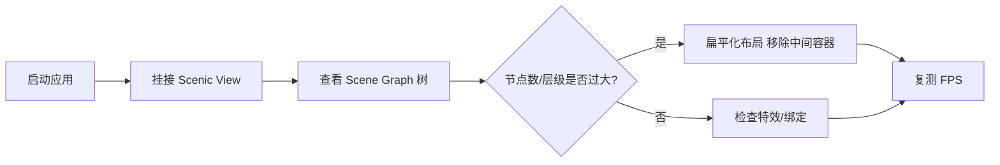
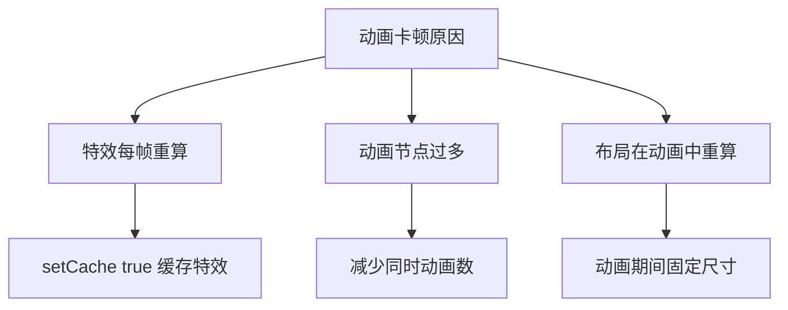
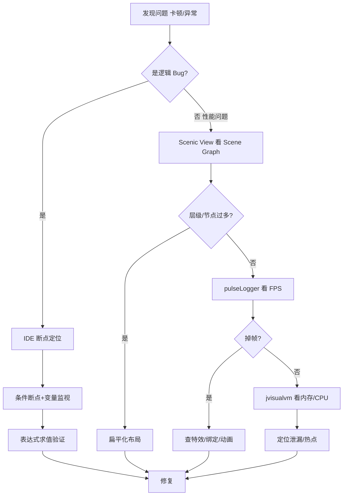

# 10.1 调试技术与性能优化

应用能跑不等于好用：界面卡顿、内存泄漏、事件处理器逻辑错误都会毁掉体验。本节解决的问题是：用 IDE 调试器定位逻辑 Bug，用 Scene Graph 分析与 FPS 监控定位性能瓶颈，识别 JavaFX 三大性能陷阱（布局过深、过度绑定、动画卡顿），并掌握内存泄漏检测方法。

## IDE 调试技术

IntelliJ IDEA / Eclipse / NetBeans 都提供图形化调试器，核心能力包括：

| 能力 | 作用 |
| --- | --- |
| 断点（Line Breakpoint） | 执行到某行暂停 |
| 条件断点（Conditional Breakpoint） | 满足表达式才暂停，适合循环/事件高频触发 |
| 方法断点 | 进入/退出方法时暂停 |
| 字段监视（Field Watchpoint） | 字段被读写时暂停 |
| 变量监视（Variables/Watch） | 实时查看变量值 |
| 表达式求值（Evaluate Expression） | 暂停时运行任意代码 |
| 步过/步入/步出 | 控制执行流 |

> [!tip] JavaFX 调试技巧
> > 事件处理器和回调（`setOnSucceeded`、`ChangeListener`）是 Bug 高发区。在这些方法首行设断点，配合“条件断点”过滤特定控件或数据，能快速定位。FX 线程暂停时 UI 会冻结，属正常现象。

## JavaFX 性能分析

### Scene Graph 分析

JavaFX 的界面是 `Scene` 下的节点树（Scene Graph）。层级过深、节点过多会拖慢布局与渲染。**Scenic View**（开源工具，或其继任 **ScenicView**）能可视化实时展示 Scene Graph，标注每个节点的尺寸、样式、特效、布局耗时。



### FPS 监控

JavaFX 渲染基于 Prism，可用 JVM 参数查看帧率与渲染细节：

```bash
# 启动时输出渲染与 FPS 信息（PowerShell 调用 java）
java -Dprism.verbose=true -Djavafx.pulseLogger=true -jar app.jar
```

| 参数 | 作用 |
| --- | --- |
| `-Dprism.verbose=true` | 输出 Prism 渲染器信息 |
| `-Djavafx.pulseLogger=true` | 打印每次 pulse 时间，定位掉帧 |
| `-Dprism.order=sw` | 强制软件渲染（排查 GPU 问题） |
| `-Dprism.forceGPU=true` | 强制 GPU 渲染 |

> [!note] pulse 机制
> > JavaFX 以约 60fps 的 pulse 节奏驱动布局、动画与渲染。若单次 pulse 处理超过 16ms 就会掉帧。`pulseLogger` 输出每次 pulse 的各阶段耗时（layout/paint/events），是定位卡顿的关键。

## 常见性能问题

### 布局嵌套过深

每个 `Pane` 在布局阶段都会计算子节点尺寸，嵌套越深计算量越大：

```java
// ❌ 套娃：AnchorPane>StackPane>HBox>VBox>Button
// ✅ 扁平：BorderPane>Button
```

| 优化 | 做法 |
| --- | --- |
| 扁平化 | 用 `BorderPane`/`GridPane` 代替多层 `VBox`/`HBox` 嵌套 |
| 避免不必要的包装 | 不为对齐而套 `StackPane`，改用 `alignment` 属性 |
| 用 `Region` 占位 | 用 `HBox.setHgrow(node, Priority.ALWAYS)` 代替空 `Pane` |

### 过度绑定

`Bindings` 计算链每次依赖变化都重算，链过长或监听过多会拖慢：

```java
// ❌ 大量属性互相绑定形成长链
NumberBinding x = a.add(b).multiply(c).subtract(d).divide(e);
// 任何 a/b/c/d/e 变化都触发整链重算
```

| 优化 | 做法 |
| --- | --- |
| 用 `InvalidationListener` | 惰性求值，只在被读取时重算 |
| 减少绑定层级 | 关键路径用普通属性 + 手动更新 |
| 避免在循环中绑定 | 循环内创建绑定导致监听器堆积 |

### 动画卡顿

动画与特效是卡顿高发区：



```java
// 给静态但带特效的节点启用缓存
node.setCache(true);
node.setCacheHint(javafx.scene.CacheHint.SPEED);

// 动画期间临时切换缓存策略
TranslateTransition slide = new TranslateTransition(Duration.millis(300), node);
node.setCacheHint(javafx.scene.CacheHint.ANIMATION);
slide.setOnFinished(e -> node.setCacheHint(javafx.scene.CacheHint.QUALITY));
```

## 内存泄漏检测

JavaFX 中内存泄漏常因**未移除的监听器**或**未释放的强引用**：

| 泄漏场景 | 原因 | 解决 |
| --- | --- | --- |
| 监听器未移除 | 短生命周期对象注册到长生命周期属性 | `removeListener` 或用弱监听 |
| 静态集合持有节点 | `static List<Node>` 阻止 GC | 避免静态持有 UI 节点 |
| 动画未停止 | `Timeline` 持续运行引用节点 | 窗口关闭时 `timeline.stop()` |
| 闭包捕获 | Lambda 捕获外部对象 | 用弱引用或显式置 null |

```java
import javafx.beans.value.ChangeListener;

ChangeListener<Number> listener = (obs, old, val) -> update();
stage.widthProperty().addListener(listener);

// 窗口关闭时移除，避免 stage 被监听器间接持有
stage.setOnCloseRequest(e -> stage.widthProperty().removeListener(listener));
```

> [!tip] 用 VisualVM/jconsole 检测
> > 用 `jvisualvm` 或 `jconsole` 连接运行中的 JavaFX 进程，观察堆内存曲线是否持续上涨。用堆转储（Heap Dump）查看哪些对象占用量大，定位监听器或集合泄漏。

## 调试流程图



## 性能优化建议表

| 类别 | 问题 | 优化建议 |
| --- | --- | --- |
| 布局 | 嵌套过深 | 扁平化、用 `BorderPane`/`GridPane` |
| 布局 | 节点过多 | 虚拟化控件 `ListView`/`TableView`，勿全量塞 `VBox` |
| 绑定 | 计算链长 | `InvalidationListener` 惰性、减少层级 |
| 绑定 | 监听器堆积 | 及时 `removeListener`、用弱监听 |
| 动画 | 特效卡顿 | `setCache(true)` + `CacheHint`、减少同时动画 |
| 动画 | 布局重算 | 动画用 `Translate`/`Scale` 而非改 `prefWidth` |
| 渲染 | 大列表项特效 | 列表项避免 `DropShadow`，或用 `cache` |
| 线程 | UI 线程阻塞 | 耗时操作移到 `Task`（见 [[8.2 Task与Service后台任务]]） |
| 内存 | 监听器泄漏 | 弱引用、窗口关闭时清理 |
| 内存 | 动画未停 | `setOnCloseRequest` 中 `stop()` |

## 易错点

> [!warning] 常见误区
> 1. 在 UI 线程做 IO/计算导致卡顿，却误以为是布局问题——先看 `pulseLogger` 是否 events 阶段耗时。
> 2. 列表用 `VBox` 装上千项，每次刷新都重布局——应改用 `ListView`（虚拟化）。
> 3. 动画里修改 `prefWidth` 触发布局重算——改用 `ScaleTransition`/`TranslateTransition` 只改变换。
> 4. 调试时 FX 线程暂停，以为应用“死锁”——这是断点暂停的正常现象。

## 小结

调试方面，用 IDE 断点/条件断点/变量监视定位逻辑 Bug，事件处理器与回调是重点。性能方面，用 Scenic View 分析 Scene Graph、`pulseLogger` 监控 FPS，识别布局过深、过度绑定、动画卡顿三大陷阱，用 `setCache` 与扁平化布局优化。内存方面，警惕未移除的监听器与未停止的动画，用 VisualVM 检测。下一节 [[10.2 模块化与项目构建]] 进入工程构建阶段。

## 关联

- 先修：[[8.1 JavaFX线程模型与Platform.runLater]]（UI 线程阻塞）、[[8.2 Task与Service后台任务]]（后台任务避免卡顿）
- 相关：[[3.1 布局面板与容器体系]]（布局优化）、[[4.3 属性变化监听与绑定机制]]（绑定性能）
- 下一节：[[10.2 模块化与项目构建]]
- 上一级：[[MOC - 第10章]]
