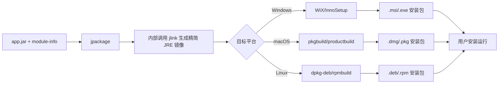
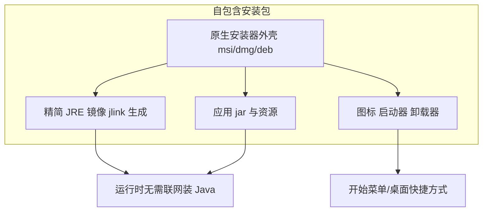
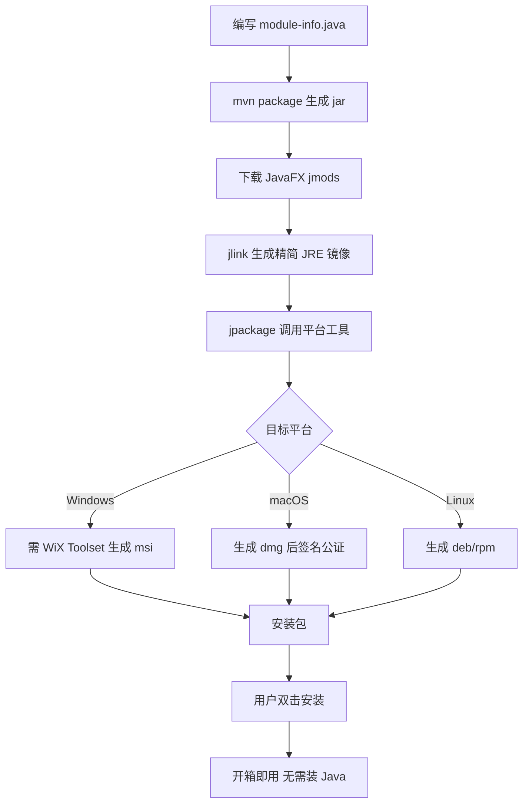

# 10.3 打包发布与跨平台部署

[[10.2 模块化与项目构建]] 让项目能编译运行，但用户不会装 Maven 与 JDK 来跑你的 jar。本节解决的问题是：用 `jlink` 生成精简自定义运行时镜像，用 `jpackage` 把镜像与应用打包成平台原生安装包（MSI/EXE、DMG/PKG、DEB/RPM），实现“双击安装、开箱即用”的自包含应用。

## jpackage 工具

`jpackage` 是 JDK 14+ 自带的打包工具（JDK 14-15 为预览，16+ 正式），把 Java 应用打包成原生安装包。它在内部调用 `jlink` 生成运行时镜像，再用平台工具（WiX/InnoSetup、pkgbuild、dpkg/rpm）生成安装器。

| 输入 | 输出（按平台） |
| --- | --- |
| 应用 jar + 模块信息 | Windows: `.msi` / `.exe` |
| JDK（提供 `jlink`/`jpackage`） | macOS: `.dmg` / `.pkg` |
| 图标 `.ico`/`.icns`/`.png` | Linux: `.deb` / `.rpm` |



## 打包格式

| 平台 | 格式 | 工具依赖 | 备注 |
| --- | --- | --- | --- |
| Windows | `.msi` | WiX Toolset 3.x | 企业部署友好 |
| Windows | `.exe` | Inno Setup | 向导式安装体验 |
| macOS | `.dmg` | 自带 | 磁盘映像，拖拽安装 |
| macOS | `.pkg` | `pkgbuild` | 系统级安装器 |
| Linux | `.deb` | `dpkg-deb` | Debian/Ubuntu 系 |
| Linux | `.rpm` | `rpmbuild` | RHEL/Fedora 系 |

> [!warning] 平台工具必须本机安装
> > `jpackage` 只能在目标平台上生成对应安装包（Windows 上打 `.msi`、macOS 上打 `.dmg`）。跨平台打包需用虚拟机、CI 矩阵或 `jpackage` 跨编译（有限支持）。Windows 打 MSI 需先安装 WiX Toolset。

## jlink 自定义运行时镜像

`jlink` 根据 `module-info.java` 把所需 JDK 模块与应用模块裁剪打包成精简 JRE。镜像不含无关模块，体积可从完整 JDK 的 300MB+ 降到 30~60MB。

```powershell
# PowerShell: 用 jlink 生成自定义运行时镜像
jlink `
  --module-path "jmods路径;target/classes;依赖jars解压目录" `
  --add-modules com.example.app `
  --output build/runtime `
  --strip-debug `
  --compress zip-6 `
  --no-header-files `
  --no-man-pages
```

| 选项 | 作用 |
| --- | --- |
| `--module-path` | 模块搜索路径（JDK jmods + 应用类 + 依赖） |
| `--add-modules` | 镜像包含的根模块 |
| `--strip-debug` | 去除调试信息减小体积 |
| `--compress` | 压缩级别 `0`/`1`/`2`/`zip-0~9` |
| `--launcher <name>=<module>/<main>` | 生成启动脚本 |
| `--bind-services` | 包含服务提供者 |

> [!note] 非 modular jar 的处理
> > 若应用未用 `module-info`（非模块化），`jpackage` 仍可通过 `--input` 指定 jar 目录、`--main-jar` 指定主 jar，自动把应用放到 classpath（ unnamed module），并打包完整 JDK 运行时（体积较大）。推荐为 JavaFX 应用编写 `module-info` 以获得精简镜像。

## 自包含应用

自包含应用（self-contained application）把精简 JRE 与应用一起打包，用户无需预装 Java。优点：

- 无环境依赖：用户机器无需 Java
- 版本锁定：避免与用户已有 Java 版本冲突
- 原生体验：安装包带图标、快捷方式、卸载器、关联文件类型



## JavaFX 打包配置与命令示例

### 基础 jpackage 命令

```powershell
# PowerShell: 把模块化 JavaFX 应用打包成 Windows MSI
jpackage `
  --name MyApp `
  --type msi `
  --module-path "build\libs;C:\path\to\javafx-jmods-21" `
  --add-modules com.example.app `
  --module com.example.app/com.example.app.App `
  --icon assets\app.ico `
  --input build\libs `
  --dest dist `
  --app-version 1.0.0 `
  --vendor "Example Corp" `
  --win-shortcut `
  --win-menu
```

| 参数 | 作用 |
| --- | --- |
| `--name` | 应用名（安装目录名） |
| `--type` | 输出类型 `msi`/`exe`/`dmg`/`pkg`/`deb`/`rpm` |
| `--module-path` | 模块路径（含 JavaFX jmods） |
| `--add-modules` | 包含的模块 |
| `--module` | 主模块/主类 |
| `--icon` | 应用图标 |
| `--input` | 非 modular jar/资源目录 |
| `--dest` | 输出目录 |
| `--app-version` | 版本号 |
| `--vendor` | 厂商名 |
| `--win-shortcut`/`--win-menu` | Windows 桌面/开始菜单快捷方式 |
| `--mac-package-name` | macOS 包名 |

> [!tip] JavaFX jmods
> > 打包模块化应用时需下载与 JavaFX 版本对应的 **jmods** 包（`javafx-jmods-21`），`jlink` 用 jmods 生成镜像。这与运行期依赖 `javafx-controls` jar 不同，jmods 是模块的编译/链接形态。

### 用 Maven 集成 jpackage

```xml
<!-- pom.xml: 用 exec-maven-plugin 调 jpackage -->
<plugin>
    <groupId>org.codehaus.mojo</groupId>
    <artifactId>exec-maven-plugin</artifactId>
    <version>3.1.0</version>
    <executions>
        <execution>
            <id>jpackage</id>
            <phase>package</phase>
            <goals><goal>exec</goal></goals>
            <configuration>
                <executable>jpackage</executable>
                <arguments>
                    <argument>--name</argument><argument>MyApp</argument>
                    <argument>--type</argument><argument>msi</argument>
                    <argument>--module-path</argument>
                    <argument>${project.build.directory}/mods;${env.JAVAFX_JMODS}</argument>
                    <argument>--add-modules</argument><argument>com.example.app</argument>
                    <argument>--module</argument><argument>com.example.app/com.example.app.App</argument>
                    <argument>--app-version</argument><argument>${project.version}</argument>
                    <argument>--dest</argument><argument>${project.build.directory}/installer</argument>
                </arguments>
            </configuration>
        </execution>
    </executions>
</plugin>
```

执行 `mvn package` 即生成 `target/installer/MyApp-1.0.0.msi`。

### macOS 签名与公证

```bash
# 打 DMG 后签名与公证（bash, macOS 上执行）
codesign --deep --force --sign "Developer ID Application: Your Name" MyApp.app
xcrun notarytool submit MyApp.dmg --apple-id you@email.com --password app-specific-password --wait
xcrun stapler staple MyApp.dmg
```

> [!warning] macOS 分发要求
> > macOS 10.15+ 要求分发的应用必须经 Developer ID 签名并公证（Notarization），否则用户首次运行会被 Gatekeeper 拦截。这需付费 Apple 开发者账号，且 `jpackage` 生成的 `.app` 需整体签名。

## 打包流程图



## 易错点

> [!warning] 常见误区
> 1. 试图在 Windows 上直接打 `.dmg`——`jpackage` 不支持跨平台打包，需在对应平台执行。
> 2. 缺少 WiX Toolset 时 `--type msi` 报错——Windows 打 MSI 必须先装 WiX 3.x。
> 3. 用 `javafx-controls` jar 而非 `javafx-jmods` 做 `--module-path`——`jlink` 只接受 jmods 格式。
> 4. 非 modular jar 打包体积过大——为应用加 `module-info.java` 才能用 `jlink` 裁剪。
> 5. macOS 未签名公证，用户无法运行——需 Developer ID 签名 + `notarytool` 公证 + `stapler` 装订。

## 小结

`jlink` 根据 `module-info` 裁剪 JDK 模块生成精简运行时镜像；`jpackage` 在镜像基础上调用平台工具生成原生安装包（MSI/EXE、DMG/PKG、DEB/RPM）。自包含应用把 JRE 一起打包，用户无需预装 Java，体验接近原生。打包须在目标平台执行，Windows 需 WiX，macOS 需签名公证。至此第10章完成从调试、构建到发布的工程闭环，课程核心内容也随之收束。

## 关联

- 先修：[[10.2 模块化与项目构建]]（`module-info` 是 `jlink` 前提）、[[3.3 FXML布局设计与SceneBuilder]]（资源打包）
- 相关：[[7.3 持久化存储与序列化]]（打包后用户偏好仍可用 Preferences）
- 上一级：[[MOC - 第10章]]
