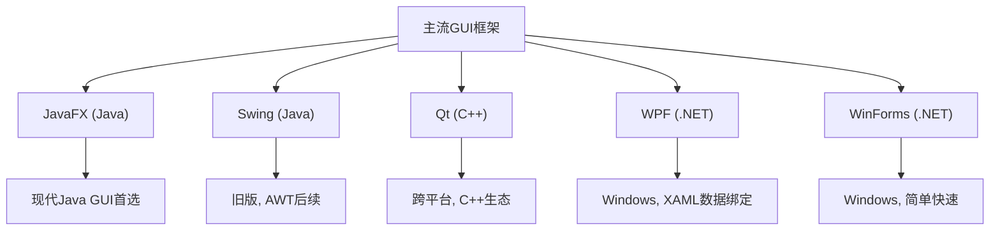

# 1.1 可视化程序设计概念与开发模式

可视化程序设计解决的问题是：**如何让开发者不必手工编写大量界面布局代码，而是通过图形化方式快速构建可交互的应用界面**。它把界面从“代码的附属品”提升为“开发的起点”，从而缩短从设计到可运行原型的距离。

## 可视化程序设计的定义

> [!definition] 可视化程序设计
> 可视化程序设计（Visual Programming）是一种以图形用户界面（GUI）为核心的开发范式：开发者通过拖拽组件、配置属性、连接事件处理逻辑来构建应用程序，而不必全部用文本代码描述界面结构与外观。

其核心特征包括：

- **所见即所得（WYSIWYG）**：设计时的界面即运行时的界面；
- **组件复用**：界面由可复用的标准控件组合而成；
- **属性驱动**：外观与行为通过属性配置而非硬编码；
- **事件驱动**：程序行为由用户操作触发的事件决定（详见 [[1.2 事件驱动编程基本原理]]）。

## 开发模式对比

### 命令行式 vs 可视化式

| 维度 | 命令行式程序设计 | 可视化程序设计 |
| --- | --- | --- |
| 交互方式 | 文本输入输出 | 图形界面、鼠标键盘交互 |
| 开发起点 | 算法与控制流 | 界面布局与组件 |
| 反馈形式 | 终端字符 | 实时渲染的窗口 |
| 典型场景 | 脚本、服务端、批处理 | 桌面应用、工具软件 |

### 代码优先 vs 界面优先

| 维度 | 代码优先（Code-First） | 界面优先（UI-First） |
| --- | --- | --- |
| 流程 | 先写逻辑，再补界面 | 先搭界面，再接逻辑 |
| 优势 | 逻辑严谨，便于测试 | 快速验证用户体验 |
| 风险 | 界面后置导致返工 | 逻辑后置可能忽视架构 |
| 适用 | 底层、算法密集型 | 产品原型、用户导向型应用 |

可视化程序设计通常采用**界面优先**策略，并通过 MVC/MVVM 分离把界面与逻辑解耦（参见 [[2.3 高级组件与自定义控件]]、[[3.3 FXML布局设计与SceneBuilder]]）。

## RAD 快速应用开发理念

> [!concept] RAD（Rapid Application Development）
> RAD 是一种强调**快速原型、迭代反馈与可视化工具支持**的软件开发方法论。它主张通过可复用组件、可视化设计器与自动化代码生成，缩短开发周期。

RAD 的关键要素：

1. **可视化构建器**：如 Scene Builder、Qt Designer、Visual Studio 设计器；
2. **组件库复用**：标准控件 + 第三方控件库；
3. **迭代式原型**：先做可点击原型，再逐步完善逻辑；
4. **事件驱动骨架**：设计器自动生成事件处理桩代码。

## 主流 GUI 框架对比

| 框架 | 语言/平台 | 渲染方式 | 优势 | 不足 |
| --- | --- | --- | --- | --- |
| JavaFX | Java / 跨平台 | 硬件加速 Prism | 现代 CSS 样式、FXML、属性绑定、控件丰富 | 生态较 Swing 小，需模块化配置 |
| Swing | Java / 跨平台 | 软件/CPU 渲染 | JDK 内置、成熟稳定 | 外观陈旧、不支持 CSS、动画弱 |
| Qt | C++ / 跨平台 | QPainter + OpenGL | 性能强、信号槽机制、嵌入式友好 | C++ 学习成本高 |
| WPF | C# / Windows | DirectX | XAML 强数据绑定、MVVM 友好 | 仅 Windows |
| WinForms | C# / Windows | GDI+ | 简单快速、拖拽便捷 | 无硬件加速、扩展性弱 |

> [!tip] 选型建议
> 本课程统一采用 **JavaFX** 作为实践框架：它是 Java 生态的现代 GUI 标准，支持 FXML 声明式界面、CSS 样式、属性绑定与硬件加速，能完整覆盖可视化程序设计的教学要点。

## 小结

可视化程序设计以界面为开发起点，借助组件复用、属性配置与事件驱动模型实现快速构建。RAD 理念贯穿其方法论，而 JavaFX 作为现代 Java GUI 框架，为后续组件、布局、事件与动画学习提供了统一载体。

## 关联

- 上一级：[[MOC - 第1章]]
- 下一节：[[1.2 事件驱动编程基本原理]]
- 关联课程：[[Java程序设计]]、[[面向对象程序设计]]
