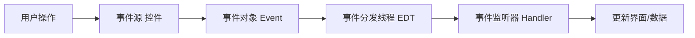
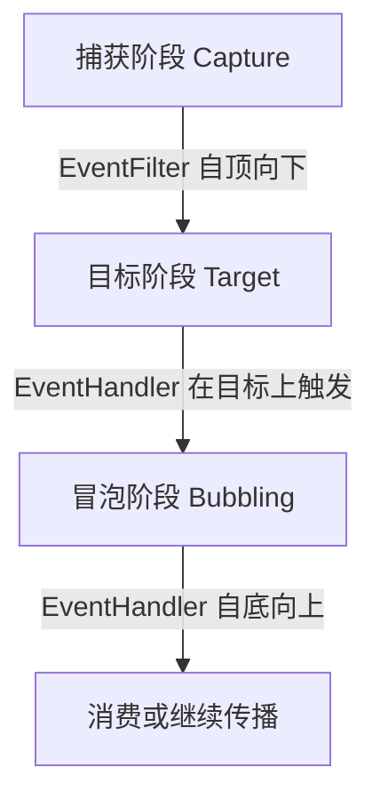

# 1.2 事件驱动编程基本原理

传统过程式程序由“输入→处理→输出”的线性流程驱动；而 GUI 程序的执行顺序由用户操作决定。**事件驱动编程**（Event-Driven Programming）解决的就是：如何让程序在不可预知的用户操作下，仍能正确响应。它把“发生了什么”抽象为事件，把“怎么处理”抽象为监听器，从而解耦事件源与处理逻辑。

## 事件驱动编程模型

事件驱动模型由三个核心要素构成：

> [!definition] 事件驱动三要素
> - **事件源（Event Source）**：产生事件的对象，通常是控件或界面元素（按钮、窗口、鼠标目标）。
> - **事件对象（Event Object）**：描述“发生了什么”的载体，封装事件类型、来源、时间戳与附加数据。
> - **事件监听器（Event Listener / Handler）**：注册在事件源上的处理逻辑，当事件发生时被回调。

三者关系：事件源在状态变化时构造事件对象，分发给已注册的监听器，监听器执行处理逻辑。



## 事件循环与消息泵机制

GUI 程序运行时并不直接退出，而是进入一个**事件循环（Event Loop）**，又称消息泵（Message Pump）：

1. 循环从事件队列中取出一个事件；
2. 将事件派发给对应的目标控件与监听器；
3. 执行处理逻辑后回到步骤 1，直到收到退出消息。

> [!note] 阻塞与响应
> 事件循环必须保持畅通。若某个监听器执行了耗时操作，后续事件会堆积在队列中，表现为界面“卡死”。这就是耗时任务必须交给后台线程的根本原因。

## 事件分发线程（EDT）

> [!definition] EDT
> 事件分发线程（Event Dispatch Thread）是 GUI 框架中专门负责事件派发与界面绘制的单一线程。JavaFX 中称为 **JavaFX Application Thread**。

EDT 的规则：

- 所有界面创建与修改操作必须在 EDT 上执行；
- 事件监听器回调在 EDT 上运行；
- 不得在 EDT 上执行阻塞或耗时操作。

JavaFX 提供两个工具切换线程：

```java
// 把任务放到后台线程执行
new Thread(() -> {
    String result = doHeavyWork();
    // 结果切回 EDT 更新界面
    Platform.runLater(() -> label.setText(result));
}).start();
```

## JavaFX 事件处理模型

JavaFX 的事件体系位于 `javafx.event` 包，核心类型包括：

| 类型 | 作用 |
| --- | --- |
| `Event` | 所有事件的基类，含 `EventType`、`Source`、`Target` |
| `ActionEvent` | 按钮点击、菜单选择等通用动作 |
| `MouseEvent` | 鼠标按下、释放、进入、退出等 |
| `KeyEvent` | 键盘按下、释放、输入字符 |
| `EventHandler<T extends Event>` | 监听器接口，`handle(T event)` 方法处理事件 |
| `EventFilter` | 捕获阶段过滤器，在事件到达目标前拦截 |

### 事件传递的三个阶段

JavaFX 事件在 Scene Graph 中传递分为捕获→目标→冒泡三阶段：



- **EventFilter**：在捕获阶段执行，适合做全局拦截（如权限校验）；
- **EventHandler**：注册在目标节点上，在目标阶段执行；
- **冒泡阶段**：事件沿节点树向上传播，父节点也可处理；
- 调用 `event.consume()` 可阻止后续传播。

## JavaFX 按钮点击事件代码示例

下面示例展示事件源、事件对象与监听器三要素的完整配合：

```java
import javafx.application.Application;
import javafx.scene.Scene;
import javafx.scene.control.Button;
import javafx.scene.layout.VBox;
import javafx.stage.Stage;
import javafx.event.ActionEvent;
import javafx.event.EventHandler;

public class ButtonEventDemo extends Application {
    @Override
    public void start(Stage stage) {
        // 事件源：按钮
        Button btn = new Button("点我");

        // 方式一：匿名内部类实现 EventHandler（事件监听器）
        btn.setOnAction(new EventHandler<ActionEvent>() {
            @Override
            public void handle(ActionEvent event) {
                // event 即事件对象，含 getSource() 等
                System.out.println("按钮被点击，来源：" + event.getSource());
            }
        });

        // 方式二：Lambda 简化（推荐）
        Button btn2 = new Button("Lambda 方式");
        btn2.setOnAction((ActionEvent e) -> System.out.println("Lambda 处理点击"));

        VBox root = new VBox(10, btn, btn2);
        stage.setScene(new Scene(root, 260, 140));
        stage.setTitle("事件处理示例");
        stage.show();
    }

    public static void main(String[] args) {
        launch(args);
    }
}
```

> [!example]- 说明
> - `btn` 与 `btn2` 是**事件源**；
> - `ActionEvent e` 是**事件对象**；
> - `EventHandler` 实现或 Lambda 表达式是**事件监听器**；
> - `setOnAction` 是注册监听器的便捷方法，等价于 `addEventHandler(ActionEvent.ACTION, handler)`。

## 小结

事件驱动模型用“事件源—事件对象—监听器”三要素把用户操作与程序响应解耦；事件循环（消息泵）保证程序持续响应；EDT 保证界面更新的线程安全。理解这套机制是学习后续组件交互与数据绑定的基础。

## 关联

- 上一节：[[1.1 可视化程序设计概念与开发模式]]
- 下一节：[[1.3 GUI框架、窗体与程序生命周期]]
- 上一级：[[MOC - 第1章]]
