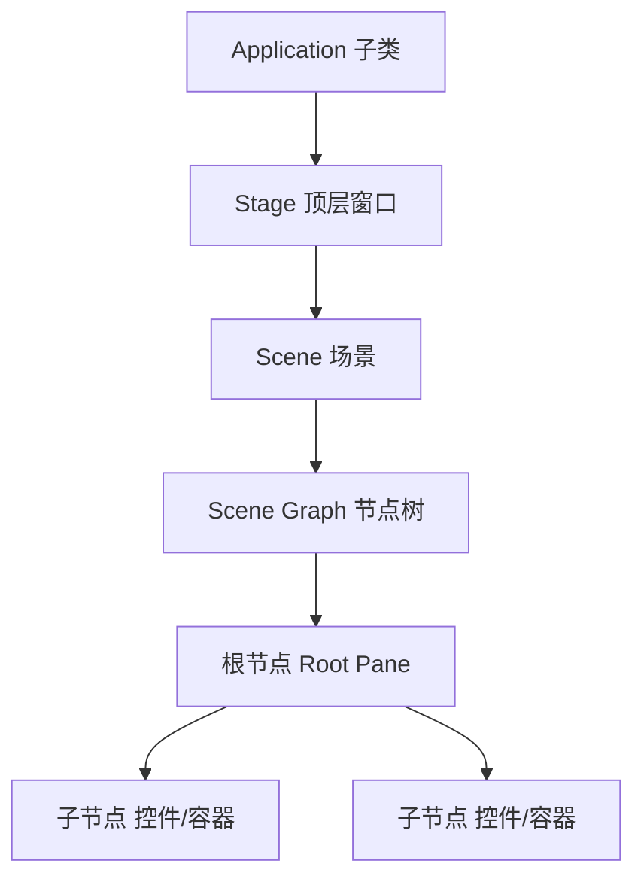
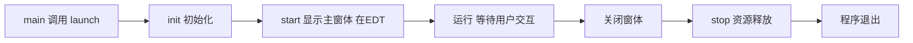
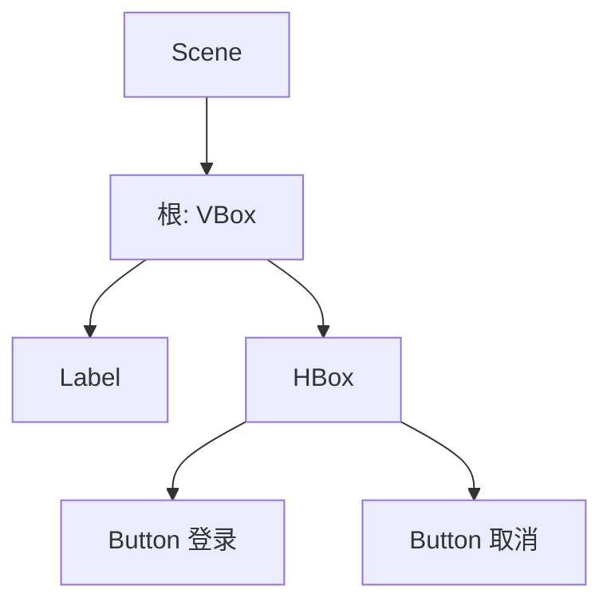

# 1.3 GUI框架、窗体与程序生命周期

一个 JavaFX 程序“长什么样”由 `Stage` 与 `Scene` 决定，“内容是什么”由 Scene Graph 节点树决定，“何时启动何时退出”由应用生命周期决定。本节解决的问题是：**理解 JavaFX 应用的整体骨架，以及一个窗体从诞生到销毁所经历的阶段**。

## JavaFX 应用结构

JavaFX 应用的核心抽象是 `Application` 类，它定义了程序入口与生命周期回调。

> [!definition] 应用四大组成部分
> - **`Application` 类**：所有 JavaFX 程序的基类（`javafx.application.Application`），子类重写 `start()` 实现界面。
> - **`start(Stage primaryStage)` 方法**：程序主入口，在 EDT 上调用，负责构建并显示主窗体。
> - **`Stage`**：顶层窗口容器，代表一个操作系统窗口。
> - **`Scene`**：舞台上的场景，承载 Scene Graph 节点树；一个 Stage 同一时刻只显示一个 Scene。

层级关系：`Application` → 拥有 `Stage` → 持有 `Scene` → 包含 Scene Graph 节点树。



## 窗体生命周期

JavaFX 应用生命周期由 `Application` 的几个回调方法定义：



| 方法 | 调用线程 | 作用 | 是否必须重写 |
| --- | --- | --- | --- |
| `main()` | 主线程 | 调用 `launch()` 启动 JavaFX 运行时 | 是（或通过模块入口） |
| `init()` | JavaFX 启动线程 | 初始化资源、加载配置 | 否，默认空实现 |
| `start(Stage)` | JavaFX Application Thread (EDT) | 构建并显示主界面 | **是，抽象方法** |
| `stop()` | JavaFX Application Thread | 释放资源、保存状态 | 否，默认空实现 |

> [!warning] 线程注意
> `init()` 在专门的 JavaFX 启动线程执行，**不能**在此创建 Stage/Scene；界面创建必须在 `start()`（EDT）中进行。

## Stage 属性

`Stage` 作为顶层窗口，常用属性如下：

| 属性 | 方法 | 说明 |
| --- | --- | --- |
| 标题 | `setTitle(String)` | 窗口标题栏文本 |
| 图标 | `getIcons().add(Image)` | 窗口图标 |
| 大小 | `setWidth(double)` / `setHeight(double)` | 初始宽高 |
| 最小尺寸 | `setMinWidth/Height` | 可缩放下限 |
| 模态 | `initModality(Modality)` | `NONE`/`WINDOW_MODAL`/`APPLICATION_MODAL` |
| 可调整 | `setResizable(boolean)` | 是否允许拖拽改变大小 |
| 显示 | `show()` / `showAndWait()` | 显示；后者阻塞直到关闭 |

> [!tip] 模态窗口
> `APPLICATION_MODAL` 模态窗口会阻塞其父应用的所有其他窗口，常用于“关于”对话框、确认弹窗等需要强制交互的场景。

## Scene Graph 节点树

> [!definition] Scene Graph
> Scene Graph 是 JavaFX 中所有可视元素的**有向无环树**结构。每个节点是 `javafx.scene.Node` 的子类（控件、形状、布局面板都是节点）。Scene 持有一个根节点（Root），渲染时遍历整棵树绘制界面。

节点树特点：

- 每个节点有唯一父节点（根节点除外）；
- 节点可包含子节点列表；
- 变换（平移/旋转/缩放）、样式（CSS）、事件处理都附属于节点；
- 修改节点属性自动触发重绘。



## JavaFX Hello World 完整示例

```java
import javafx.application.Application;
import javafx.scene.Scene;
import javafx.scene.control.Button;
import javafx.scene.control.Label;
import javafx.scene.layout.VBox;
import javafx.stage.Stage;

public class HelloWorld extends Application {

    @Override
    public void init() throws Exception {
        // 初始化阶段：可加载配置、准备资源（非EDT线程，勿创建UI）
        System.out.println("应用初始化...");
    }

    @Override
    public void start(Stage primaryStage) {
        // start 在 EDT 上调用：构建界面
        Label label = new Label("Hello, 可视化程序设计！");
        Button button = new Button("点击我");
        button.setOnAction(e -> label.setText("已响应事件！"));

        VBox root = new VBox(12, label, button);   // Scene Graph 根节点
        Scene scene = new Scene(root, 320, 180);   // 场景承载节点树

        primaryStage.setTitle("Hello World 示例");   // Stage 标题
        primaryStage.setScene(scene);               // Stage 装载 Scene
        primaryStage.show();                        // 显示窗体
    }

    @Override
    public void stop() throws Exception {
        // 释放资源、保存状态
        System.out.println("应用关闭，释放资源...");
    }

    public static void main(String[] args) {
        launch(args);   // 启动 JavaFX 运行时，触发生命周期回调
    }
}
```

> [!example]- 代码导读
> - `launch(args)` 启动 JavaFX 运行时 → 创建 `HelloWorld` 实例 → 调用 `init()`；
> - 运行时在 EDT 调用 `start(primaryStage)`，构造 `Label`/`Button` 节点；
> - `VBox` 作为 Scene Graph 根节点，被 `Scene` 包裹，再装入 `Stage`；
> - `show()` 后进入事件循环，等待用户交互；
> - 关闭窗口触发 `stop()`，程序退出。

## 小结

JavaFX 应用的骨架是 `Application → Stage → Scene → Scene Graph`。理解窗体生命周期四个回调（`init`/`start`/`运行`/`stop`）及其线程归属，是正确初始化资源、构建界面与释放资源的前提；理解 Scene Graph 节点树，则是后续学习布局与组件的基础。

## 关联

- 上一节：[[1.2 事件驱动编程基本原理]]
- 下一章：[[MOC - 第2章]]
- 上一级：[[MOC - 第1章]]
