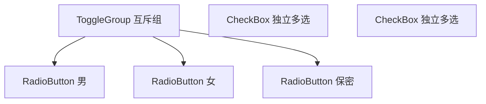
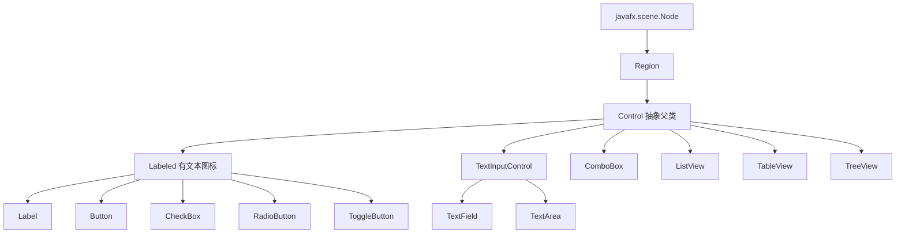

# 2.2 选择类与列表类组件

当界面需要让用户“做选择”时，单用文本输入既低效又易错。本节解决的问题是：**如何用选择类与列表类控件把可选项结构化呈现，并正确获取用户的选择结果**。

## 选择类组件

| 控件 | 类 | 选择模式 | 典型场景 |
| --- | --- | --- | --- |
| 复选框 | `CheckBox` | 多选 | 同意条款、多个标签 |
| 单选按钮 | `RadioButton` | 单选（需 ToggleGroup） | 性别、支付方式 |
| 切换按钮 | `ToggleButton` | 单/多选（视分组） | 工具栏开关 |
| 下拉选择 | `ChoiceBox` | 单选 | 少量枚举项 |
| 组合框 | `ComboBox` | 单选（可编辑） | 较多枚举项，可搜索 |

> [!definition] ToggleGroup
> `ToggleGroup` 是组织 `Toggle` 类型控件（RadioButton、ToggleButton）的分组类。同一组内的 `Toggle` 互斥，只能选中一个；未分组的 RadioButton 各自独立，可同时选中。



## 列表类组件

| 控件 | 类 | 数据结构 | 适用 |
| --- | --- | --- | --- |
| 列表视图 | `ListView<T>` | 一列 `ObservableList` | 单列同构数据 |
| 树视图 | `TreeView<T>` | `TreeItem` 层级 | 文件目录、组织结构 |
| 表格视图 | `TableView<T>` | `ObservableList` + `TableColumn` | 多列结构化数据 |

## 数据绑定与选择模式

JavaFX 列表类组件采用**可观察列表** `ObservableList` 作为数据模型，模型变化时界面自动更新。

> [!concept] ObservableList
> `ObservableList` 位于 `javafx.collections`，是带监听器的列表。增删元素会触发 `ListChangeListener`，绑定到它的 `ListView`/`TableView` 自动刷新，无需手动重绘。

选择模式由 `SelectionModel` 控制：

```java
ListView<String> list = new ListView<>(items);
list.getSelectionModel().setSelectionMode(SelectionMode.MULTIPLE); // 多选
// SINGLE 为单选（默认）
```

获取选择结果：

```java
// 单选
String selected = list.getSelectionModel().getSelectedItem();
// 多选
ObservableList<String> all = list.getSelectionModel().getSelectedItems();
```

## 组件继承关系



> [!tip] 继承关系的意义
> `Labeled` 系控件共享 `text`/`graphic`/`alignment` 属性；`TextInputControl` 系共享文本编辑能力；所有控件继承 `Control` 拥有 CSS 样式支持。理解继承树能快速推断控件共有属性。

## JavaFX 代码示例

下面示例演示 RadioButton + ToggleGroup、CheckBox、ComboBox 与 ListView 的协作：

```java
import javafx.application.Application;
import javafx.collections.FXCollections;
import javafx.collections.ObservableList;
import javafx.geometry.Insets;
import javafx.scene.Scene;
import javafx.scene.control.*;
import javafx.scene.layout.VBox;
import javafx.stage.Stage;

public class SelectionControlsDemo extends Application {
    @Override
    public void start(Stage stage) {
        // RadioButton + ToggleGroup 实现单选
        ToggleGroup genderGroup = new ToggleGroup();
        RadioButton male = new RadioButton("男");
        RadioButton female = new RadioButton("女");
        male.setToggleGroup(genderGroup);
        female.setToggleGroup(genderGroup);
        male.setSelected(true);

        // CheckBox 多选
        CheckBox read = new CheckBox("阅读");
        CheckBox code = new CheckBox("编程");
        code.setSelected(true);

        // ComboBox 下拉
        ComboBox<String> cityBox = new ComboBox<>();
        cityBox.getItems().addAll("北京", "上海", "广州", "深圳");
        cityBox.setPromptText("选择城市");

        // ListView + ObservableList
        ObservableList<String> langs = FXCollections.observableArrayList(
                "Java", "Python", "C++", "Rust", "Go");
        ListView<String> langList = new ListView<>(langs);
        langList.getSelectionModel().setSelectionMode(SelectionMode.MULTIPLE);
        langList.setPrefHeight(120);

        Button submit = new Button("提交");
        Label result = new Label("结果将显示在此");
        submit.setOnAction(e -> {
            String gender = ((RadioButton) genderGroup.getSelectedToggle()).getText();
            StringBuilder hobbies = new StringBuilder();
            if (read.isSelected()) hobbies.append("阅读 ");
            if (code.isSelected()) hobbies.append("编程 ");
            String city = cityBox.getValue();
            String selectedLangs = langList.getSelectionModel().getSelectedItems().toString();
            result.setText("性别:" + gender + " | 爱好:" + hobbies
                    + "| 城市:" + city + " | 语言:" + selectedLangs);
        });

        VBox root = new VBox(8,
                new Label("性别:"), male, female,
                new Label("爱好:"), read, code,
                new Label("城市:"), cityBox,
                new Label("掌握语言:"), langList,
                submit, result);
        root.setPadding(new Insets(15));

        stage.setScene(new Scene(root, 360, 460));
        stage.setTitle("选择与列表组件示例");
        stage.show();
    }

    public static void main(String[] args) { launch(args); }
}
```

> [!example]- 示例要点
> - `ToggleGroup.getSelectedToggle()` 获取被选中的 RadioButton；
> - `ComboBox.getValue()` 获取当前选择项；
> - `ListView.getSelectionModel().getSelectedItems()` 在多选模式下返回全部选中项；
> - 直接操作 `ObservableList`（如 `langs.add("Kotlin")`）界面会即时刷新。

## 小结

选择类组件用 `ToggleGroup` 实现互斥、用 `CheckBox` 实现独立多选；列表类组件以 `ObservableList` 为数据源，自动同步界面。选择模式（单/多选）通过 `SelectionModel` 配置。理解组件继承关系有助于快速掌握共性与差异。

## 关联

- 上一节：[[2.1 标签、按钮与文本输入组件]]
- 下一节：[[2.3 高级组件与自定义控件]]
- 上一级：[[MOC - 第2章]]
