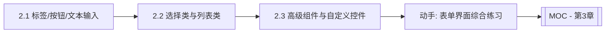

# MOC - 第2章 基础界面组件设计

> [!info] 本章定位
> 第2章聚焦“界面由什么构成”。JavaFX 所有可视元素都是 `Node`，本章按“文本类 → 选择/列表类 → 高级/自定义”三个层次介绍常用控件，并引入 FXML 与 Controller 分离思想。学完本章应能独立完成一个静态表单界面的搭建。

## 学习路线图

## 知识点导航

| 节 | 主题 | 核心要点 | 入口 |
| --- | --- | --- | --- |
| 2.1 | 标签、按钮与文本输入组件 | Label/Button/TextField/TextArea/PasswordField、属性、样式 | [[2.1 标签、按钮与文本输入组件]] |
| 2.2 | 选择类与列表类组件 | CheckBox/RadioButton/ComboBox/ListView/TreeView/TableView、数据绑定、选择模式 | [[2.2 选择类与列表类组件]] |
| 2.3 | 高级组件与自定义控件 | ScrollPane/TabPane/Spinner/Slider/ProgressBar、自定义控件、FXML+Controller | [[2.3 高级组件与自定义控件]] |

## 核心考点

> [!warning] 重点掌握
> 1. 各基础控件的功能差异与适用场景（如 TextField vs TextArea、CheckBox vs RadioButton）。
> 2. 控件公共属性：`text`、`font`、`alignment`、`tooltip`、CSS 样式设置方式。
> 3. 列表类组件的数据模型与选择模式（`SelectionMode.SINGLE/MULTIPLE`）。
> 4. ToggleGroup 对 RadioButton 的组织作用。
> 5. 自定义控件的基本途径（继承 `Control`/`Region` + CSS）与 FXML/Controller 分离。

## 自测题

> [!question] 题1
> TextField、TextArea、PasswordField 三者有何异同？分别适合采集什么数据？
> > [!check]- 参考答案
> > 三者都继承自 `TextInputControl`，用于文本输入。TextField 单行输入，适合短文本（用户名、搜索词）；TextArea 多行输入，适合长文本（备注、描述）；PasswordField 输入字符以掩码显示，适合密码等敏感信息。

> [!question] 题2
> RadioButton 如何实现“多选一”？关键类是什么？
> > [!check]- 参考答案
> > 通过 `ToggleGroup` 组织多个 RadioButton，同一组内只能选中一个。关键步骤：创建 `ToggleGroup` 实例，对每个 RadioButton 调用 `setToggleGroup(group)`。未加入同组的 RadioButton 互不影响。

> [!question] 题3
> ListView 与 TableView 的核心区别是什么？分别适合展示什么数据？
> > [!check]- 参考答案
> > ListView 展示一列同类型对象，适合简单列表（如姓名、文件名）；TableView 展示多列结构化数据，每列对应对象的一个属性，适合表格化数据（如学生成绩记录）。TableView 通过 `TableColumn` 定义列与单元格工厂。

> [!question] 题4
> 简述 FXML 与 Controller 分离的好处，并说明 `fx:controller` 与 `@FXML` 的作用。
> > [!check]- 参考答案
> > 分离使界面结构（FXML）与业务逻辑（Controller Java 类）解耦，便于可视化设计与团队协作。`fx:controller` 在 FXML 根元素指定 Controller 类全名；`@FXML` 标注 Controller 中需被 FXMLLoader 注入的字段或方法，使其与 FXML 中 `fx:id` 或事件处理名对应。

## 章节导航

- 上一章：[[MOC - 第1章]]
- 上一级：[[MOC - 可视化程序设计]]
- 下一章：[[MOC - 第3章]]
