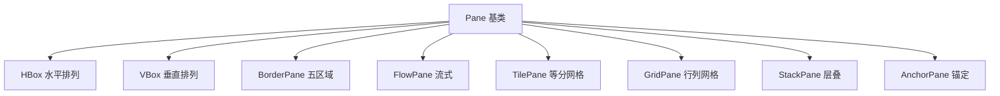

# 3.1 布局面板与容器体系

直接用坐标硬定位控件会导致窗口缩放时错位、不同分辨率下变形。**布局面板**（Layout Pane）解决的问题是：用一套规则自动计算子节点的位置与大小，让界面在不同窗口尺寸下保持合理结构。

## JavaFX 八大布局面板



## 各布局面板特性对比

| 面板 | 排列规则 | 关键属性 | 典型场景 |
| --- | --- | --- | --- |
| `HBox` | 子节点水平单行排列 | `spacing`、`alignment`、`hgrow` | 工具栏、按钮组 |
| `VBox` | 子节点垂直单列排列 | `spacing`、`alignment`、`vgrow` | 表单、设置项 |
| `BorderPane` | 上/下/左/右/中五区域 | `setTop/Bottom/Left/Right/Center` | 主框架 |
| `FlowPane` | 按流向换行排列 | `orientation`、`hgap/vgap` | 标签云、卡片流 |
| `TilePane` | 等大小格子排列 | `prefColumns/Rows` | 图标网格 |
| `GridPane` | 行列网格，可跨格 | `columnIndex/rowIndex`、`columnSpan` | 表单对齐 |
| `StackPane` | 子节点层叠居中 | — | 居中提示、叠加效果 |
| `AnchorPane` | 相对四边锚定 | `topAnchor/bottomAnchor/...` | 自由拖拽布局 |

> [!tip] 选型思路
> - 整体框架用 `BorderPane`；
> - 单行/单列用 `HBox`/`VBox`；
> - 表单对齐用 `GridPane`；
> - 需要窗口拉伸时用 `AnchorPane` 锚定或 `grow` 权重；
> - 居中覆盖用 `StackPane`（如加载遮罩）。

## 各布局 JavaFX 代码示例

### HBox / VBox

```java
import javafx.scene.layout.*;

HBox hbox = new HBox(10,
        new Button("新建"), new Button("打开"), new Button("保存"));
hbox.setStyle("-fx-padding: 10;");

VBox vbox = new VBox(8,
        new Label("姓名:"), new TextField(),
        new Label("邮箱:"), new TextField());
```

### BorderPane

```java
BorderPane border = new BorderPane();
border.setTop(new MenuBar());            // 顶部菜单
border.setBottom(new Label("就绪"));     // 底部状态栏
border.setLeft(new ListView<>());        // 左侧导航
border.setCenter(new TextArea());        // 中间内容
border.setRight(new VBox(new Button("A"), new Button("B"))); // 右侧工具
```

> [!note] BorderPane 扩展规则
> 中心区域（`center`）会自动占据剩余空间并随窗口拉伸；上下区域高度由内容决定；左右区域宽度由内容决定。这是构建主界面的首选骨架。

### FlowPane / TilePane

```java
FlowPane flow = new FlowPane(8, 8);
flow.getChildren().addAll(
        new Button("标签1"), new Button("标签2"),
        new Button("标签3"), new Button("标签4")); // 超宽自动换行

TilePane tile = new TilePane();
tile.setPrefColumns(3); // 每行 3 个等宽格子
tile.getChildren().addAll(new Button("1"), new Button("2"), new Button("3"),
        new Button("4"), new Button("5"));
```

### GridPane

```java
GridPane grid = new GridPane();
grid.setHgap(8); grid.setVgap(8);
grid.add(new Label("用户名:"), 0, 0);   // 第0列第0行
grid.add(new TextField(),    1, 0);     // 第1列第0行
grid.add(new Label("密码:"),   0, 1);
grid.add(new PasswordField(), 1, 1);
Button login = new Button("登录");
grid.add(login, 1, 2);                   // 跨列：可用 columnSpan
```

### StackPane

```java
StackPane stack = new StackPane();
stack.getChildren().addAll(
        new Rectangle(200, 120, Color.LIGHTGRAY), // 底层
        new Label("加载中..."));                   // 上层居中
```

### AnchorPane

```java
AnchorPane anchor = new AnchorPane();
Button save = new Button("保存");
Button cancel = new Button("取消");
anchor.getChildren().addAll(save, cancel);
// save 锚定右下，cancel 在 save 左侧
AnchorPane.setBottomAnchor(save, 10.0);
AnchorPane.setRightAnchor(save, 10.0);
AnchorPane.setBottomAnchor(cancel, 10.0);
AnchorPane.setRightAnchor(cancel, 90.0);
```

> [!example]- AnchorPane 自适应
> 当窗口变大时，右锚定距离不变，按钮自动随右边沿移动；若同时设置 `leftAnchor` 和 `rightAnchor`，节点会随窗口水平拉伸。这种特性是 [[3.2 响应式布局与界面适配]] 的基础。

## 小结

八大布局面板各有侧重：`BorderPane` 做骨架、`HBox`/`VBox` 做线性、`GridPane` 做对齐、`StackPane` 做层叠、`AnchorPane` 做锚定、`FlowPane`/`TilePane` 做流式。实际界面通常是这些面板的嵌套组合。

## 关联

- 上一章：[[2.3 高级组件与自定义控件]]
- 下一节：[[3.2 响应式布局与界面适配]]
- 上一级：[[MOC - 第3章]]
