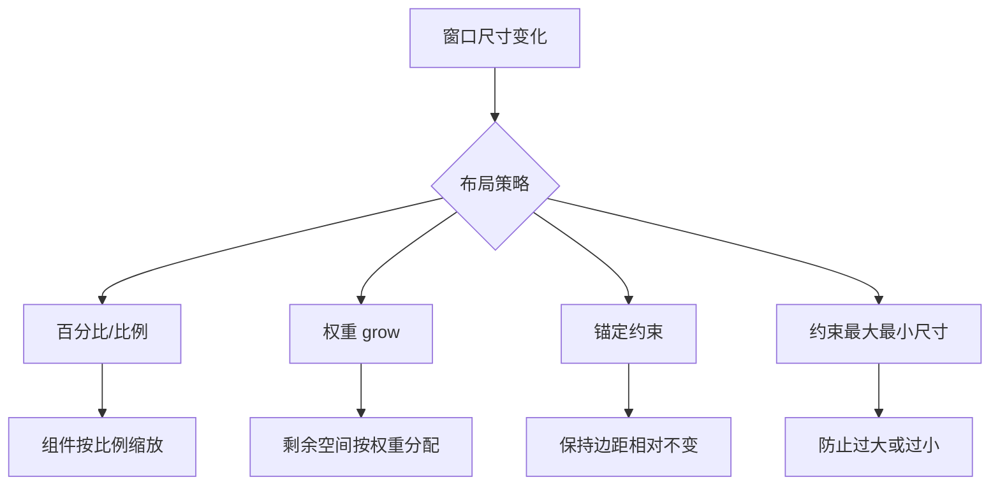

# 3.2 响应式布局与界面适配

固定坐标布局在窗口缩放或换设备时会崩坏。**响应式布局**解决的问题是：让界面在不同窗口尺寸、不同屏幕分辨率下都能合理呈现，而不必为每种情况单独写一套界面。

## 界面自适应原理

> [!definition] 自适应
> 自适应（Adaptive）指界面能根据可用空间自动调整组件大小、位置与可见性。它包含两个层面：
> - **可伸缩（Scalable）**：组件随容器大小按比例拉伸或压缩；
> - **可调整（Flexible）**：布局规则随空间变化切换（如换行、折叠、隐藏）。

## 响应式布局策略



### 1. 权重分配（grow）

`HBox.hgrow` / `VBox.vgrow` 让子节点按 `Priority` 分配剩余空间：

- `Priority.ALWAYS`：优先增长，均分剩余空间；
- `Priority.SOMETIMES`：仅当有剩余时增长；
- `Priority.NEVER`：永不增长。

```java
HBox hbox = new HBox(10);
TextField input = new TextField();
Button send = new Button("发送");
HBox.setHgrow(input, Priority.ALWAYS);   // 输入框吃掉剩余宽度
input.setMaxWidth(Double.MAX_VALUE);
hbox.getChildren().addAll(input, send);
```

### 2. 锚定约束（AnchorPane）

同时设置左右或上下锚点，节点会随窗口双向拉伸（详见 [[3.1 布局面板与容器体系]]）。

```java
AnchorPane.setLeftAnchor(table, 10.0);
AnchorPane.setRightAnchor(table, 10.0);   // 水平双向拉伸
AnchorPane.setTopAnchor(table, 10.0);
AnchorPane.setBottomAnchor(table, 10.0);  // 垂直双向拉伸
```

### 3. 最小/最大/偏好尺寸约束

防止组件被拉伸过头或压扁：

```java
button.setMinWidth(60);
button.setMaxWidth(120);
button.setPrefWidth(90);
```

### 4. 百分比列宽（GridPane）

`ColumnConstraints` 可设百分比列宽，窗口变化时列按比例分配：

```java
GridPane grid = new GridPane();
ColumnConstraints col1 = new ColumnConstraints();
col1.setPercentWidth(30);   // 30%
ColumnConstraints col2 = new ColumnConstraints();
col2.setPercentWidth(70);   // 70%
grid.getColumnConstraints().addAll(col1, col2);
```

## 窗口大小变化处理

可监听 `Scene` 的宽高变化做动态调整：

```java
scene.widthProperty().addListener((obs, oldVal, newVal) -> {
    double w = newVal.doubleValue();
    if (w < 600) {
        sideBar.setVisible(false);     // 窄屏隐藏侧栏
    } else {
        sideBar.setVisible(true);
    }
});
```

> [!tip] 绑定优先于监听
> 能用属性绑定解决的，尽量用 `bind` 而非手动监听。例如 `label.prefWidthProperty().bind(root.widthProperty())` 让标签宽度自动跟随根容器。

## 高 DPI 屏幕适配

> [!concept] 高 DPI
> 高 DPI（Dots Per Inch）屏幕单位面积像素更多，若按物理像素绘制，控件会显得过小。操作系统通过缩放比例（如 150%、200%）放大界面。

JavaFX 的适配优势：

1. **矢量渲染**：JavaFX 基于 Prism 管线，控件、文字、图形均为矢量绘制，缩放后不糊；
2. **自动缩放**：JavaFX 会读取系统 DPI 设置，自动放大坐标空间，无需手动换算；
3. **相对单位**：使用 `em`、`px` 在 CSS 中与系统缩放联动。

> [!warning] 适配注意事项
> - 避免硬编码像素位图作为按钮图标，改用 SVG/矢量形状或高分辨率图片；
> - 字体使用相对单位，而非固定小字号；
> - 测试时在 100%/125%/150%/200% 缩放下各跑一遍。

## JavaFX 响应式布局完整示例

下面示例综合使用 `BorderPane` 骨架、`HBox.hgrow` 权重、`GridPane` 百分比列与窄屏隐藏：

```java
import javafx.application.Application;
import javafx.scene.Scene;
import javafx.scene.control.*;
import javafx.scene.layout.*;
import javafx.stage.Stage;

public class ResponsiveDemo extends Application {
    private ListView<String> sideBar = new ListView<>();

    @Override
    public void start(Stage stage) {
        // 顶部工具栏：搜索框吃掉剩余宽度
        TextField search = new TextField();
        search.setPromptText("搜索...");
        HBox.setHgrow(search, Priority.ALWAYS);
        search.setMaxWidth(Double.MAX_VALUE);
        HBox topBar = new HBox(8, new Label("关键词:"), search, new Button("查询"));

        // 中部：侧栏 + 内容，用百分比列控制
        sideBar.getItems().addAll("首页", "设置", "关于");
        TextArea content = new TextArea("主内容区");
        GridPane center = new GridPane();
        ColumnConstraints c1 = new ColumnConstraints();
        c1.setPercentWidth(25);
        ColumnConstraints c2 = new ColumnConstraints();
        c2.setPercentWidth(75);
        center.getColumnConstraints().addAll(c1, c2);
        center.add(sideBar, 0, 0);
        center.add(content, 1, 0);
        GridPane.setHgrow(content, Priority.ALWAYS);

        // 主框架
        BorderPane root = new BorderPane();
        root.setTop(topBar);
        root.setCenter(center);
        root.setBottom(new Label("状态栏 - 自适应示例"));

        Scene scene = new Scene(root, 800, 500);

        // 窄屏隐藏侧栏
        scene.widthProperty().addListener((obs, o, n) -> {
            sideBar.setVisible(n.doubleValue() >= 600);
            sideBar.setManaged(n.doubleValue() >= 600);
        });

        stage.setScene(scene);
        stage.setTitle("响应式布局示例");
        stage.show();
    }

    public static void main(String[] args) { launch(args); }
}
```

> [!example]- 示例要点
> - `HBox.setHgrow(search, Priority.ALWAYS)` 让搜索框占据工具栏剩余空间；
> - `ColumnConstraints.setPercentWidth` 让侧栏与内容区按 25:75 分配；
> - `setManaged(false)` 配合 `setVisible(false)`：不仅隐藏，还释放占用的布局空间；
> - 整体随窗口拉伸自动重排，无需手动计算坐标。

## 小结

响应式布局的核心是“让布局规则而非坐标决定位置”。通过 grow 权重、锚定约束、百分比列宽、最小/最大尺寸与属性绑定，配合窄屏动态隐藏，可使界面在多尺寸下保持可用；JavaFX 矢量渲染进一步保证高 DPI 下清晰。

## 关联

- 上一节：[[3.1 布局面板与容器体系]]
- 下一节：[[3.3 FXML布局设计与SceneBuilder]]
- 上一级：[[MOC - 第3章]]
