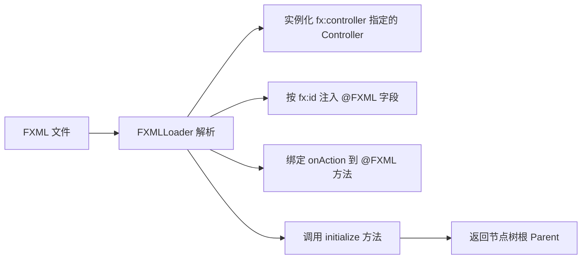

# 3.3 FXML布局设计与SceneBuilder

用 Java 代码构建复杂界面冗长且难以可视化预览。**FXML** 解决的问题是：用声明式 XML 描述界面结构，把界面与逻辑分离；**Scene Builder** 进一步提供拖拽式可视化设计，让界面搭建像画图一样直观。

## FXML 语法结构

> [!definition] FXML
> FXML 是基于 XML 的 JavaFX 界面描述语言。每个 XML 元素对应一个 JavaFX 对象（控件或布局），属性对应对象属性，子元素对应包含关系。FXML 不描述行为，行为由 Controller 处理。

### 基本结构

```xml
<?xml version="1.0" encoding="UTF-8"?>
<!-- 导入 JavaFX 控件与布局 -->
<?import javafx.scene.control.*?>
<?import javafx.scene.layout.*?>
<?import javafx.geometry.Insets?>

<VBox xmlns="http://javafx.com/javafx/17"
      xmlns:fx="http://javafx.com/fxml/1"
      fx:controller="com.example.LoginController"
      spacing="10" alignment="CENTER">
    <padding><Insets topRightBottomLeft="15"/></padding>
    <Label text="用户登录" style="-fx-font-size:16px;"/>
    <TextField fx:id="userName" promptText="用户名"/>
    <PasswordField fx:id="password" promptText="密码"/>
    <Button text="登录" onAction="#handleLogin"/>
    <Label fx:id="message" text=""/>
</VBox>
```

### 元素与属性规则

| FXML 写法 | 含义 |
| --- | --- |
| `<VBox>` | 创建 `VBox` 对象，作为根节点 |
| `xmlns` / `xmlns:fx` | 命名空间，`fx` 前缀用于特殊属性 |
| `<?import ...?>` | 导入类包，类似 Java 的 import |
| `spacing="10"` | 设置属性 `spacing=10` |
| `<children>` | 默认子元素集合（可省略，直接写子节点） |
| `fx:id="userName"` | 给节点命名，供 Controller 注入 |
| `onAction="#handleLogin"` | 绑定事件到 Controller 方法 |
| `fx:controller="..."` | 指定 Controller 类全限定名 |

> [!note] 静态属性与只读属性
> FXML 支持 `<padding><Insets topRightBottomLeft="15"/></padding>` 这类嵌套对象构造。对于像 `HBox.hgrow` 这类静态属性，写法是 `<TextField><HBox.hgrow>ALWAYS</HBox.hgrow></TextField>`。

## FXML 与 Controller 绑定

绑定由 `FXMLLoader` 在加载时完成，三要素协作如下：



- `fx:controller`：写在根元素，指定 Controller 类全名；
- `@FXML`：标注 Controller 字段（对应 `fx:id`）或方法（对应 `onAction="#方法名"`）；
- `initialize()`：可选括注解，加载完成后自动调用，用于初始化监听与数据。

```java
package com.example;
import javafx.fxml.FXML;
import javafx.scene.control.*;

public class LoginController {
    @FXML private TextField userName;
    @FXML private PasswordField password;
    @FXML private Label message;

    @FXML
    private void initialize() {
        // 加载后初始化：用户名输入框聚焦
        userName.requestFocus();
    }

    @FXML
    private void handleLogin() {
        if ("admin".equals(userName.getText()) && "123456".equals(password.getText())) {
            message.setText("登录成功");
        } else {
            message.setText("用户名或密码错误");
        }
    }
}
```

## Scene Builder 可视化设计

> [!concept] Scene Builder
> Scene Builder 是 Gluon 维护的可视化 FXML 设计工具。它提供拖拽式控件库、属性面板与实时预览，能直接产出 `.fxml` 文件，无需手写 XML。

工作流：

1. 新建 FXML 文件，选择根容器（如 `BorderPane`）；
2. 从左侧控件库拖拽控件到画布；
3. 在右侧 Inspector 面板设置属性（文本、字体、布局约束、CSS）；
4. 在 Code 面板设置 `fx:id`、`onAction`、`fx:controller`；
5. 保存生成 `.fxml`，IDE 中用 `FXMLLoader` 加载。

> [!tip] IDEA 集成
> IntelliJ IDEA 可在设置中指定 Scene Builder 可执行文件路径，双击 `.fxml` 文件即可打开 Scene Builder 编辑，保存后自动回写。

## FXML 加载机制：FXMLLoader

```java
import javafx.fxml.FXMLLoader;
import javafx.scene.Parent;
import javafx.scene.Scene;
import javafx.stage.Stage;

@Override
public void start(Stage stage) throws Exception {
    FXMLLoader loader = new FXMLLoader(
        getClass().getResource("/login.fxml"));   // 1. 定位 FXML
    Parent root = loader.load();                   // 2. 加载并解析，返回根节点
    // LoginController controller = loader.getController(); // 3. 可选：获取 Controller 引用

    stage.setScene(new Scene(root, 360, 220));
    stage.setTitle("FXML 加载示例");
    stage.show();
}
```

> [!warning] 资源路径注意
> `getResource()` 路径以 `/` 开头表示从 classpath 根开始。Maven 项目中 FXML 通常放在 `src/main/resources` 下，与 Controller 的包路径对应。路径错误会抛出 `NullPointerException` 或 `LoadException`。

## include 复用 FXML

复杂界面可拆成多个 FXML，用 `<fx:include>` 引入，便于复用与团队分工：

```xml
<!-- main.fxml 主界面 -->
<BorderPane xmlns="http://javafx.com/javafx/17"
            xmlns:fx="http://javafx.com/fxml/1"
            fx:controller="com.example.MainController">
    <top>
        <fx:include source="menubar.fxml"/>     <!-- 复用菜单栏 -->
    </top>
    <left>
        <fx:include source="sidebar.fxml" fx:id="sideBar"/> <!-- 复用侧栏 -->
    </left>
    <center>
        <fx:include source="content.fxml"/>     <!-- 复用内容区 -->
    </center>
</BorderPane>
```

> [!note] include 的 Controller
> 每个 `<fx:include>` 对应的 FXML 可有自己的 `fx:controller`，它们独立初始化。父 Controller 可通过 `fx:id` 获取被包含根节点，但通常不直接操作子 Controller，以保持低耦合。

## 完整 FXML 示例文件

下面是一个登录界面 FXML 完整示例，含布局、样式、Controller 绑定与 include 思路：

```xml
<?xml version="1.0" encoding="UTF-8"?>
<?import javafx.scene.control.*?>
<?import javafx.scene.layout.*?>
<?import javafx.geometry.Insets?>

<VBox xmlns="http://javafx.com/javafx/17"
      xmlns:fx="http://javafx.com/fxml/1"
      fx:controller="com.example.LoginController"
      spacing="12" alignment="CENTER"
      style="-fx-background-color: #fafafa;">
    <padding><Insets topRightBottomLeft="24"/></padding>

    <Label text="用户登录"
           style="-fx-font-size: 20px; -fx-font-weight: bold; -fx-text-fill: #2a4d8f;"/>

    <GridPane hgap="10" vgap="10" alignment="CENTER">
        <columnConstraints>
            <ColumnConstraints minWidth="60"/>
            <ColumnConstraints prefWidth="180" maxWidth="240"/>
        </columnConstraints>
        <Label text="用户名:" GridPane.rowIndex="0" GridPane.columnIndex="0"/>
        <TextField fx:id="userName" promptText="请输入用户名"
                   GridPane.rowIndex="0" GridPane.columnIndex="1"/>
        <Label text="密码:" GridPane.rowIndex="1" GridPane.columnIndex="0"/>
        <PasswordField fx:id="password" promptText="请输入密码"
                       GridPane.rowIndex="1" GridPane.columnIndex="1"/>
    </GridPane>

    <HBox spacing="10" alignment="CENTER">
        <Button text="登录" onAction="#handleLogin"
                style="-fx-background-color: #4caf50; -fx-text-fill: white;"/>
        <Button text="重置" onAction="#handleReset"/>
    </HBox>

    <Label fx:id="message" text="" style="-fx-text-fill: #d32f2f;"/>
</VBox>
```

> [!example]- 示例要点
> - `fx:controller` 绑定 `LoginController`；
> - `fx:id` 命名 `userName`/`password`/`message`，供 Controller 注入；
> - `onAction="#handleLogin"`/`"#handleReset"` 绑定按钮事件；
> - `GridPane` 用 `columnConstraints` 约束列宽，`GridPane.rowIndex/columnIndex` 定位单元格；
> - 内联 CSS 控制颜色与字号，响应式适配见 [[3.2 响应式布局与界面适配]]。

## 小结

FXML 用 XML 声明界面结构，Scene Builder 提供可视化设计，`FXMLLoader` 把 FXML、Controller 与事件绑定组装成可运行的节点树。`<fx:include>` 支持界面模块复用。这一工作流是工程化 JavaFX 开发的标准实践，也呼应了 [[2.3 高级组件与自定义控件]] 中界面/逻辑分离的思想。

## 关联

- 上一节：[[3.2 响应式布局与界面适配]]
- 上一章：[[2.3 高级组件与自定义控件]]
- 上一级：[[MOC - 第3章]]
