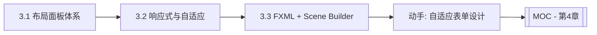

# MOC - 第3章 布局管理与界面自适应

> [!info] 本章定位
> 第2章解决了“放什么控件”，第3章解决“控件放在哪、窗口变化时怎么变”。布局管理是 GUI 从“能用”到“好用”的关键一跃。本章覆盖 JavaFX 八大布局面板、响应式适配策略，以及 FXML + Scene Builder 的可视化布局工作流。

## 学习路线图

## 知识点导航

| 节 | 主题 | 核心要点 | 入口 |
| --- | --- | --- | --- |
| 3.1 | 布局面板与容器体系 | HBox/VBox/BorderPane/FlowPane/TilePane/GridPane/StackPane/AnchorPane、特性对比 | [[3.1 布局面板与容器体系]] |
| 3.2 | 响应式布局与界面适配 | 自适应原理、百分比/权重/约束、窗口变化、高 DPI | [[3.2 响应式布局与界面适配]] |
| 3.3 | FXML布局设计与SceneBuilder | FXML 语法、fx:controller/@FXML、Scene Builder、FXMLLoader、include | [[3.3 FXML布局设计与SceneBuilder]] |

## 核心考点

> [!warning] 重点掌握
> 1. 八大布局面板的排列规则与适用场景，能根据需求选型。
> 2. `BorderPane` 五区域、`GridPane` 行列约束、`StackPane` 层叠的特性。
> 3. 响应式布局的常见策略：百分比、`HBox.hgrow`/`VBox.vgrow` 权重、`AnchorPane` 锚定约束。
> 4. 高 DPI 适配的基本思路与 JavaFX 的矢量渲染优势。
> 5. FXML 语法结构、与 Controller 绑定方式、`FXMLLoader` 加载流程、`<fx:include>` 复用。

## 自测题

> [!question] 题1
> 对比 HBox、VBox、BorderPane、GridPane 四种布局的排列规则与典型用途。
> > [!check]- 参考答案
> > HBox 水平单行排列，适合工具栏；VBox 垂直单列排列，适合表单；BorderPane 分 top/bottom/left/right/center 五区域，适合主框架（顶菜单、底状态栏、中内容）；GridPane 按行列网格排列，适合结构化表单（标签+输入框对齐）。

> [!question] 题2
> 在 HBox 中如何让某个按钮占据剩余空间？关键属性是什么？
> > [!check]- 参考答案
> > 设置 `HBox.setHgrow(button, Priority.ALWAYS)`，并让 `button.setMaxWidth(Double.MAX_VALUE)`。`Priority.ALWAYS` 表示在分配剩余空间时该子节点优先增长，从而占满水平剩余区域。

> [!question] 题3
> AnchorPane 的锚定约束如何实现界面自适应？
> > [!check]- 参考答案
> > AnchorPane 通过 `AnchorPane.setTopAnchor/BottomAnchor/LeftAnchor/RightAnchor` 设置子节点到四边的距离。当窗口缩放时，锚定的边距保持不变，节点会被拉伸或移动，从而实现自适应。同时设置左右或上下锚点会让节点随窗口拉伸。

> [!question] 题4
> 简述 FXMLLoader 加载 FXML 的过程，以及 `fx:controller`、`fx:id`、`onAction` 三者的协作。
> > [!check]- 参考答案
> > FXMLLoader 解析 FXML 文件 → 根据 `fx:controller` 实例化 Controller → 遍历元素创建节点 → 把带 `fx:id` 的节点注入 Controller 中同名 `@FXML` 字段 → 把 `onAction="#方法名"` 绑定到 Controller 同名 `@FXML` 方法 → 调用 Controller 的 `initialize()` → 返回节点树根。

## 章节导航

- 上一章：[[MOC - 第2章]]
- 上一级：[[MOC - 可视化程序设计]]
- 下一章：[[MOC - 第4章]]
